# Crea y Despliega un Sistema de Ventas FULL STACK con REACT y PostgreSQL | 2025

## SalesSystem

[](https://www.youtube.com/watch?v=URG4rnmdThs&t=270s)

## 1. Precondiciones (00:00:00)

1. Instalar `NODEJS` y `npm` en su sistema, usando el `nvm`:
  [Instalar múltiples versiones de Node.js en Windows](https://rafaelneto.dev/blog/instalar-multiples-versiones-nodejs-windows/).

```bash
nvm install [version]
nvm use [version]
```

2. Verificar las versiones de `NODEJS` instaladas en una `TERMINAL`:

```bash
nvm list
```

3. Instalar también el `pnpm` [pnpm installation](https://pnpm.io/installation), es mas rápido que el  `npm`.

4. Instalar [Visual Studio Code](https://code.visualstudio.com/insiders/).

5. Dentro de `Visual Studio Code`, se recomiendan estas extensiones:
* `ES7+ React/Redux/React-Native snippets` de `dsznajder` 4.4.x.
* `Better Comments` de `Aaron Bond` 3.0.x.
* `ESLint` de `Microsoft` 3.0.x.
* `Paste JSON as Code` de `quicktype` 23.0.x.
* `Prettier - Code formatter` de `Prettier` 11.0.x.
* `React Create Component` de `Javier Gutierrez` 1.5.x.
* `Simple React Snippets` de `Burke Holland` 1.2.x
* `TSLint` de `Microsoft` 1.3.x.
* `vscode-styled-components` de `Styled Components` 1.7.x.

## 2. Login

>[!IMPORTANT]  
>### Temas puntuales de la sección  
>**Descripción de la sección:**  
>En esta sección exploraremos todo lo relacionado con el desarrollo del módulo de `Login`. Aprenderás desde la creación del proyecto hasta la implementación completa del sistema de autenticación utilizando herramientas modernas como `Zustand` y `Supabase`. Además, diseñaremos una interfaz intuitiva y funcional, enfocándonos en detalles como maquetado, estilos globales, y componentes reutilizables.
>
>Entre los temas que abordaremos están:
>
>* Configuración inicial del proyecto con herramientas como `Auto Barrel`.
>* Organización del código y buenas prácticas en estructuras de carpetas.
>* Diseño del login con componentes responsivos y ajustes de estilos.
>* Implementación de un `AuthStore` para gestionar el estado global.
>* Conexión del proyecto con `Supabase` para autenticar usuarios.
>* Incorporación de funciones avanzadas como manejo del contexto y gestión de datos del usuario.
>
>Al finalizar esta sección, tendrás un módulo de login totalmente funcional y estilizado, listo para integrarse en cualquier aplicación.

### Creando el Proyecto (00:04:30)

1. Estando en la raíz de nuestro proyecto ejecutamos este comando
usando `VITE`:
```bash
pnpm create vite@latest . --template react-ts
```

>[!NOTE]  
>* El instructor sugiere el uso de `npm`, prefiereo el uso de `pnpm`.
>* También sugiere usar `JavaScript`, pero lo prefiero en `TypeScript`. Es mas exigente y pone mas retos, me gusta mas.

2. Nos consulta lo siguiente, en el proceso de instalación:
```dos
  Current directory is not empty. Please choose how to proceed:
│  ○ Cancel operation
│  ○ Remove existing files and continue
│  ● Ignore files and continue
```
* Seleccionamos la tercera `Ignore files and continue`.
```dos
Package name:
│  salessystem
```
* Lo dejamos así, con el `salessystem`.
```dos
◇  Scaffolding project in E:\tutorials\react\SalesSystem...
│
└  Done. Now run:

  pnpm install
  pnpm run dev
```
* Nos sugiere esto al final.

3. Así luce nuestro proyecto hasta el momento:  


4. Abrimos el **`package.json`** y eliminamos todos los _carets_ (`^`).

5. Ejecutamos en una `TERMINAL`, las dos líneas que nos sugirió al
final del proceso de creación del proyecto en `react`:
```bash
pnpm install
pnpm run dev
```
* Nos arroja esta respuesta:
```bash
  VITE v6.3.5  ready in 940 ms

  ➜  Local:   http://localhost:5173/
  ➜  Network: use --host to expose
  ➜  press h + enter to show help
```
* Así luce la página inicial:  


### Instalar `Auto Barrel` (00:06:44)

1. Instalar la extensión en `Visual Studio Code` de nombre `Auto Barrel for VSCode` de `Manuel Gil` 1.19.x.
2. Acá está el link para descargar el propuesto por el instructor: [auto-barrel-1.10.0](images/auto-barrel-1.10.0_vsixhub.com.zip).


### Configuración de `Auto Barrel` (00:07:37)

>[!NOTE]  
>El instructor habla de configurar el `Auto Barrel` por 
>`Extension Settings`, pero este no requiere dicho cambio en la versión 1.19.x.

### Organizando Carpetas (00:08:01)

1. Creamos la carpeta **"components"** dentro de **"src"**.

2. Creamos la carpeta **"pages"** dentro de **"src"**.

3. Creamos la carpeta **"routes"** dentro de **"src"**.

4. Creamos la carpeta **"styles"** dentro de **"src"**.

5. Creamos la carpeta **"utils"** dentro de **"src"**.

6. Creamos la carpeta **"supabase"** dentro de **"src"**.

7. Creamos la carpeta **"store"** dentro de **"src"**.

### Instalando dependencias básicas (00:09:32)

1. Empezamos en una `TERMINAL` con 
[`styled-components`](https://www.npmjs.com/package/styled-components) y su respectivo 
[`@types`](https://www.npmjs.com/package/@types/styled-components):
```bash
pnpm add styled-components @types/styled-components -E
```

2. En la `TERMINAL` seguimos con
[`react-router-dom`](https://www.npmjs.com/package/react-router-dom) y el respectivo
[`@types`](https://www.npmjs.com/package/@types/react-router-dom):
```bash
pnpm add react-router-dom @types/react-router-dom -E
```

3. En la `TERMINAL` otra librería o dependencia,
[`react-icons`](https://www.npmjs.com/package/react-icons) 
y no requiere el adicional 
[`@types`](https://www.npmjs.com/package/@types/react-icons)
pues el sitio dice "`This is a stub types definition. react-icons provides its own type definitions, so you do not need this installed`":
```bash
pnpm add react-icons -E
```

4. En la `TERMINAL` esta dependencia
[`Iconify for React`](https://www.npmjs.com/package/@iconify/react)
, no requiere `@types`, este sitio no existe:
```bash
pnpm add --save-dev @iconify/react -E
```

### Agregando Estilos Globales (00:11:55)

1. Empezamos borrando el archivo **`src/App.css`**.
2. Borramos también el **`src/index.css`**.
3. Borramos el contenido del `return` del archivo **`src/App.tsx`**, dejando dentro de la etiqueta `<>` vacía, esto `<span>Hola mundo</span>`.
4. Borramos de este mismo archivo el _hook_ `useState` y todos los `import`.
5. Del archivo **`src\main.tsx`**, borramos la importación del `index.css`.
6. Ajustamos también otras cosas en el archivo **`index.html`**:
```html
<!doctype html>
<html lang="es-CO">
  <head>
    <meta charset="UTF-8" />
    <link rel="icon" type="image/svg+xml" href="/vite.svg" />
    <meta name="viewport" content="width=device-width, initial-scale=1.0" />
    <title>POSS 1.0.0</title>
  </head>
  <body>
    <div id="root"></div>
    <script type="module" src="/src/main.tsx"></script>
  </body>
</html>
```
7. Agrego la imagen de un ícono para nuestro proyecto en extensión `.PNG`, la obtengo con la _A.I_ de `Copilot`, y consigo dos imágens, esta  y esta , que la voy a copiar en las carpetas **"public"** y **"src/assets"**, en diferentes tamaños.
8. En el archivo **`index.html`**, cambiamos la `url` del `<link rel="icon"`, por el de la imagen de 32x32:
```html
    <link rel="icon" type="image/png" href="/poss2_32x32.png" />
```
9. Creamos el archivo **`GlobalStyles.tsx`** en la carpeta **"src/styles"**.
10. Empezamos importando el `'styled-components'` el elemento `{createGlobalStyle}`.
11. Exportamos la constante `GlobalStyles` qu es igual al valor que recién importamos mas un grupo de valores dentro de comillas invertidas o en el teclado _ascii_ el [`ALT`]+[9]+[6]:
```js
import { createGlobalStyle } from 'styled-components';

export const GlobalStyles = createGlobalStyle`
  @import url('https://fonts.googleapis.com/css2?family=Poppins:wght@200;300;400;500;600;700;800;900&display=swap');
  body{
    margin: 0;
    padding: 0;
    box-sizing: border-box;
    font-family: 'Poppins', sans-serif;
    background-color: pink; /* #f4f4f4;*/
    color: #333;
  }
`;
```
12.  Vamos a crear un `Auto Barrel`, en la carpeta **"src"**, esto crea un arhivo de nombre **`index.ts`**, el instructor sugiere que solo se utilice para _Componentes_, con esto por ahora:
```js
export { default as App } from './App';
export * from './main';
export * from './styles/GlobalStyles';
```
13.    En el archivo **`src/App.tsx`**, agregamos un `import` al `./index.ts` el elemento `{GlobalStyles}`, y el renderizado de `<GlobalStyles />`:
```js
import { GlobalStyles } from './index.ts';

function App() {
  return (
    <div>
      <GlobalStyles />
      <h1>Hola mundo</h1>
    </div>
  );
}

export default App;
```
14.  Y así se ve la pantalla hasta el momento: <br> 


### Primer maquetado (00:20:40)

1. En el archivo **`src/App.tsx`**, agregamos esta importación: <br> `import styled from 'styled-components';`.
2. Creamos una constante `Container` igual a `styled.main` al lado de `main` abrimos y cerramos la comilla invertida o en el teclado _ascii_ el [`ALT`]+[9]+[6]:
```js
import styled from 'styled-components';
import { GlobalStyles } from './index.ts';

const Container = styled.main`
  // Es un componente de estilo
  display: grid;
  grid-template-columns: 1fr;
  background-color: lightyellow;
`;

function App() {
  return (
    <Container>
      <GlobalStyles />
      <section className='leftSidebar'>
        <p>uno</p>
      </section>
      <section className='mainMenu'>
        <p>dos</p>
      </section>
      <section className='rightRoutes'>
        <p>tres</p>
      </section>
    </Container>
  );
}

export default App;
```
3. Creamos el archivo **`breakpoints.ts`** y copiamos el contenido del repositorio [breakpoints.jsx](https://github.com/Franklin369/pos-react-login/blob/main/src/styles/breakpoints.jsx). <br> Como explica el instructor, estos son _objetos_ No _componentes_ por ende la extensión debe ser `.ts`.
4. En el archivo **`src/App.tsx`**, en la definición del componente `Container`, agregamos definiciones de cada clase usada en las `<section`:
```css
const Container = styled.main`
  // Es un componente de estilo
  display: grid;
  grid-template-columns: 1fr;
  background-color: lightyellow;
  .leftSidebar{
    display: none; /* Oculta la barra lateral izquierda */
    background-color: lightblue;
  };
  .mainMenu{
    position: absolute;
    background-color: lightgreen;
  };
  .rightRoutes{
    background-color: lightcoral;
  };
`;
```
5. Agregamos la importación de `./styles/breakpoints.ts` y de allí tomamos `{Device}`.
6. Luego en la misma definición del `Container`, agregamos los `@media`, relacionando con cada _objeto_ de `Device`:
```css
  @media ${Device.tablet} {
    grid-template-columns: 88px 1fr ; /* una columnas */
    .leftSidebar {
      display: initial; /* Barra lateral izquierda en tablets */
    }
    .mainMenu {
      position: none; /* Elimina la posición absoluta en tablets */
      width: 100%;
    }
    .rightRoutes {
      width: 100%;
    }
  }
```


### Definiendo secciones (00:32:29)

1. Al archivo **`src/App.tsx`**, agregamos mas estilos a la constante `Container`:
```css
...
  ...
  .rightRoutes {
    background-color: lightcoral;
    grid-column: 1; /* Ocupa toda la fila */
    width: 100%; /* Asegura que ocupe todo el ancho disponible */
  }
  @media ${Device.tablet} {
   ...
    .rightRoutes {
      width: 100%;
      grid-column: 2; /* Ocupa la segunda columna */
      width: calc(100% - 88px); /* Ajusta el ancho para ocupar el espacio restante */
    }
  }
```
2. En la carpeta **"src\pages"**, creamos el archivo **`Home.tsx`**, y ejecutamos el _snippet_ `rfce`:
```js
import React from 'react';

function Home() {
  return <div>Home</div>;
}

export default Home;
```
3. Cambiamos el único `import` por uno para tomar los dato de `"styled-components"` e igual creamos la constante `Container` para utilizarla como componente:
```js
import styled from 'styled-components';

const Container = styled.div``;

function Home() {
  return (
    <Container>
      <span>Home</span>
    </Container>
  );
}

export default Home;
```
4. Creamos una cuatro carpetas dentro de **"src/components"**:
* `atoms`
* `molecules`
* `organisms`
* `templates`
5. Dentro de la nueva carpeta **"src/components/templates"**, creamos el archivo **`HomeTemplate.tsx`**, ejecutamos el _snippet_, ajustamos la importación a 'styled-components' y añadimos la definición del componente `Container`:
```js
import styled from 'styled-components';

const Container = styled.div``;

function HomeTemplate() {
  return (
    <Container>
      <span>HomeTemplate</span>
    </Container>
  );
}

export default HomeTemplate;
```
6. En la carpeta **"src/routes"** creamos el archivo **`routes.ts`**, con este código inicial:
```js
import { Route, Routes, BrowserRouter } from 'react-router-dom';
import { Home } from '../index.ts';

function MyRoutes() {
  return (
    <BrowserRouter>
      <Routes>
        <Route path='/' element={<Home />} />
        <Route path='*' element={<div>404 Not Found</div>} />
      </Routes>
    </BrowserRouter>
  );
}

export default MyRoutes;
```
7. Actualizo el `Auto barrel`, es decir el archivo **`index.ts`** y esto es lo que debe mostrar hasta el momento:
```js
export { default as App } from './App';
export { default as HomeTemplate } from './components/templates/HomeTemplate';
export * from './main';
export { default as Home } from './pages/Home';
export { default as MyRoutes } from './routes/MyRoutes';
export * from './styles/GlobalStyles';
export * from './styles/breakpoints';
```
8. Luego regreso al archivo **`src/App.tsx`**, añado a la importación del `'index'`, el de `MyRoutes` y lo renderizo en la `classname` de nombre `'rightRoutes'`:
```js
function App() {
  return (
    <Container>
      <GlobalStyles />
      <section className='leftSidebar'>
        <p>Sidebar</p>
      </section>
      <section className='mainMenu'>
        <p>MainMenu</p>
      </section>
      <section className='rightRoutes'>
        <MyRoutes />
      </section>
    </Container>
  );
}
```
9. Dentro de la carpeta **"src/components/organisms"**, creamos otra carpeta de nombre `sidebar`, creamos un componente de nombre **`Sidebar.tsx`**, ejecutamos el _snippet_ `rfce` y le ajustamos para utilizar el `'styled-components'`:
```js

```
10. Actualizamos el `Auto Barrel` o el archivo **`index.ts`**.
11. Y en el archivo **`src/App.tsx`**, añado a la importación del `'index'`, el de `Sidebar` y lo renderizo en la `classname` de nombre `'leftSidebar'`:
```js
function App() {
  return (
    <Container>
      <GlobalStyles />
      <section className='leftSidebar'>
        <Sidebar />
      </section>
      <section className='mainMenu'>
        <p>MainMenu</p>
      </section>
      <section className='rightRoutes'>
        <MyRoutes />
      </section>
    </Container>
  );
}
```
12. Tomamos del archivo **`src/styles/GlobalStyles.tsx`**, el dato de `@import url` para los _fonts_ y lo llevamos para **`index.html`**:
```html
    <style>
      @import url("https://fonts.googleapis.com/css2?family=Poppins:wght@200;300;400;500;600;700;800;900&display=swap");
    </style>
```
13. Ahora si borramos de **`src/styles/GlobalStyles.tsx`**, ese valor de `@import url`.


### Definiendo return (00:43:22)

1. El archivo **`src/routes/MyRoutes.tsx`**, ya tiene el `return` para ser tratado como _Componente_.
2. En el archivo **`src\components\templates\HomeTemplate.tsx`**, agregamos unos elementos _css_, dentro de las comillas invertidas de la definición de `Container`:
```css
const Container = styled.div`
  height: 100vh;
`;
```
3. En el archivo **`src/pages/Home.tsx`**, Renderizo el componente `<HomeTemplate`, y lo importo del `'../index.ts'`:
```js
import styled from 'styled-components';
import {HomeTemplate} from '../index.ts'; 

const Container = styled.div``;

function Home() {
  return (
    <Container>
      <HomeTemplate/>
    </Container>
  );
}

export default Home;
```
4. En el archivo **`src/App.tsx`**, corrijo algunos estilos de _css_ para las clases `mainMenu` y `rightRoutes`,para el `@media ${Device.tablet}`:
```css
  @media ${Device.tablet} {
    grid-template-columns: 88px 1fr; /* una columnas */
    .leftSidebar {
      display: initial; /* Barra lateral izquierda en tablets */
    }
    .mainMenu {
      display: none;
    }
    .rightRoutes {
      grid-column: 2; /* Ocupa la segunda columna */
    }
  }
```
5. Así se ve la pantalla hasta el momento, tanto en presentación `tablet` o `mobile`: <br>  <br> 


### Implementando temas con zustand (00:44:38)

1. En una `TERMINAL`, instalamos la despendencia de <br>[](https://www.npmjs.com/package/zustand)):
```bash
pnpm add zustand -E
```
2. En la carpeta **"src/store"**, es donde se va implementar el manejo de los estados de `Zustand`, y allí creamos un archivo de nombre **`ThemeStore.tsx`**.
3. En el nuevo archivo empezamos con una importación de `'Zustand'`:
```js
import { create } from 'zustand';

interface ThemeState {
  theme: 'light' | 'dark';
  toggleTheme: () => void;
}
export const useThemeStore = create<ThemeState>((set) => ({
  theme: 'light',
  toggleTheme: () =>
    set((state) => ({
      theme: state.theme === 'light' ? 'dark' : 'light',
    })),
}));
```
4. Agregamos en la carpeta **"src/styles"**, el archivo **`themes.ts`**, y le copiamos la información de esta ruta [`themes.jsx`](https://github.com/Franklin369/pos-react-login/blob/main/src/styles/themes.jsx).
5. En el archivo **`src/store/ThemeStore.tsx`** importamos de `'../styles/themes.ts'` los dos objetos `{Light, Dark}`.
6. Completamos el código de **`ThemeStore.tsx`**:
```js
import { create } from 'zustand';
import { Light, Dark } from '../styles/themes';

interface ThemeState {
  theme: 'light' | 'dark';
  themesStyle: typeof Light | typeof Dark;
  setTheme: () => void;
}
export const useThemeStore = create<ThemeState>((set, get) => ({
  theme: 'light',
  themesStyle: Light,
  setTheme: () => {
    const { theme } = get();
    set({ theme: theme === 'light' ? 'dark' : 'light' });
    set({ themesStyle: theme === 'light' ? Dark : Light });
  },
}));
```
7. Regresamos al archivo **`src/App.tsx`** importamos de `'styled-components'` el `{ThemeProvider}` y envolvemos todo debajo del `return` en el renderizado de `<ThemeProvider`:
```js
function App() {
  return (
    <ThemeProvider theme={{ mode: 'light' }}>
      <Container>
        <GlobalStyles />
        <section className='leftSidebar'>
          <Sidebar />
        </section>
        <section className='mainMenu'>
          <p>MainMenu</p>
        </section>
        <section className='rightRoutes'>
          <MyRoutes />
        </section>
      </Container>
    </ThemeProvider>
  );
}
```
8. Actualizamos el `Auto Barrel` o el archivo **`index.ts`**.
9. En el archivo **`src/App.tsx`** usamos un _hook_ de `Zustand`, que lo bautizamos como `useThemeStore`, con la respectiva importación:
```js
...
import { GlobalStyles, MyRoutes, Sidebar, useThemeStore } from './index.ts';
...
function App() {
  const { themesStyle } = useThemeStore();
  return (
    <ThemeProvider theme={themesStyle}>
      ...
    </ThemeProvider>
  );
}
```


### Agregando el SIDEBAR (00:56:56)

1. Copiamos de esta ruta [`Sidebar.jsx`](https://github.com/Franklin369/pos-react-login/blob/main/src/components/organismos/sidebar/Sidebar.jsx), el contenido en el archivo **`src\components\organisms\sidebar\Sidebar.tsx`**.
>[!WARNING]
>Tenemos errores, pues nos faltan componentes:
>* `import { LinksArray, SecondarylinksArray, ToggleTema } from '../../../index';`
>* `import { v } from '../../../styles/variables';`
2. Copiamos el contenido de esta ruta [`ToggleTema.jsx`](https://github.com/Franklin369/pos-react-login/blob/main/src/components/organismos/ToggleTema.jsx), dentro del archivo **`src/components/organisms/ToggleTema.tsx`**, que debemos crear.
3. Creamos el archivo **`src\styles\variables.ts`** y copiamos el contenido de [`variables.jsx`](https://github.com/Franklin369/pos-react-login/blob/main/src/styles/variables.jsx).
4. En el archivo de **`variables.ts`**, correjimos el logo por el que tenemos en la carpeta **"assets"**: <br> `import logo from '../assets/poss2_32x32.png';`
5. Creamos el archivo **`src/utils/dataEstatica.ts`** y copiamos el contenido de [`dataEstatica.jsx`](https://github.com/Franklin369/pos-react-login/blob/main/src/utils/dataEstatica.jsx)
6. Actualizao el `Auto Barrel` o el archivo **`index.ts`**.
7. Hago correcciones de _TypeScript_ en el archivo **`src/components/organisms/sidebar/Sidebar.tsx`**:
```js
...
import { v } from '../../../styles/variables';
...
interface SidebarProps {
  state: boolean;
  setState: React.Dispatch<React.SetStateAction<boolean>>;
  $isopen: string;
}

export function Sidebar({ state, setState, $isopen }: SidebarProps) {
  return (...)
}
```
8. En el archivo **`src/App.tsx`**, al renderizar el `<Sidebar`, debemos ponerle algunas propiedades o parámetros, antes de eso creamos un _hook_ tipo `useState`:
```js
  const [sidebarOpen, setSidebarOpen] = useState(false);
```
* E importar el respectivo _hook_: <br> `import { useState } from 'react';`
9. Quitamos el renderizadode `<BrowserRouter` del archivo **`src/routes/MyRoutes.tsx`** y nos lo llevamos al archivo **`src\main.tsx`**:
```js
import { StrictMode } from 'react';
import { createRoot } from 'react-dom/client';

import App from './App.tsx';
import { BrowserRouter } from 'react-router-dom';

createRoot(document.getElementById('root')!).render(
  <StrictMode>
    <BrowserRouter>
      <App />
    </BrowserRouter>
  </StrictMode>
);
```
10. El archivo **`src/routes/MyRoutes.tsx`**, quedó solo con este código:
```js
import { Route, Routes } from 'react-router-dom';
import { Home } from '../index.ts';

function MyRoutes() {
  return (
    <Routes>
      <Route path='/' element={<Home />} />
      <Route path='*' element={<div>404 Not Found</div>} />
    </Routes>
  );
}

export default MyRoutes;
```
11. Así se ve hasta el momento el aplicativo en pantalla: <br> 


12. Los íconos que se están utilizando en el archivo **`src\utils\dataEstatica.ts`**, vienen de este sitio [Iconify for React](https://iconify.design/docs/icon-components/react/), mas específicamente de este [icons](https://icon-sets.iconify.design/).
13. Hay un sitio para almacenar las imágenes a parte del poyecto, utiliza este sitio [imgbb](https://es.imgbb.com/), se aloja las imagenes, tiene este texto: <br> `ImgBB es un servicio gratuito de alojamiento de imágenes. Actualiza tu suscripción para acceder a todas las funciones.`
14. Así luce el proyecto con el cambio de _Dark_ o _Light_: <br>  


>[!WARNING]
>El archivo **`src/components/organisms/sidebar/Sidebar.tsx`**, presenta muchos errores de _TypeScript_, mas adelante se buscará el modo de solucionarlos.


### Cambiando tamaños (01:11:05)

1. En el archivo **`src/App.tsx`**, en el renderizado de `<Container` agregamos un `className` con un condicional terciario para poner o no el valor de `'active'`:
```js
  return (
    <ThemeProvider theme={themesStyle}>
      <Container className={sidebarOpen ? 'active' : ''}>
        ...
      </Container>
    </ThemeProvider>
  );
```
1. En la definición _css_ de `Container`, dentro de `@media ${Device.tablet}`, agregamos la clase `.active`, si el `sidebarOpen` es verdadero, y definimos el tamaño inicial sea de `260px`:
```css
    grid-template-columns: 88px 1fr; /* una columnas */
    &.active{
      grid-template-columns: 260px 1fr;
    }
```
1. Comentamos en ese _css_ la definición de la clase `.mainMenu` en la primera, que es para _mobile_ la parte de `background-color: lightgreen;`.
2. Comentamos también el _css_ para la definición de la clase `.rightRoutes` para _mobile_ la parte `background-color: lightcoral;`.
3. También se comenta el _css_ para el `background-color: lightyellow;`, que hay al principio.
4. Abrimos el archivo **`src/styles/GlobalStyles.tsx`**, para ajustar lo siguiente, para que el color de fondo y el color de las letras coincidan con los definidos en el `theme`:
```js
export const GlobalStyles = createGlobalStyle`
    body{
        margin:0;
        padding:0;
        box-sizing:border-box;
        font-family:"Poppins",sans-serif;
        background-color:${({ theme }) => theme.bgtotal};
        color:${(props) => props.theme.text};/*#fff;*/
    }
`;
```
7. Ahora bien nos salen muchos errores relacionados con el `theme` y los valores que se requieren representar, como por ejemplo:<br> `Property 'bgtotal' does not exist on type 'DefaultTheme'.`.<br> Entonces se declara un `module` de `'styled-components'` y dentro una _interface_ que se exporta de nombre `interface DefaultTheme`, y dentro todos los valores que el `theme` se van a utilizar tanto en: 
* **`src/styles/GlobalStyles.tsx`**, como en 
* **`src/components\organisms\sidebar\Sidebar.tsx`**. 
```js
declare module 'styled-components' {
  export interface DefaultTheme {
    bgtotal: string;
    text: string;
    color2: string;
    colorScroll: string;
    logorotate: string;
    bgAlpha: string;
    bg6: string;
    bg5: string;  
    color1: string; 
    bgtgderecha: string;  
    bg3: string;
    bg  : string;
    bg4 : string;
  }
}
```
8. Se arregló el comportamiento del archivo **`src/components/organisms/sidebar/Sidebar.tsx`**, poniendo la definición como tipo de `$isopen` cuando se crea la constante `Container`:
```js
const Container = styled.div<{ $isopen: string }>`
  ...
`;
```
9. Lo mismo en la definición de la constante `Main`, se define como tipo el `$isopen`:
```js
const Main = styled.div<{ $isopen: string }>`
  ...
`;
```
10.  Se comenta esta llamada de función `onClick={() => SetstateDesplegableLinks(!stateDesplegableLinks)}`, que por ahora está pendiente se ser creada, en el archivo: **`src/components/organisms/sidebar/Sidebar.tsx`**.
11. Del archivo **`src/components/organisms/sidebar/Sidebar.tsx`**, nos copiamos la propiedad del _css_ `transition: 0.1s ease-in-out;`, para el archivo **`src/App.tsx`**, en el _css_ del `Container`.
12. Comentamos en el mismo archivo, en el _css_ para la definición de la clase `.leftSidebar` para _mobile_ la parte `background-color: lightblue;`.


### Diseño del login (01:19:14)

>[!TIP]
>El instructor pone en el archivo **`src/App.tsx`**, la definición en el _css_ del `color`: <br> `color:${({ theme }) => theme.text};` <br> La cuestión es que esto ya se hizo en el sitio correcto, en el archivo: **`src/styles/GlobalStyles.tsx`**.

1. Creamos el archivo **`src/pages/Login.tsx`**, se ejecuta el _snippet_ `rfce` y se hacen los ajustes correspondientes:
```js
import styled from 'styled-components';

const Container = styled.div``;

function Login() {
  return <Container>Login</Container>;
}

export default Login;
```
2. Creamos un _Template_ de nombre **`src\components\templates\LoginTemplate.tsx`**, también ejecutamos el _snippet_ `rfce` y se hacen los ajustes:
```js
import styled from 'styled-components';

const Container = styled.div``;

function LoginTemplate() {
  return (
    <Container>
      <span>LoginTemplate</span>
    </Container>
  );
}

export default LoginTemplate;
```
3. Actualizamos el _barrel_ o archivo **`src/index.ts`**.
4. Regresamos al archivo **`src/pages/Login.tsx`** y allí renderizamos el componente `<LoginTemplate`>
```js
import styled from 'styled-components';
import { LoginTemplate } from '../index.ts';

const Container = styled.div``;

function Login() {
  return (
    <Container>
      <LoginTemplate />
    </Container>
  );
}

export default Login;
```
5. Ahora si vamos al archivo **`src/routes/MyRoutes.tsx`** y agrego la ruta del `login`, copiando el del `<Home`, e importando el componente faltante de `Login`:
```js
import { Route, Routes } from 'react-router-dom';
import { Home, Login } from '../index.ts';

function MyRoutes() {
  return (
    <Routes>
      <Route path='/' element={<Home />} />
      <Route path='*' element={<div>404 Not Found</div>} />
      <Route path='/login' element={<Login />} />
    </Routes>
  );
}

export default MyRoutes;
```
6. Probamos poniendo en la _url_ la ruta del `login` y obtenemos esto en pantalla:<br>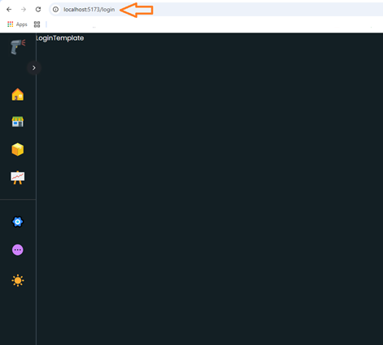.
7. Regresamos al archivo **`src/components/templates/LoginTemplate.tsx`**, y empezamos a maquetar lo que veríamos luego en pantalla:
```js
import styled from 'styled-components';

const Container = styled.div``;

function LoginTemplate() {
  return (
    <Container>
      <section className='contentCard'>
        <div className='card'></div>
      </section>
    </Container>
  );
}

export default LoginTemplate;
```
8. Vamos a la carpeta **"src/components/atoms"**, para agregar un componenente, de nombre **`Title.tsx`**, ejecutamos el _snippet_ `rfce` y hacemos los ajustes correspondientes:
```js
import styled from 'styled-components';

const Container = styled.div`
  height: 100vh;
`;

function Title() {
  return <Container>Title</Container>;
}

export default Title;
```
9. Como es un _atoms_ , lo podemos ajustar, el instructor sugiere que ni se requere el `return`, verificando si funciona sin errores:
```js
import styled from 'styled-components';

const Title = styled.span`
  font-weight: 700;
  font-size: 30px;
`;

export default Title;
```
10. Actualizamos el _barrel_ es decir el archivo **`src/index.ts`**.
11. Regresamos al componente **`src/components/templates/LoginTemplate.tsx`**, importamos el _atoms_ `Title` a través del `index.ts` y lo renderizamos con el texto `Ingresar`:
```js
import styled from 'styled-components';
import { Title } from '../../index.ts';

const Container = styled.div``;

function LoginTemplate() {
  return (
    <Container>
      <section className='contentCard'>
        <div className='card'>
          <Title>Ingresar</Title>
        </div>
      </section>
    </Container>
  );
}

export default LoginTemplate;
```
12. Agregamos en el _css_ del `Container`del archivo **`src/components/templates\LoginTemplate.tsx`**, algunos estilos:

* Sugerido por Copilot:
```css
const Container = styled.div`
  height: 100vh;
  display: flex;
  justify-content: center;
  align-items: center;

  .contentCard {
    width: 100%;
    max-width: 400px;
    padding: 20px;
    background-color: #f8f9fa;
    border-radius: 8px;
    box-shadow: 0 2px 10px rgba(0, 0, 0, 0.1);
    
    .card {
      text-align: center;
    }
  }
`;
```
* Lo que solicita el Instructor:
```css
const Container = styled.div`
  height: 100vh;
  display: flex;
  justify-content: center;
  align-items: center;
`;
```
13. Clonamos este archivo [**`InputText2.jsx`**](https://github.com/Franklin369/pos-react-login/blob/main/src/components/organismos/formularios/InputText2.jsx), en el siguiente archivo: <br> **`src/components/organisms/forms/InputText2.tsx`**.
14. Por ahora solo tenemos un error :<br> `Binding element 'children' implicitly has an 'any' type.`, <br> lo corregimos de la siguiente manera:
```js
import styled from 'styled-components';
import { type ReactNode } from 'react';

export function InputText2({ children }: { children: ReactNode }) {
  return (
    <Container>
      <div className='form__group field'>{children}</div>
    </Container>
  );
}
const Container = styled.div`
...
`;
```
15. Actualizamos el _barrel_ es decir el archivo **`src/index.ts`**.
16. En el archivo **`src/components/templates/LoginTemplate.tsx`**, debajo del renderizado del `</Title>`, agregamos la etiqueta `<form` y ponemos estos otros elementos:
```js
        <div className='card'>
          <Title>Ingresar</Title>
          <form action=""></form>
        </div>
```
17. Dentro del `<form` renderizamos el componente `<InputText2`, lo importamos de `index.ts` y dentro de este empezamos con las etiquetas `label` e `input`:
```js
        <div className='card'>
          <Title>Ingresar</Title>
          <form action=''>
            <InputText2>
              <label htmlFor=''></label>
              <input type='text' />
            </InputText2>
          </form>
        </div>
```
18. Empezamos poniendo la etiqueta `input` un `className`, con el valor de `'form__field'`.
19. A la etiqueta `input` le agrego un `placeholder`, `name` y `id` con el texto de `'email'`.
20. Aprovecho para ponerle a label en el `for` el nombre de `email`.
21. Copio todo el componente `<InputText2`, y cambio los nombre de `email`, por `password`, lo mismo que el `type`:
```js
          <form action=''>
          <InputText2>
              <label htmlFor='email'></label>
              <input type='text' className='form__field' placeholder='email' name='email' id='email'/>
            </InputText2>            <InputText2>
              <label htmlFor='password'></label>
              <input type='password' className='form__field' placeholder='password' name='password' id='password'/>
            </InputText2>
          </form>
```
22. Así luce hasta el momento la página `login`:<br>


### Agregando Buttons (01:29:52)


1. Empezamos clonando del repositorio el archivo [**`Btnsave.jsx`**](https://github.com/Franklin369/pos-react-login/blob/main/src/components/moleculas/Btnsave.jsx), en el archivo **`src/components/molecules/SaveButton.tsx`**, con los ajustes respectivos, como el nombre de la función a exportar por esta: <br> `export function SaveButton({...`
2. Tenemos errores varios, pero el primero a solucionar es el de:<br> `Module '"../../index"' has no exported member 'Icono'.`, se logra clonando del repositorio [**`Icono.jsx`**](https://github.com/Franklin369/pos-react-login/blob/main/src/components/atomos/Icono.jsx), en el archivo nuevo de nombre **`src/components/atoms/Icon.tsx`**, con el respectivo ajuste.
3. El error que tenemos de `Property '$color' does not exist on type 'ExecutionContext' `, lo solucionamos con una `interface`, quedando así el archivo:
```js
import styled from 'styled-components';
interface IconoProps {
  $color: string;
}

export const Icono = styled.span<IconoProps>`
  display: flex;
  align-items: center;
  text-align: center;
  font-size: 20px;
  color: ${(props) => props.$color};
`;
```
4. Actualizamos el _barrel_ es decir el archivo **`src/index.ts`**.
5. Regresamos al archivo **`src/components/molecules/SaveButton.tsx`**, revisamos los errores que todavía tenemos por corregir, añadiendo una `interface`:
```js
...
import type { JSX } from 'react';


interface SaveButtonProps {  
  funcion?: ()=> void; // Optional, to pass a function on click
  titulo: string;
  bgcolor: string; 
  icono?: JSX.Element; // import type { JSX } from 'react';
  url?: string; // Optional, if you want to use it as a link
  color: string; // Optional, to set the text color of the button
  disabled?: boolean; // Optional, if you want to disable the button
  width?: string; // Optional, to set the width of the button
}

export function SaveButton({
  funcion,
  titulo,
  bgcolor,
  icono,
  url,
  color,
  disabled,
  width,
}: SaveButtonProps) {
  return (
    ...
  )
}
```
6. Sigo viendo errores, por el manejo del signo `$` para algunas variables, vemos como se puede solucionar en el _css_ del `Container`:
```js
const Container = styled.button<{ $width?: string; $bgcolor: string; $color: string; }>`
  font-weight: 700;
  display: flex;
  font-size: 15px;
  padding: 10px 25px;
  border-radius: 16px;
  background-color: ${(props) => props.$bgcolor};
  border: 2px solid rgba(50, 50, 50, 0.2);
  border-bottom: 5px solid rgba(50, 50, 50, 0.2);
  transform: translate(0, -3px);
  cursor: pointer;
  transition: 0.2s;
  transition-timing-function: linear;
  color: rgb(${(props) => props.$color});
  align-items: center;
  justify-content: center;
  width: ${(props) => props.$width};
  .content {
    display: flex;
    gap: 12px;
  }
  &:active {
    transform: translate(0, 0);
    border-bottom: 2px solid rgba(50, 50, 50, 0.5);
  }
  &[disabled] {
    background-color: #646464;
    cursor: no-drop;
    box-shadow: none;
  }
`;
```
7. Vamos al archivo **`src/components/templates/LoginTemplate.tsx`**, donde vamos a renderizar el componente `<SaveButton`:
```js
          <form action=''>
            ...
            <InputText2>
              ...
              <SaveButton />
            </InputText2>
          </form>
```
8. Podemos poner propiedades al momento de renderiar `<SaveButton`:
```js
              <SaveButton
                titulo='INGRESAR'
                bgcolor='#1cb0f6'
                color='255,255,255'
                width='100%'
              />
            </InputText2>
```
9. Así se ve hasta el momento la pantalla, con el primer botón: <br>
10. Creo un archivo en la carpeta **"atoms"** de nombre **`Line.tsx`**, con este código:
```js
import styled from 'styled-components';

export const Linea = styled.div`
  background-color: ${({theme}) => theme.color2};
  height: 2px;
  border-radius: 15px;
  margin: 20px 0;
  position: relative;
  text-align: center;
`;
```
11. Actualizamos el _barrel_ es decir el archivo **`src/index.ts`**.
12. En el archivo **`src/components/templates/LoginTemplate.tsx`**, importamos `Linea` de `index.ts` y lo renderizamos debajo del cierre de la etiqueta `</form>`:
```js
          <Linea>
            <span>O</span>
          </Linea>
```
13. Agregamos en el archivo **`src/components/atoms/Line.tsx`**, a la constante `Linea`, en el _css_, estilos para el `span`:
```css
  span{
    top: -10px;
    position: absolute;
    background-color: #${({theme}) => theme.bgtotal};
    text-align: center;
    padding: 0 5px;
    color: ${({theme}) => theme.color2};
    font-weight: 700;
  }
```
14. Así se ve la pantallas hasta el momento:<br>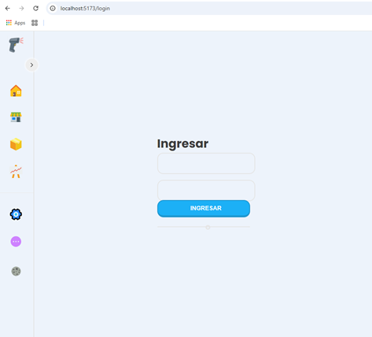
15. Debajo de `Linea` agregamos otro renderizado de `<SaveButton`, con algunas propiedades:
```js
          <SaveButton
            titulo='Google'
            bgcolor='#fff'
            color='0,0,0'
            width='100%'
            icono={<v.iconogoogle/>}
          />
```
16. Debemos importar las variables `v` del archivo `'../../styles/variables.ts'`, que es de donde sacamos el:<br>`icono={<v.iconogoogle/>}`
17. Así luce nuestra pantalla de `login`:<br>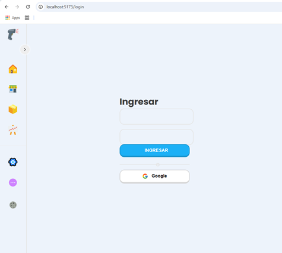


### Culminando diseño (01:41:00)

1. En el archivo **`src\components\templates\LoginTemplate.tsx`**, añadimos para el `Container`, algunos estilos:
```css
const Container = styled.div`
  height: 100vh;
  display: flex;
  justify-content: center;
  align-items: center;
  text-align: center;
  .contentCard{
    height: 100%;
    width: 100%;
    display: flex;
    flex-direction: column;
    align-items: center;
    justify-content: center;
    .card{
      display: flex;
      flex-direction: column;
      justify-content: center;
      height: 100%;
      width: 100%;
      padding: 10px;
      margin: 0 auto;
    }
  }
`;
```
2. Importamos `{Device}` del archivo `'../../styles/breakpoints.ts'`.
3. Agregamos los _responsive_ dentro del _css_ para la clase `.card{`:
```css
    .card{
      ...
      @media ${Device.tablet} {
        width: 400px;
      }
    }
```
4. Vamos a eliminar la clase `.ContentCard`.
5. El renderizado de ` <SaveButton`, lo ponemos por fuer del `<InputText2`.
6. En el archivo **`src/components/atoms/Title.tsx`**, agrego mas estilos pero los pongo de dinámica, es decir que llegan como _props_ desde donde lo llaman o renderizan:
```js
import styled from 'styled-components';
interface TitleProps {
  $paddingBottom: string;
}

const Title = styled.span<TitleProps>`
  font-weight: 700;
  font-size: 30px;
  padding-bottom: ${(props) => props.$paddingBottom || '10px'};
`;

export default Title;
```
7. Regresamos al archivo **`src/components/templates/LoginTemplate.tsx`**, al momento de renderiar el `<Title`, le añadimos una propiedad de nombre `paddingBottom`:
```js
          <Title $paddingBottom='20px'>Ingresar</Title>
```
8. Así luce nuestra pantalla en `tablet` y en `mobile`:<br> 


### Footer (01:46:19)

1. Empezamos clonando del repositorio [**`Footer.jsx`**](https://github.com/Franklin369/pos-react-login/blob/main/src/components/organismos/Footer.jsx), en el archivo <br>**`src/components/organisms/Footer.tsx`**<br> El contenido no genera errores.
2. Ejecutamos en una terminal el siguiente comando:
```bash
pnpm i --save-dev @types/node -E
```
3. Creo el archivo **`.env`**, con los siguiente elementos:
```ini
VITE_RUT="7#######-#"
VITE_YEAR="2025"
VITE_SITE=Alquimia Software
VITE_PHONE="+57 ### ### ###"
```
4. Hacemos unos cambios en el contenido o textos para nuestro propósito, haciendo use de las variables de ambiente:
```js
export function Footer() {
  return (
    <Container>
      <section className='lock'>
        <GiPadlock />
        <span>
          Esta es una página segura de {import.meta.env.VITE_SITE}. Si tienes dudas sobre
          la autenticidad de la web, comunícate con
          <br /> nosotros al {import.meta.env.VITE_PHONE} o a través de nuestros medios
          digitales.
        </span>
      </section>
      <section className='derechos'>
        <span>
          {import.meta.env.VITE_SITE} - RUT: {import.meta.env.VITE_RUT}
        </span>
        <div className='separador'></div>
        <span>Todos los derechos reservados</span>
        <div className='separador'></div>
        <span>
          © {import.meta.env.VITE_YEAR} {import.meta.env.VITE_SITE}
        </span>
      </section>
    </Container>
  );
}
```
5. Actualizamos el _barrel_ es decir el archivo **`src/index.
6. Vamos al archivo **`src/components/templates/LoginTemplate.tsx`**, se añade la importación de `Footer` del `'../../index.ts'`, y se renderiza antes de cerrar el `</Container>`.
7. Así nos sale en pantalla:<br>
8. Se debe ajustar la posición del `Footer`, lo hacemos con estilos en el `Container`:
```css
const Container = styled.div`
  ...;
  flex-direction: column;

  .card {
    ...
  }
`;
```
9. Elimino la etiqueta `<section>` y ahora si el `Footer` se ubica del todo abajo:<br> 
10. En el archivo **`.gitignore`**, para no subir al repositorio, se añaden los tipo **`*.env`** y similares. 


### Conectando a SUPABASE (01:47:35)


>[!TIP]  
> Debemos ingresar a la página de [supabase](https://supabase.com/dashboard), y crear una cuenta con  `github`:
>
>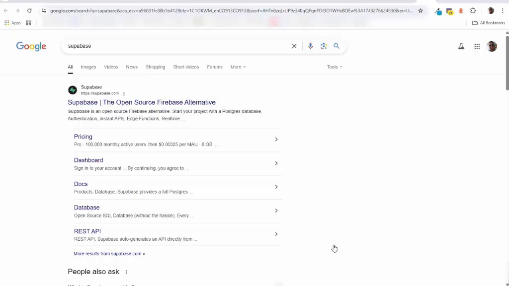

1. Entramos al sitio [supabase](https://supabase.com/dashboard).
2. Si nos falta o no tenemos la _Organization_ de nombre `Tutorials`, damos clic al botón `[New Organization]` y le ponemos de nombre `Tutorials` y damos clic en el botón `[Create Organization]`:<br> 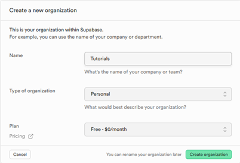
3. Regresamos al [supabase/dashboard](https://supabase.com/dashboard).
4. Damos clic al boton de `[New Project]` y dejamos la _Organization_ de nombre `Tutorials`.
5. Completamos el formulario:
    * Organization: `Tutorials`
    * Project-name: `SalesSystem`
    * Database password: ~~xoxoxoxo~~ (Usamos una buena contraseña)
    * Region: `East US (North Virginia)`
* Así se ve el formulario:<br>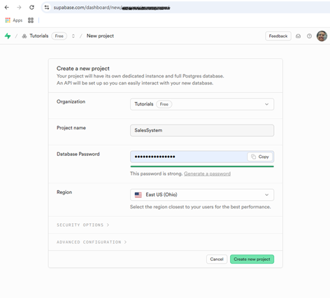 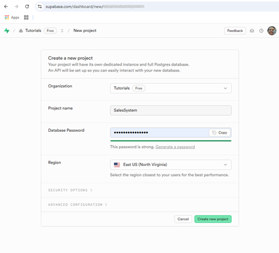
6. Y le damos clic en el botón `[Create new project]`: <br>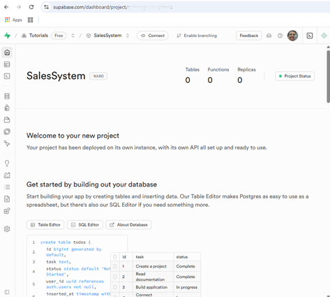.
7. En la página de `Supabase`, buscamos el símbolo de configuración que es como engranaje o _gear_ <svg xmlns="http://www.w3.org/2000/svg" width="32" height="32" viewBox="0 0 24 24" fill="none" stroke="currentColor" stroke-width="1.5" stroke-linecap="round" stroke-linejoin="round" class="lucide lucide-settings"><path d="M12.22 2h-.44a2 2 0 0 0-2 2v.18a2 2 0 0 1-1 1.73l-.43.25a2 2 0 0 1-2 0l-.15-.08a2 2 0 0 0-2.73.73l-.22.38a2 2 0 0 0 .73 2.73l.15.1a2 2 0 0 1 1 1.72v.51a2 2 0 0 1-1 1.74l-.15.09a2 2 0 0 0-.73 2.73l.22.38a2 2 0 0 0 2.73.73l.15-.08a2 2 0 0 1 2 0l.43.25a2 2 0 0 1 1 1.73V20a2 2 0 0 0 2 2h.44a2 2 0 0 0 2-2v-.18a2 2 0 0 1 1-1.73l.43-.25a2 2 0 0 1 2 0l.15.08a2 2 0 0 0 2.73-.73l.22-.39a2 2 0 0 0-.73-2.73l-.15-.08a2 2 0 0 1-1-1.74v-.5a2 2 0 0 1 1-1.74l.15-.09a2 2 0 0 0 .73-2.73l-.22-.38a2 2 0 0 0-2.73-.73l-.15.08a2 2 0 0 1-2 0l-.43-.25a2 2 0 0 1-1-1.73V4a2 2 0 0 0-2-2z"></path><circle cx="12" cy="12" r="3"></circle></svg>, al final del menú a la izquierda.
8. En el mismo menú de la izquierda buscamos `API` o `Data API`, copiamos la `URL` y la llevamos al archivo **`.env`**, con el siguiente _key_ `VITE_APP_SUPABASE_URL=`.
9.  Le damos clic al botón `[Go to API Keys]` o en el mismo menú de la izquierda buscamos `API Keys`.
10. Copiamos el `anon` `public`, en el arhico **`.env`** con la _key_ `VITE_APP_SUPABASE_ANON_KEY=`.
11. Se crea el siguiente archivo **`src/supabase/supabase.config.tsx`**.
12. Entramos a este sitio [Use Supabase with React](https://supabase.com/docs/guides/getting-started/quickstarts/reactjs) y buscamos el paso `(3)`, para ejecutar este comando en una `TERMINAL`:
```bash
pnpm add @supabase/supabase-js -E
```
13. Regresamos al archivo **`src/supabase/supabase.config.tsx`**, y añadimos este código:
```js
import { createClient } from '@supabase/supabase-js';

export const supabase = createClient(
  import.meta.env.VITE_SUPABASE_URL || '',
  import.meta.env.VITE_SUPABASE_ANON_KEY || ''
);
```
14. Volvemos al sitio de `Supabase`y buscamos `Authentication`, con este icono <svg xmlns="http://www.w3.org/2000/svg" width="32" height="32" viewBox="0 0 24 24" fill="none" stroke="currentColor" stroke-width="1.5" stroke-linecap="round" stroke-linejoin="round" class="lucide lucide-auth "><path d="M5.24121 15.0674H12.7412M5.24121 15.0674V18.0674H12.7412V15.0674M5.24121 15.0674V12.0674H12.7412V15.0674M15 7.60547V4.60547C15 2.94861 13.6569 1.60547 12 1.60547C10.3431 1.60547 9 2.94861 9 4.60547V7.60547M5.20898 9.60547L5.20898 19.1055C5.20898 20.21 6.10441 21.1055 7.20898 21.1055H16.709C17.8136 21.1055 18.709 20.21 18.709 19.1055V9.60547C18.709 8.5009 17.8136 7.60547 16.709 7.60547L7.20899 7.60547C6.10442 7.60547 5.20898 8.5009 5.20898 9.60547Z"></path></svg>, y buscamo `Sign In / Providers`.
15. En la lista `Auth Providers`, activamos si falta `Email` y `Google`, aunque para este último requiere mas pasos.


### AuthStore (01:54:48)

1. Empezamos buscando en este sitio: [`Consola de Google Cloud`](https://cloud.google.com/storage/docs/cloud-console?hl=es-419).
2. Dar clic al botón [`Consola`] y debe aparecer algo similar a esto: <br> 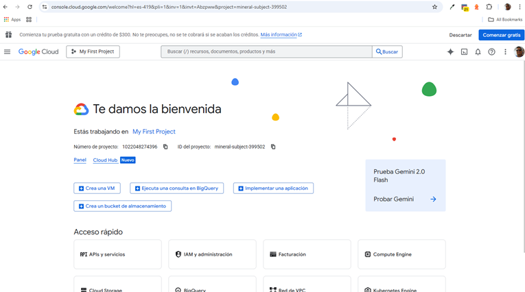.
3. Clic en el menú de hamburguesa en la parte superior izquierda: <svg xmlns="http://www.w3.org/2000/svg" width="32" height="32" fill="currentColor" class="bi bi-list" viewBox="0 0 16 16">  <path fill-rule="evenodd" d="M2.5 12a.5.5 0 0 1 .5-.5h10a.5.5 0 0 1 0 1H3a.5.5 0 0 1-.5-.5m0-4a.5.5 0 0 1 .5-.5h10a.5.5 0 0 1 0 1H3a.5.5 0 0 1-.5-.5m0-4a.5.5 0 0 1 .5-.5h10a.5.5 0 0 1 0 1H3a.5.5 0 0 1-.5-.5"/></svg>.
4. Luego seleccionamos `APIs y Servicios` y ahí `APIs y Servicios habilitados`: <br> 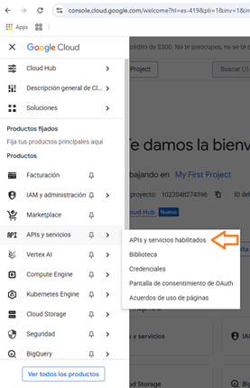
5. Damos clic en `Credenciales`.
6. Arriba en `+Crear Credenciales`, empezamos con `ID de cliente de OAuth`. 
7. Damos clic en el botón de _Warning_ [`Configurar pantalla de consentimiento`].
8. Se requiere Completar el proceso de `Información de marca`:<br>
9. Regresamos a `APIs y Servicios` y ahí `APIs y Servicios habilitados`: <br> 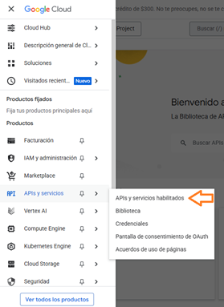.
10. Entramos en el Menú de la izquierda a `Credenciales`.
11. Seleccionamos la parte de arriba `+Crear Credenciales` y de las opciones clic en ` ID de cliente de OAuth `.
12. En `Tipo de Aplicación`, seleccionamos `Aplicación Web`:<br>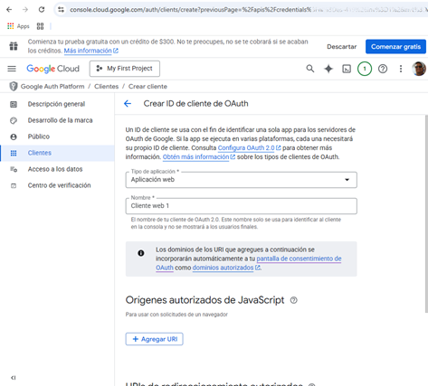
13. En el `Nombre` va `Sales System`.
14. En la sección `URIs de redireccionamiento autorizados`, damos clic al botón `+ Agregar URI`.
15. Regresamos al sitio de [`Supabase - > Google`](https://supabase.com/dashboard/project/{proyect}/auth/providers?provider=Google):<br>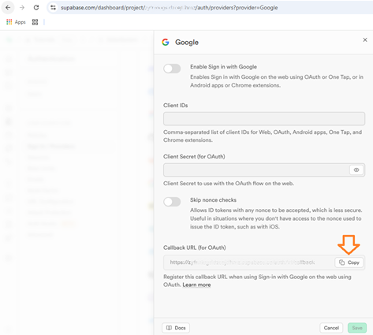
16. Seleccionamos de `Callback URL (for OAuth)` el texto para dar un `copy`.
17. Y lo llevamos al sitio de `Google` en `Crear ID de cliente de OAuth` y lo pegamos en la `URI` pendiente.
18. Y allí le damos clic en `Crear` y esperamos varios minutos.
19. Sale una ventana y copiamos el `ID de cliente`: <br> "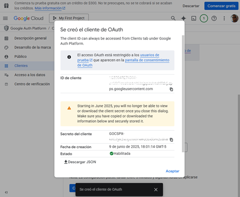.
20. Se pega en la pagina de `Supabase` pega en `Client ID for OAuth`.
21. Se repite el proceso de `Secreto del Cliente` de `Google`, para `Client Secret ` de `Supabase`.
22. En `Supabase` estar seguro que el botón `Enable Sign in in Google` esté activo o en verde y dar clic en el botón `[Save]`.
23. Nos vamos a este sitio a revisar los pasos a proceder [`Supabase -> Login with Google`](https://supabase.com/docs/guides/auth/social-login/auth-google).
24. Creamos el archivo **`src/store/AuthStore.tsx`**, empezamos con la importación de `{create}` de `zustand`:<br>`import { create } from 'zustand';`
25. Creamos una función tipo flecha de nombre `useAuthStore` y luego la exportamos:
```js
export const useAuthStore = create((set) => ({
  
}));
```
26. Creamos el primer objeto que será una función de nombre `loginGoogle` y hacemos uso de la información en esta sección de la página [`Saving Google tokens #`](https://supabase.com/docs/guides/auth/social-login/auth-google#saving-google-tokens):
```js
const useAuthStore = create((set) => ({
  loginGoogle: async () => {
    // signInWithOAuth - this method is used to sign in with Google OAuth
    await supabase.auth.signInWithOAuth({
      provider: 'google',
      options: {
        redirectTo: window.location.origin,
      },
    });
  },
}));
```
27. El error en la línea de `supabase.auth.signInWithOAuth`, se requiere importar  `{supabase}` de `'../supabase/supabase.config'`.
28. En este sitio buscamos como desconectarnos de la sesión [``Signing out](https://supabase.com/docs/guides/auth/signout), y parece ser este simple comando :<br> `const { error } = await supabase.auth.signOut()`, completamos todo el códio de esta manera:
```js
import { create } from 'zustand';
import { supabase } from '../supabase/supabase.config';

interface AuthStore {
  loginGoogle: () => Promise<void>;
  logout: () => Promise<void>;
}

// eslint-disable-next-line @typescript-eslint/no-unused-vars
export const useAuthStore = create<AuthStore>((set) => ({
  loginGoogle: async () => {
    // signInWithOAuth - this method is used to sign in with Google OAuth
    await supabase.auth.signInWithOAuth({
      provider: 'google',
      options: {
        redirectTo: window.location.origin,
      },
    });
  },
  logout: async () => {
    // signOut - this method is used to sign out the user
    const { error } = await supabase.auth.signOut();
    if (error) {
      console.log('Error signing out:', error.message);
    }
  },
}));
```
>[!TIP]  
>#### En el contexto de cerrar sesión en una aplicación o sitio web, "signing out" y "logout" son esencialmente intercambiables y significan lo mismo: finalizar una sesión y desconectarse de una cuenta. 
>El significado de ambos términos: 
>*"Signing out" (o "sign out"):*
>Se utiliza para indicar el acto de cerrar sesión o desconectar de una cuenta, especialmente en el contexto de aplicaciones o sitios web.
>*"Logout":*
>Es una forma más informal de decir "signing out". También significa cerrar sesión o desconectar de una cuenta. 
>_En resumen:_ 
>"Signing out" y "logout" son sinónimos en el contexto de cerrar sesión. La forma en que se use dependerá del contexto específico, pero ambos significan lo mismo. 
29. Actualizamos el _barrel_ es decir el archivo **`src/index.ts`**.
30. Abrimos el archivo **`src/components/templates/LoginTemplate.tsx`**, para hacer la prueba de ingresar con una cuenta de `Google`, en la función `LoginTemplate()`, hago uso de la función nueva de `zustand` de nombre `useAuthStore`:
```js
import {
  ...
  useAuthStore,
} from '../../index.ts';
...
function LoginTemplate() {
  const { loginGoogle } = useAuthStore();
  ...
}
```
30. Abajo en el renderizado de `<SaveButton titulo='Google'`, activamos una nueva propiedad o parámetro de nmbre `funcion` y la igualamos a la de `zustand` de nombre `loginGoogle`:
```js
        <SaveButton
          funcion={loginGoogle}
          titulo='Google'
          bgcolor='#fff'
          color='0,0,0'
          width='100%'
          icono={<v.iconogoogle />}
        />
```
31. Luego hacemos las respectiva pruebas para verificar la funcionalidad del botón y el ingreso usando una cuenta de `Google`.

