# Crea y Despliega un Sistema de Ventas FULL STACK con REACT y PostgreSQL | 2025

## SalesSystem

[](https://www.youtube.com/watch?v=URG4rnmdThs&t=270s)

## Section 1: Precondiciones (00:00:00)

1. Instalar `NODEJS` y `npm` en su sistema, usando el `nvm`:
  [Instalar múltiples versiones de Node.js en Windows](https://rafaelneto.dev/blog/instalar-multiples-versiones-nodejs-windows/).

```bash
nvm install [version]
nvm use [version]
```

2. Verificar las versiones de `NODEJS` instaladas en una `TERMINAL`:

```bash
nvm list
```

3. Instalar también el `pnpm` [pnpm installation](https://pnpm.io/installation), es mas rápido que el  `npm`.

4. Instalar [Visual Studio Code](https://code.visualstudio.com/insiders/).

5. Dentro de `Visual Studio Code`, se recomiendan estas extensiones:
* `ES7+ React/Redux/React-Native snippets` de `dsznajder` 4.4.x.
* `Better Comments` de `Aaron Bond` 3.0.x.
* `ESLint` de `Microsoft` 3.0.x.
* `Paste JSON as Code` de `quicktype` 23.0.x.
* `Prettier - Code formatter` de `Prettier` 11.0.x.
* `React Create Component` de `Javier Gutierrez` 1.5.x.
* `Simple React Snippets` de `Burke Holland` 1.2.x
* `TSLint` de `Microsoft` 1.3.x.
* `vscode-styled-components` de `Styled Components` 1.7.x.

## Section 2: Login

>[!IMPORTANT]  
>
>### Temas puntuales de la sección (Login) 
>
>**Descripción de la sección:**  
>En esta sección exploraremos todo lo relacionado con el desarrollo del módulo de `Login`. Aprenderás desde la creación del proyecto hasta la implementación completa del sistema de autenticación utilizando herramientas modernas como `Zustand` y `Supabase`. Además, diseñaremos una interfaz intuitiva y funcional, enfocándonos en detalles como maquetado, estilos globales, y componentes reutilizables.
>
>Entre los temas que abordaremos están:
>
>* Configuración inicial del proyecto con herramientas como `Auto Barrel`.
>* Organización del código y buenas prácticas en estructuras de carpetas.
>* Diseño del login con componentes responsivos y ajustes de estilos.
>* Implementación de un `AuthStore` para gestionar el estado global.
>* Conexión del proyecto con `Supabase` para autenticar usuarios.
>* Incorporación de funciones avanzadas como manejo del contexto y gestión de datos del usuario.
>
>Al finalizar esta sección, tendrás un módulo de login totalmente funcional y estilizado, listo para integrarse en cualquier aplicación.

### Creando el Proyecto (00:04:30)

1. Estando en la raíz de nuestro proyecto ejecutamos este comando
usando `VITE`:
```bash
pnpm create vite@latest . --template react-ts
```

>[!NOTE]  
>* El instructor sugiere el uso de `npm`, prefiereo el uso de `pnpm`.
>* También sugiere usar `JavaScript`, pero lo prefiero en `TypeScript`. Es mas exigente y pone mas retos, me gusta mas.

2. Nos consulta lo siguiente, en el proceso de instalación:
```dos
  Current directory is not empty. Please choose how to proceed:
│  ○ Cancel operation
│  ○ Remove existing files and continue
│  ● Ignore files and continue
```
* Seleccionamos la tercera `Ignore files and continue`.
```dos
Package name:
│  salessystem
```
* Lo dejamos así, con el `salessystem`.
```dos
◇  Scaffolding project in E:\tutorials\react\SalesSystem...
│
└  Done. Now run:

  pnpm install
  pnpm run dev
```
* Nos sugiere esto al final.

3. Así luce nuestro proyecto hasta el momento:  
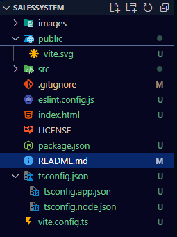


4. Abrimos el **`package.json`** y eliminamos todos los _carets_ (`^`).

5. Ejecutamos en una `TERMINAL`, las dos líneas que nos sugirió al
final del proceso de creación del proyecto en `react`:
```bash
pnpm install
pnpm run dev
```
* Nos arroja esta respuesta:
```bash
  VITE v6.3.5  ready in 940 ms

  ➜  Local:   http://localhost:5173/
  ➜  Network: use --host to expose
  ➜  press h + enter to show help
```
* Así luce la página inicial:  
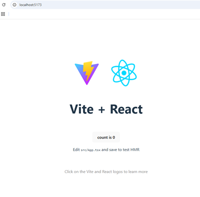


### Instalar `Auto Barrel` (00:06:44)

1. Instalar la extensión en `Visual Studio Code` de nombre `Auto Barrel for VSCode` de `Manuel Gil` 1.19.x.
2. Acá está el link para descargar el propuesto por el instructor: [auto-barrel-1.10.0](images/auto-barrel-1.10.0_vsixhub.com.zip).


### Configuración de `Auto Barrel` (00:07:37)

>[!NOTE]  
>El instructor habla de configurar el `Auto Barrel` por
>`Extension Settings`, pero este no requiere dicho cambio en la versión 1.19.x.

### Organizando Carpetas (00:08:01)

1. Creamos la carpeta **"components"** dentro de **"src"**.

2. Creamos la carpeta **"pages"** dentro de **"src"**.

3. Creamos la carpeta **"routes"** dentro de **"src"**.

4. Creamos la carpeta **"styles"** dentro de **"src"**.

5. Creamos la carpeta **"utils"** dentro de **"src"**.

6. Creamos la carpeta **"supabase"** dentro de **"src"**.

7. Creamos la carpeta **"store"** dentro de **"src"**.

### Instalando dependencias básicas (00:09:32)

1. Empezamos en una `TERMINAL` con
[`styled-components`](https://www.npmjs.com/package/styled-components) y su respectivo
[`@types`](https://www.npmjs.com/package/@types/styled-components):
```bash
pnpm add styled-components @types/styled-components -E
```

2. En la `TERMINAL` seguimos con
[`react-router-dom`](https://www.npmjs.com/package/react-router-dom) y el respectivo
[`@types`](https://www.npmjs.com/package/@types/react-router-dom):
```bash
pnpm add react-router-dom @types/react-router-dom -E
```

3. En la `TERMINAL` otra librería o dependencia,
[`react-icons`](https://www.npmjs.com/package/react-icons)
y no requiere el adicional
[`@types`](https://www.npmjs.com/package/@types/react-icons)
pues el sitio dice "`This is a stub types definition. react-icons provides its own type definitions, so you do not need this installed`":
```bash
pnpm add react-icons -E
```

4. En la `TERMINAL` esta dependencia
[`Iconify for React`](https://www.npmjs.com/package/@iconify/react)
, no requiere `@types`, este sitio no existe:
```bash
pnpm add --save-dev @iconify/react -E
```

### Agregando Estilos Globales (00:11:55)

1. Empezamos borrando el archivo **`src/App.css`**.
2. Borramos también el **`src/index.css`**.
3. Borramos el contenido del `return` del archivo **`src/App.tsx`**, dejando dentro de la etiqueta `<>` vacía, esto `<span>Hola mundo</span>`.
4. Borramos de este mismo archivo el _hook_ `useState` y todos los `import`.
5. Del archivo **`src\main.tsx`**, borramos la importación del `index.css`.
6. Ajustamos también otras cosas en el archivo **`index.html`**:
```html
<!doctype html>
<html lang="es-CO">
  <head>
    <meta charset="UTF-8" />
    <link rel="icon" type="image/svg+xml" href="/vite.svg" />
    <meta name="viewport" content="width=device-width, initial-scale=1.0" />
    <title>POSS 1.0.0</title>
  </head>
  <body>
    <div id="root"></div>
    <script type="module" src="/src/main.tsx"></script>
  </body>
</html>
```
7. Agrego la imagen de un ícono para nuestro proyecto en extensión `.PNG`, la obtengo con la _A.I_ de `Copilot`, y consigo dos imágens, esta  y esta 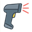, que la voy a copiar en las carpetas **"public"** y **"src/assets"**, en diferentes tamaños.
8. En el archivo **`index.html`**, cambiamos la `url` del `<link rel="icon"`, por el de la imagen de 32x32:
```html
    <link rel="icon" type="image/png" href="/poss2_32x32.png" />
```
9. Creamos el archivo **`GlobalStyles.tsx`** en la carpeta **"src/styles"**.
10. Empezamos importando el `'styled-components'` el elemento `{createGlobalStyle}`.
11. Exportamos la constante `GlobalStyles` qu es igual al valor que recién importamos mas un grupo de valores dentro de comillas invertidas o en el teclado _ascii_ el [`ALT`]+[9]+[6]:
```js
import { createGlobalStyle } from 'styled-components';

export const GlobalStyles = createGlobalStyle`
  @import url('https://fonts.googleapis.com/css2?family=Poppins:wght@200;300;400;500;600;700;800;900&display=swap');
  body{
    margin: 0;
    padding: 0;
    box-sizing: border-box;
    font-family: 'Poppins', sans-serif;
    background-color: pink; /* #f4f4f4;*/
    color: #333;
  }
`;
```
12. Vamos a crear un `Auto Barrel`, en la carpeta **"src"**, esto crea un arhivo de nombre **`index.ts`**, el instructor sugiere que solo se utilice para _Componentes_, con esto por ahora:
```js
export { default as App } from './App';
export * from './main';
export * from './styles/GlobalStyles';
```
13. En el archivo **`src/App.tsx`**, agregamos un `import` al `./index.ts` el elemento `{GlobalStyles}`, y el renderizado de `<GlobalStyles />`:
```js
import { GlobalStyles } from './index.ts';

function App() {
  return (
    <div>
      <GlobalStyles />
      <h1>Hola mundo</h1>
    </div>
  );
}

export default App;
```
14. Y así se ve la pantalla hasta el momento: </br> 


### Primer maquetado (00:20:40)

1. En el archivo **`src/App.tsx`**, agregamos esta importación: </br> `import styled from 'styled-components';`.
2. Creamos una constante `Container` igual a `styled.main` al lado de `main` abrimos y cerramos la comilla invertida o en el teclado _ascii_ el [`ALT`]+[9]+[6]:
```js
import styled from 'styled-components';
import { GlobalStyles } from './index.ts';

const Container = styled.main`
  // Es un componente de estilo
  display: grid;
  grid-template-columns: 1fr;
  background-color: lightyellow;
`;

function App() {
  return (
    <Container>
      <GlobalStyles />
      <section className='leftSidebar'>
        <p>uno</p>
      </section>
      <section className='mainMenu'>
        <p>dos</p>
      </section>
      <section className='rightRoutes'>
        <p>tres</p>
      </section>
    </Container>
  );
}

export default App;
```
3. Creamos el archivo **`breakpoints.ts`** y copiamos el contenido del repositorio [breakpoints.jsx](https://github.com/Franklin369/pos-react-login/blob/main/src/styles/breakpoints.jsx). </br> Como explica el instructor, estos son _objetos_ No _componentes_ por ende la extensión debe ser `.ts`.
4. En el archivo **`src/App.tsx`**, en la definición del componente `Container`, agregamos definiciones de cada clase usada en las `<section`:
```css
const Container = styled.main`
  // Es un componente de estilo
  display: grid;
  grid-template-columns: 1fr;
  background-color: lightyellow;
  .leftSidebar{
    display: none; /* Oculta la barra lateral izquierda */
    background-color: lightblue;
  };
  .mainMenu{
    position: absolute;
    background-color: lightgreen;
  };
  .rightRoutes{
    background-color: lightcoral;
  };
`;
```
5. Agregamos la importación de `./styles/breakpoints.ts` y de allí tomamos `{Device}`.
6. Luego en la misma definición del `Container`, agregamos los `@media`, relacionando con cada _objeto_ de `Device`:
```css
  @media ${Device.tablet} {
    grid-template-columns: 88px 1fr ; /* una columnas */
    .leftSidebar {
      display: initial; /* Barra lateral izquierda en tablets */
    }
    .mainMenu {
      position: none; /* Elimina la posición absoluta en tablets */
      width: 100%;
    }
    .rightRoutes {
      width: 100%;
    }
  }
```


### Definiendo secciones (00:32:29)

1. Al archivo **`src/App.tsx`**, agregamos mas estilos a la constante `Container`:
```css
...
  ...
  .rightRoutes {
    background-color: lightcoral;
    grid-column: 1; /* Ocupa toda la fila */
    width: 100%; /* Asegura que ocupe todo el ancho disponible */
  }
  @media ${Device.tablet} {
   ...
    .rightRoutes {
      width: 100%;
      grid-column: 2; /* Ocupa la segunda columna */
      width: calc(100% - 88px); /* Ajusta el ancho para ocupar el espacio restante */
    }
  }
```
2. En la carpeta **"src\pages"**, creamos el archivo **`Home.tsx`**, y ejecutamos el _snippet_ `rfce`:
```js
import React from 'react';

function Home() {
  return <div>Home</div>;
}

export default Home;
```
3. Cambiamos el único `import` por uno para tomar los dato de `"styled-components"` e igual creamos la constante `Container` para utilizarla como componente:
```js
import styled from 'styled-components';

const Container = styled.div``;

function Home() {
  return (
    <Container>
      <span>Home</span>
    </Container>
  );
}

export default Home;
```
4. Creamos una cuatro carpetas dentro de **"src/components"**:
* `atoms`
* `molecules`
* `organisms`
* `templates`
5. Dentro de la nueva carpeta **"src/components/templates"**, creamos el archivo **`HomeTemplate.tsx`**, ejecutamos el _snippet_, ajustamos la importación a 'styled-components' y añadimos la definición del componente `Container`:
```js
import styled from 'styled-components';

const Container = styled.div``;

function HomeTemplate() {
  return (
    <Container>
      <span>HomeTemplate</span>
    </Container>
  );
}

export default HomeTemplate;
```
6. En la carpeta **"src/routes"** creamos el archivo **`routes.ts`**, con este código inicial:
```js
import { Route, Routes, BrowserRouter } from 'react-router-dom';
import { Home } from '../index.ts';

function MyRoutes() {
  return (
    <BrowserRouter>
      <Routes>
        <Route path='/' element={<Home />} />
        <Route path='*' element={<div>404 Not Found</div>} />
      </Routes>
    </BrowserRouter>
  );
}

export default MyRoutes;
```
7. Actualizo el `Auto barrel`, es decir el archivo **`index.ts`** y esto es lo que debe mostrar hasta el momento:
```js
export { default as App } from './App';
export { default as HomeTemplate } from './components/templates/HomeTemplate';
export * from './main';
export { default as Home } from './pages/Home';
export { default as MyRoutes } from './routes/MyRoutes';
export * from './styles/GlobalStyles';
export * from './styles/breakpoints';
```
8. Luego regreso al archivo **`src/App.tsx`**, añado a la importación del `'index'`, el de `MyRoutes` y lo renderizo en la `classname` de nombre `'rightRoutes'`:
```js
function App() {
  return (
    <Container>
      <GlobalStyles />
      <section className='leftSidebar'>
        <p>Sidebar</p>
      </section>
      <section className='mainMenu'>
        <p>MainMenu</p>
      </section>
      <section className='rightRoutes'>
        <MyRoutes />
      </section>
    </Container>
  );
}
```
9. Dentro de la carpeta **"src/components/organisms"**, creamos otra carpeta de nombre `sidebar`, creamos un componente de nombre **`Sidebar.tsx`**, ejecutamos el _snippet_ `rfce` y le ajustamos para utilizar el `'styled-components'`:
```js

```
10. Actualizamos el `Auto Barrel` o el archivo **`index.ts`**.
11. Y en el archivo **`src/App.tsx`**, añado a la importación del `'index'`, el de `Sidebar` y lo renderizo en la `classname` de nombre `'leftSidebar'`:
```js
function App() {
  return (
    <Container>
      <GlobalStyles />
      <section className='leftSidebar'>
        <Sidebar />
      </section>
      <section className='mainMenu'>
        <p>MainMenu</p>
      </section>
      <section className='rightRoutes'>
        <MyRoutes />
      </section>
    </Container>
  );
}
```
12. Tomamos del archivo **`src/styles/GlobalStyles.tsx`**, el dato de `@import url` para los _fonts_ y lo llevamos para **`index.html`**:
```html
    <style>
      @import url("https://fonts.googleapis.com/css2?family=Poppins:wght@200;300;400;500;600;700;800;900&display=swap");
    </style>
```
13. Ahora si borramos de **`src/styles/GlobalStyles.tsx`**, ese valor de `@import url`.


### Definiendo return (00:43:22)

1. El archivo **`src/routes/MyRoutes.tsx`**, ya tiene el `return` para ser tratado como _Componente_.
2. En el archivo **`src\components\templates\HomeTemplate.tsx`**, agregamos unos elementos _css_, dentro de las comillas invertidas de la definición de `Container`:
```css
const Container = styled.div`
  height: 100vh;
`;
```
3. En el archivo **`src/pages/Home.tsx`**, Renderizo el componente `<HomeTemplate`, y lo importo del `'../index.ts'`:
```js
import styled from 'styled-components';
import {HomeTemplate} from '../index.ts'; 

const Container = styled.div``;

function Home() {
  return (
    <Container>
      <HomeTemplate/>
    </Container>
  );
}

export default Home;
```
4. En el archivo **`src/App.tsx`**, corrijo algunos estilos de _css_ para las clases `mainMenu` y `rightRoutes`,para el `@media ${Device.tablet}`:
```css
  @media ${Device.tablet} {
    grid-template-columns: 88px 1fr; /* una columnas */
    .leftSidebar {
      display: initial; /* Barra lateral izquierda en tablets */
    }
    .mainMenu {
      display: none;
    }
    .rightRoutes {
      grid-column: 2; /* Ocupa la segunda columna */
    }
  }
```
5. Así se ve la pantalla hasta el momento, tanto en presentación `tablet` o `mobile`: </br> 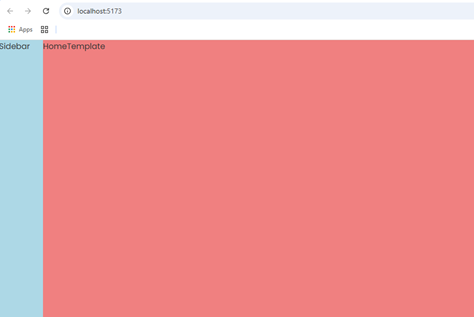 </br> 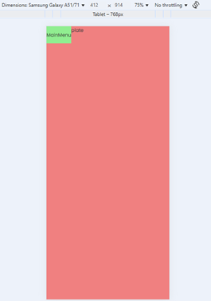


### Implementando temas con zustand (00:44:38)

1. En una `TERMINAL`, instalamos la despendencia de </br>[](https://www.npmjs.com/package/zustand)):
```bash
pnpm add zustand -E
```
2. En la carpeta **"src/store"**, es donde se va implementar el manejo de los estados de `Zustand`, y allí creamos un archivo de nombre **`ThemeStore.tsx`**.
3. En el nuevo archivo empezamos con una importación de `'Zustand'`:
```js
import { create } from 'zustand';

interface ThemeState {
  theme: 'light' | 'dark';
  toggleTheme: () => void;
}
export const useThemeStore = create<ThemeState>((set) => ({
  theme: 'light',
  toggleTheme: () =>
    set((state) => ({
      theme: state.theme === 'light' ? 'dark' : 'light',
    })),
}));
```
4. Agregamos en la carpeta **"src/styles"**, el archivo **`themes.ts`**, y le copiamos la información de esta ruta [`themes.jsx`](https://github.com/Franklin369/pos-react-login/blob/main/src/styles/themes.jsx).
5. En el archivo **`src/store/ThemeStore.tsx`** importamos de `'../styles/themes.ts'` los dos objetos `{Light, Dark}`.
6. Completamos el código de **`ThemeStore.tsx`**:
```js
import { create } from 'zustand';
import { Light, Dark } from '../styles/themes';

interface ThemeState {
  theme: 'light' | 'dark';
  themesStyle: typeof Light | typeof Dark;
  setTheme: () => void;
}
export const useThemeStore = create<ThemeState>((set, get) => ({
  theme: 'light',
  themesStyle: Light,
  setTheme: () => {
    const { theme } = get();
    set({ theme: theme === 'light' ? 'dark' : 'light' });
    set({ themesStyle: theme === 'light' ? Dark : Light });
  },
}));
```
7. Regresamos al archivo **`src/App.tsx`** importamos de `'styled-components'` el `{ThemeProvider}` y envolvemos todo debajo del `return` en el renderizado de `<ThemeProvider`:
```js
function App() {
  return (
    <ThemeProvider theme={{ mode: 'light' }}>
      <Container>
        <GlobalStyles />
        <section className='leftSidebar'>
          <Sidebar />
        </section>
        <section className='mainMenu'>
          <p>MainMenu</p>
        </section>
        <section className='rightRoutes'>
          <MyRoutes />
        </section>
      </Container>
    </ThemeProvider>
  );
}
```
8. Actualizamos el `Auto Barrel` o el archivo **`index.ts`**.
9. En el archivo **`src/App.tsx`** usamos un _hook_ de `Zustand`, que lo bautizamos como `useThemeStore`, con la respectiva importación:
```js
...
import { GlobalStyles, MyRoutes, Sidebar, useThemeStore } from './index.ts';
...
function App() {
  const { themesStyle } = useThemeStore();
  return (
    <ThemeProvider theme={themesStyle}>
      ...
    </ThemeProvider>
  );
}
```


### Agregando el SIDEBAR (00:56:56)

1. Copiamos de esta ruta [`Sidebar.jsx`](https://github.com/Franklin369/pos-react-login/blob/main/src/components/organismos/sidebar/Sidebar.jsx), el contenido en el archivo **`src\components\organisms\sidebar\Sidebar.tsx`**.
>[!WARNING]
>Tenemos errores, pues nos faltan componentes:
>* `import { LinksArray, SecondarylinksArray, ToggleTema } from '../../../index';`
>* `import { v } from '../../../styles/variables';`
2. Copiamos el contenido de esta ruta [`ToggleTema.jsx`](https://github.com/Franklin369/pos-react-login/blob/main/src/components/organismos/ToggleTema.jsx), dentro del archivo **`src/components/organisms/ToggleTema.tsx`**, que debemos crear.
3. Creamos el archivo **`src\styles\variables.ts`** y copiamos el contenido de [`variables.jsx`](https://github.com/Franklin369/pos-react-login/blob/main/src/styles/variables.jsx).
4. En el archivo de **`variables.ts`**, correjimos el logo por el que tenemos en la carpeta **"assets"**: </br> `import logo from '../assets/poss2_32x32.png';`
5. Creamos el archivo **`src/utils/dataEstatica.ts`** y copiamos el contenido de [`dataEstatica.jsx`](https://github.com/Franklin369/pos-react-login/blob/main/src/utils/dataEstatica.jsx)
6. Actualizao el `Auto Barrel` o el archivo **`index.ts`**.
7. Hago correcciones de _TypeScript_ en el archivo **`src/components/organisms/sidebar/Sidebar.tsx`**:
```js
...
import { v } from '../../../styles/variables';
...
interface SidebarProps {
  state: boolean;
  setState: React.Dispatch<React.SetStateAction<boolean>>;
  $isopen: string;
}

export function Sidebar({ state, setState, $isopen }: SidebarProps) {
  return (...)
}
```
8. En el archivo **`src/App.tsx`**, al renderizar el `<Sidebar`, debemos ponerle algunas propiedades o parámetros, antes de eso creamos un _hook_ tipo `useState`:
```js
  const [sidebarOpen, setSidebarOpen] = useState(false);
```
* E importar el respectivo _hook_: </br> `import { useState } from 'react';`
9. Quitamos el renderizadode `<BrowserRouter` del archivo **`src/routes/MyRoutes.tsx`** y nos lo llevamos al archivo **`src\main.tsx`**:
```js
import { StrictMode } from 'react';
import { createRoot } from 'react-dom/client';

import App from './App.tsx';
import { BrowserRouter } from 'react-router-dom';

createRoot(document.getElementById('root')!).render(
  <StrictMode>
    <BrowserRouter>
      <App />
    </BrowserRouter>
  </StrictMode>
);
```
10. El archivo **`src/routes/MyRoutes.tsx`**, quedó solo con este código:
```js
import { Route, Routes } from 'react-router-dom';
import { Home } from '../index.ts';

function MyRoutes() {
  return (
    <Routes>
      <Route path='/' element={<Home />} />
      <Route path='*' element={<div>404 Not Found</div>} />
    </Routes>
  );
}

export default MyRoutes;
```
11. Así se ve hasta el momento el aplicativo en pantalla: </br> 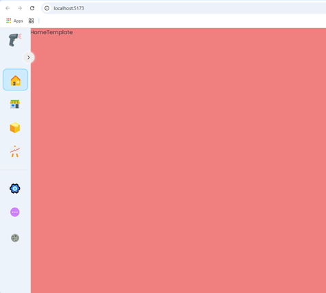


12. Los íconos que se están utilizando en el archivo **`src\utils\dataEstatica.ts`**, vienen de este sitio [Iconify for React](https://iconify.design/docs/icon-components/react/), mas específicamente de este [icons](https://icon-sets.iconify.design/).
13. Hay un sitio para almacenar las imágenes a parte del poyecto, utiliza este sitio [imgbb](https://es.imgbb.com/), se aloja las imagenes, tiene este texto: </br> `ImgBB es un servicio gratuito de alojamiento de imágenes. Actualiza tu suscripción para acceder a todas las funciones.`
14. Así luce el proyecto con el cambio de _Dark_ o _Light_: </br> 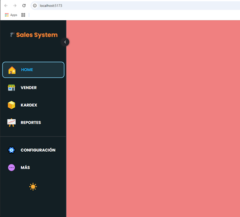 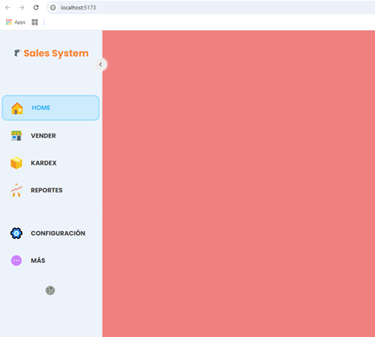


>[!WARNING]
>El archivo **`src/components/organisms/sidebar/Sidebar.tsx`**, presenta muchos errores de _TypeScript_, mas adelante se buscará el modo de solucionarlos.


### Cambiando tamaños (01:11:05)

1. En el archivo **`src/App.tsx`**, en el renderizado de `<Container` agregamos un `className` con un condicional terciario para poner o no el valor de `'active'`:
```js
  return (
    <ThemeProvider theme={themesStyle}>
      <Container className={sidebarOpen ? 'active' : ''}>
        ...
      </Container>
    </ThemeProvider>
  );
```
1. En la definición _css_ de `Container`, dentro de `@media ${Device.tablet}`, agregamos la clase `.active`, si el `sidebarOpen` es verdadero, y definimos el tamaño inicial sea de `260px`:
```css
    grid-template-columns: 88px 1fr; /* una columnas */
    &.active{
      grid-template-columns: 260px 1fr;
    }
```
1. Comentamos en ese _css_ la definición de la clase `.mainMenu` en la primera, que es para _mobile_ la parte de `background-color: lightgreen;`.
2. Comentamos también el _css_ para la definición de la clase `.rightRoutes` para _mobile_ la parte `background-color: lightcoral;`.
3. También se comenta el _css_ para el `background-color: lightyellow;`, que hay al principio.
4. Abrimos el archivo **`src/styles/GlobalStyles.tsx`**, para ajustar lo siguiente, para que el color de fondo y el color de las letras coincidan con los definidos en el `theme`:
```js
export const GlobalStyles = createGlobalStyle`
    body{
        margin:0;
        padding:0;
        box-sizing:border-box;
        font-family:"Poppins",sans-serif;
        background-color:${({ theme }) => theme.bgtotal};
        color:${(props) => props.theme.text};/*#fff;*/
    }
`;
```
7. Ahora bien nos salen muchos errores relacionados con el `theme` y los valores que se requieren representar, como por ejemplo:</br> `Property 'bgtotal' does not exist on type 'DefaultTheme'.`.</br> Entonces se declara un `module` de `'styled-components'` y dentro una _interface_ que se exporta de nombre `interface DefaultTheme`, y dentro todos los valores que el `theme` se van a utilizar tanto en:
* **`src/styles/GlobalStyles.tsx`**, como en
* **`src/components\organisms\sidebar\Sidebar.tsx`**.
```js
declare module 'styled-components' {
  export interface DefaultTheme {
    bgtotal: string;
    text: string;
    color2: string;
    colorScroll: string;
    logorotate: string;
    bgAlpha: string;
    bg6: string;
    bg5: string;  
    color1: string; 
    bgtgderecha: string;  
    bg3: string;
    bg  : string;
    bg4 : string;
  }
}
```
8. Se arregló el comportamiento del archivo **`src/components/organisms/sidebar/Sidebar.tsx`**, poniendo la definición como tipo de `$isopen` cuando se crea la constante `Container`:
```js
const Container = styled.div<{ $isopen: string }>`
  ...
`;
```
9. Lo mismo en la definición de la constante `Main`, se define como tipo el `$isopen`:
```js
const Main = styled.div<{ $isopen: string }>`
  ...
`;
```
10. Se comenta esta llamada de función `onClick={() => SetstateDesplegableLinks(!stateDesplegableLinks)}`, que por ahora está pendiente se ser creada, en el archivo: **`src/components/organisms/sidebar/Sidebar.tsx`**.
11. Del archivo **`src/components/organisms/sidebar/Sidebar.tsx`**, nos copiamos la propiedad del _css_ `transition: 0.1s ease-in-out;`, para el archivo **`src/App.tsx`**, en el _css_ del `Container`.
12. Comentamos en el mismo archivo, en el _css_ para la definición de la clase `.leftSidebar` para _mobile_ la parte `background-color: lightblue;`.


### Diseño del login (01:19:14)

>[!TIP]
>El instructor pone en el archivo **`src/App.tsx`**, la definición en el _css_ del `color`: </br> `color:${({ theme }) => theme.text};` </br> La cuestión es que esto ya se hizo en el sitio correcto, en el archivo: **`src/styles/GlobalStyles.tsx`**.

1. Creamos el archivo **`src/pages/Login.tsx`**, se ejecuta el _snippet_ `rfce` y se hacen los ajustes correspondientes:
```js
import styled from 'styled-components';

const Container = styled.div``;

function Login() {
  return <Container>Login</Container>;
}

export default Login;
```
2. Creamos un _Template_ de nombre **`src\components\templates\LoginTemplate.tsx`**, también ejecutamos el _snippet_ `rfce` y se hacen los ajustes:
```js
import styled from 'styled-components';

const Container = styled.div``;

function LoginTemplate() {
  return (
    <Container>
      <span>LoginTemplate</span>
    </Container>
  );
}

export default LoginTemplate;
```
3. Actualizamos el _barrel_ o archivo **`src/index.ts`**.
4. Regresamos al archivo **`src/pages/Login.tsx`** y allí renderizamos el componente `<LoginTemplate`>
```js
import styled from 'styled-components';
import { LoginTemplate } from '../index.ts';

const Container = styled.div``;

function Login() {
  return (
    <Container>
      <LoginTemplate />
    </Container>
  );
}

export default Login;
```
5. Ahora si vamos al archivo **`src/routes/MyRoutes.tsx`** y agrego la ruta del `login`, copiando el del `<Home`, e importando el componente faltante de `Login`:
```js
import { Route, Routes } from 'react-router-dom';
import { Home, Login } from '../index.ts';

function MyRoutes() {
  return (
    <Routes>
      <Route path='/' element={<Home />} />
      <Route path='*' element={<div>404 Not Found</div>} />
      <Route path='/login' element={<Login />} />
    </Routes>
  );
}

export default MyRoutes;
```
6. Probamos poniendo en la _url_ la ruta del `login` y obtenemos esto en pantalla:</br>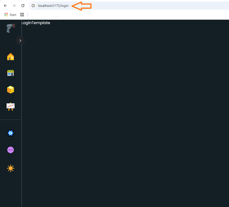.
7. Regresamos al archivo **`src/components/templates/LoginTemplate.tsx`**, y empezamos a maquetar lo que veríamos luego en pantalla:
```js
import styled from 'styled-components';

const Container = styled.div``;

function LoginTemplate() {
  return (
    <Container>
      <section className='contentCard'>
        <div className='card'></div>
      </section>
    </Container>
  );
}

export default LoginTemplate;
```
8. Vamos a la carpeta **"src/components/atoms"**, para agregar un componenente, de nombre **`Title.tsx`**, ejecutamos el _snippet_ `rfce` y hacemos los ajustes correspondientes:
```js
import styled from 'styled-components';

const Container = styled.div`
  height: 100vh;
`;

function Title() {
  return <Container>Title</Container>;
}

export default Title;
```
9. Como es un _atoms_ , lo podemos ajustar, el instructor sugiere que ni se requere el `return`, verificando si funciona sin errores:
```js
import styled from 'styled-components';

const Title = styled.span`
  font-weight: 700;
  font-size: 30px;
`;

export default Title;
```
10. Actualizamos el _barrel_ es decir el archivo **`src/index.ts`**.
11. Regresamos al componente **`src/components/templates/LoginTemplate.tsx`**, importamos el _atoms_ `Title` a través del `index.ts` y lo renderizamos con el texto `Ingresar`:
```js
import styled from 'styled-components';
import { Title } from '../../index.ts';

const Container = styled.div``;

function LoginTemplate() {
  return (
    <Container>
      <section className='contentCard'>
        <div className='card'>
          <Title>Ingresar</Title>
        </div>
      </section>
    </Container>
  );
}

export default LoginTemplate;
```
12. Agregamos en el _css_ del `Container`del archivo **`src/components/templates\LoginTemplate.tsx`**, algunos estilos:

* Sugerido por Copilot:
```css
const Container = styled.div`
  height: 100vh;
  display: flex;
  justify-content: center;
  align-items: center;

  .contentCard {
    width: 100%;
    max-width: 400px;
    padding: 20px;
    background-color: #f8f9fa;
    border-radius: 8px;
    box-shadow: 0 2px 10px rgba(0, 0, 0, 0.1);
    
    .card {
      text-align: center;
    }
  }
`;
```
* Lo que solicita el Instructor:
```css
const Container = styled.div`
  height: 100vh;
  display: flex;
  justify-content: center;
  align-items: center;
`;
```
13. Clonamos este archivo [**`InputText2.jsx`**](https://github.com/Franklin369/pos-react-login/blob/main/src/components/organismos/formularios/InputText2.jsx), en el siguiente archivo: </br> **`src/components/organisms/forms/InputText2.tsx`**.
14. Por ahora solo tenemos un error :</br> `Binding element 'children' implicitly has an 'any' type.`, </br> lo corregimos de la siguiente manera:
```js
import styled from 'styled-components';
import { type ReactNode } from 'react';

export function InputText2({ children }: { children: ReactNode }) {
  return (
    <Container>
      <div className='form__group field'>{children}</div>
    </Container>
  );
}
const Container = styled.div`
...
`;
```
15. Actualizamos el _barrel_ es decir el archivo **`src/index.ts`**.
16. En el archivo **`src/components/templates/LoginTemplate.tsx`**, debajo del renderizado del `</Title>`, agregamos la etiqueta `<form` y ponemos estos otros elementos:
```js
        <div className='card'>
          <Title>Ingresar</Title>
          <form action=""></form>
        </div>
```
17. Dentro del `<form` renderizamos el componente `<InputText2`, lo importamos de `index.ts` y dentro de este empezamos con las etiquetas `label` e `input`:
```js
        <div className='card'>
          <Title>Ingresar</Title>
          <form action=''>
            <InputText2>
              <label htmlFor=''></label>
              <input type='text' />
            </InputText2>
          </form>
        </div>
```
18. Empezamos poniendo la etiqueta `input` un `className`, con el valor de `'form__field'`.
19. A la etiqueta `input` le agrego un `placeholder`, `name` y `id` con el texto de `'email'`.
20. Aprovecho para ponerle a label en el `for` el nombre de `email`.
21. Copio todo el componente `<InputText2`, y cambio los nombre de `email`, por `password`, lo mismo que el `type`:
```js
          <form action=''>
          <InputText2>
              <label htmlFor='email'></label>
              <input type='text' className='form__field' placeholder='email' name='email' id='email'/>
            </InputText2>            <InputText2>
              <label htmlFor='password'></label>
              <input type='password' className='form__field' placeholder='password' name='password' id='password'/>
            </InputText2>
          </form>
```
22. Así luce hasta el momento la página `login`:</br>


### Agregando Buttons (01:29:52)


1. Empezamos clonando del repositorio el archivo [**`Btnsave.jsx`**](https://github.com/Franklin369/pos-react-login/blob/main/src/components/moleculas/Btnsave.jsx), en el archivo **`src/components/molecules/SaveButton.tsx`**, con los ajustes respectivos, como el nombre de la función a exportar por esta: </br> `export function SaveButton({...`
2. Tenemos errores varios, pero el primero a solucionar es el de:</br> `Module '"../../index"' has no exported member 'Icono'.`, se logra clonando del repositorio [**`Icono.jsx`**](https://github.com/Franklin369/pos-react-login/blob/main/src/components/atomos/Icono.jsx), en el archivo nuevo de nombre **`src/components/atoms/Icon.tsx`**, con el respectivo ajuste.
3. El error que tenemos de `Property '$color' does not exist on type 'ExecutionContext'`, lo solucionamos con una `interface`, quedando así el archivo:
```js
import styled from 'styled-components';
interface IconoProps {
  $color: string;
}

export const Icono = styled.span<IconoProps>`
  display: flex;
  align-items: center;
  text-align: center;
  font-size: 20px;
  color: ${(props) => props.$color};
`;
```
4. Actualizamos el _barrel_ es decir el archivo **`src/index.ts`**.
5. Regresamos al archivo **`src/components/molecules/SaveButton.tsx`**, revisamos los errores que todavía tenemos por corregir, añadiendo una `interface`:
```js
...
import type { JSX } from 'react';


interface SaveButtonProps {  
  funcion?: ()=> void; // Optional, to pass a function on click
  titulo: string;
  bgcolor: string; 
  icono?: JSX.Element; // import type { JSX } from 'react';
  url?: string; // Optional, if you want to use it as a link
  color: string; // Optional, to set the text color of the button
  disabled?: boolean; // Optional, if you want to disable the button
  width?: string; // Optional, to set the width of the button
}

export function SaveButton({
  funcion,
  titulo,
  bgcolor,
  icono,
  url,
  color,
  disabled,
  width,
}: SaveButtonProps) {
  return (
    ...
  )
}
```
6. Sigo viendo errores, por el manejo del signo `$` para algunas variables, vemos como se puede solucionar en el _css_ del `Container`:
```js
const Container = styled.button<{ $width?: string; $bgcolor: string; $color: string; }>`
  font-weight: 700;
  display: flex;
  font-size: 15px;
  padding: 10px 25px;
  border-radius: 16px;
  background-color: ${(props) => props.$bgcolor};
  border: 2px solid rgba(50, 50, 50, 0.2);
  border-bottom: 5px solid rgba(50, 50, 50, 0.2);
  transform: translate(0, -3px);
  cursor: pointer;
  transition: 0.2s;
  transition-timing-function: linear;
  color: rgb(${(props) => props.$color});
  align-items: center;
  justify-content: center;
  width: ${(props) => props.$width};
  .content {
    display: flex;
    gap: 12px;
  }
  &:active {
    transform: translate(0, 0);
    border-bottom: 2px solid rgba(50, 50, 50, 0.5);
  }
  &[disabled] {
    background-color: #646464;
    cursor: no-drop;
    box-shadow: none;
  }
`;
```
7. Vamos al archivo **`src/components/templates/LoginTemplate.tsx`**, donde vamos a renderizar el componente `<SaveButton`:
```js
          <form action=''>
            ...
            <InputText2>
              ...
              <SaveButton />
            </InputText2>
          </form>
```
8. Podemos poner propiedades al momento de renderiar `<SaveButton`:
```js
              <SaveButton
                titulo='INGRESAR'
                bgcolor='#1cb0f6'
                color='255,255,255'
                width='100%'
              />
            </InputText2>
```
9. Así se ve hasta el momento la pantalla, con el primer botón: </br>
10. Creo un archivo en la carpeta **"atoms"** de nombre **`Line.tsx`**, con este código:
```js
import styled from 'styled-components';

export const Linea = styled.div`
  background-color: ${({theme}) => theme.color2};
  height: 2px;
  border-radius: 15px;
  margin: 20px 0;
  position: relative;
  text-align: center;
`;
```
11. Actualizamos el _barrel_ es decir el archivo **`src/index.ts`**.
12. En el archivo **`src/components/templates/LoginTemplate.tsx`**, importamos `Linea` de `index.ts` y lo renderizamos debajo del cierre de la etiqueta `</form>`:
```js
          <Linea>
            <span>O</span>
          </Linea>
```
13. Agregamos en el archivo **`src/components/atoms/Line.tsx`**, a la constante `Linea`, en el _css_, estilos para el `span`:
```css
  span{
    top: -10px;
    position: absolute;
    background-color: #${({theme}) => theme.bgtotal};
    text-align: center;
    padding: 0 5px;
    color: ${({theme}) => theme.color2};
    font-weight: 700;
  }
```
14. Así se ve la pantallas hasta el momento:</br>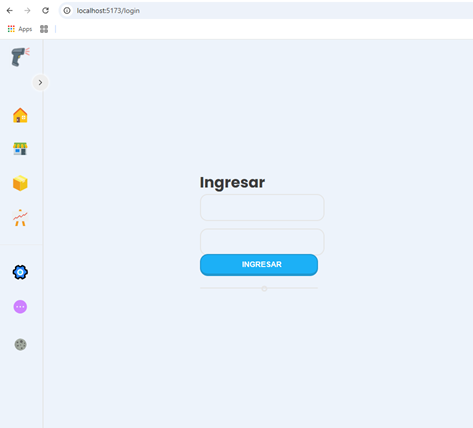
15. Debajo de `Linea` agregamos otro renderizado de `<SaveButton`, con algunas propiedades:
```js
          <SaveButton
            titulo='Google'
            bgcolor='#fff'
            color='0,0,0'
            width='100%'
            icono={<v.iconogoogle/>}
          />
```
16. Debemos importar las variables `v` del archivo `'../../styles/variables.ts'`, que es de donde sacamos el:</br>`icono={<v.iconogoogle/>}`
17. Así luce nuestra pantalla de `login`:</br>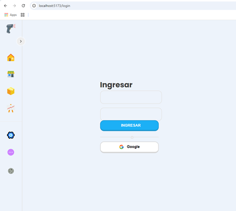


### Culminando diseño (01:41:00)

1. En el archivo **`src\components\templates\LoginTemplate.tsx`**, añadimos para el `Container`, algunos estilos:
```css
const Container = styled.div`
  height: 100vh;
  display: flex;
  justify-content: center;
  align-items: center;
  text-align: center;
  .contentCard{
    height: 100%;
    width: 100%;
    display: flex;
    flex-direction: column;
    align-items: center;
    justify-content: center;
    .card{
      display: flex;
      flex-direction: column;
      justify-content: center;
      height: 100%;
      width: 100%;
      padding: 10px;
      margin: 0 auto;
    }
  }
`;
```
2. Importamos `{Device}` del archivo `'../../styles/breakpoints.ts'`.
3. Agregamos los _responsive_ dentro del _css_ para la clase `.card{`:
```css
    .card{
      ...
      @media ${Device.tablet} {
        width: 400px;
      }
    }
```
4. Vamos a eliminar la clase `.ContentCard`.
5. El renderizado de `<SaveButton`, lo ponemos por fuer del `<InputText2`.
6. En el archivo **`src/components/atoms/Title.tsx`**, agrego mas estilos pero los pongo de dinámica, es decir que llegan como _props_ desde donde lo llaman o renderizan:
```js
import styled from 'styled-components';
interface TitleProps {
  $paddingBottom: string;
}

const Title = styled.span<TitleProps>`
  font-weight: 700;
  font-size: 30px;
  padding-bottom: ${(props) => props.$paddingBottom || '10px'};
`;

export default Title;
```
7. Regresamos al archivo **`src/components/templates/LoginTemplate.tsx`**, al momento de renderiar el `<Title`, le añadimos una propiedad de nombre `paddingBottom`:
```js
          <Title $paddingBottom='20px'>Ingresar</Title>
```
8. Así luce nuestra pantalla en `tablet` y en `mobile`:</br> 


### Footer (01:46:19)

1. Empezamos clonando del repositorio [**`Footer.jsx`**](https://github.com/Franklin369/pos-react-login/blob/main/src/components/organismos/Footer.jsx), en el archivo </br>**`src/components/organisms/Footer.tsx`**</br> El contenido no genera errores.
2. Ejecutamos en una terminal el siguiente comando:
```bash
pnpm i --save-dev @types/node -E
```
3. Creo el archivo **`.env`**, con los siguiente elementos:
```ini
VITE_RUT="7#######-#"
VITE_YEAR="2025"
VITE_SITE=Alquimia Software
VITE_PHONE="+57 ### ### ###"
```
4. Hacemos unos cambios en el contenido o textos para nuestro propósito, haciendo use de las variables de ambiente:
```js
export function Footer() {
  return (
    <Container>
      <section className='lock'>
        <GiPadlock />
        <span>
          Esta es una página segura de {import.meta.env.VITE_SITE}. Si tienes dudas sobre
          la autenticidad de la web, comunícate con
          <br /> nosotros al {import.meta.env.VITE_PHONE} o a través de nuestros medios
          digitales.
        </span>
      </section>
      <section className='derechos'>
        <span>
          {import.meta.env.VITE_SITE} - RUT: {import.meta.env.VITE_RUT}
        </span>
        <div className='separador'></div>
        <span>Todos los derechos reservados</span>
        <div className='separador'></div>
        <span>
          © {import.meta.env.VITE_YEAR} {import.meta.env.VITE_SITE}
        </span>
      </section>
    </Container>
  );
}
```
5. Actualizamos el _barrel_ es decir el archivo **`src/index.
6. Vamos al archivo **`src/components/templates/LoginTemplate.tsx`**, se añade la importación de `Footer` del `'../../index.ts'`, y se renderiza antes de cerrar el `</Container>`.
7. Así nos sale en pantalla:</br>
8. Se debe ajustar la posición del `Footer`, lo hacemos con estilos en el `Container`:
```css
const Container = styled.div`
  ...;
  flex-direction: column;

  .card {
    ...
  }
`;
```
9. Elimino la etiqueta `<section>` y ahora si el `Footer` se ubica del todo abajo:</br> 
10. En el archivo **`.gitignore`**, para no subir al repositorio, se añaden los tipo **`*.env`** y similares.


### Conectando a SUPABASE (01:47:35)


>[!TIP]  
> Debemos ingresar a la página de [supabase](https://supabase.com/dashboard), y crear una cuenta con  `github`:
>
>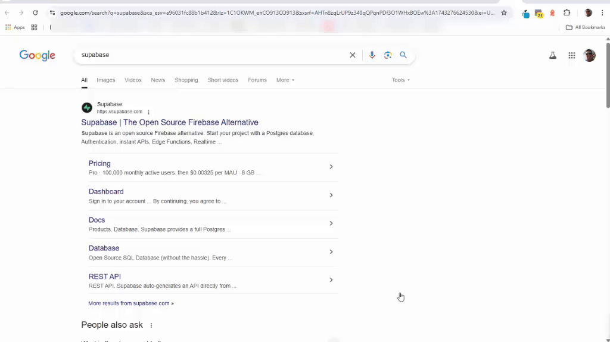

1. Entramos al sitio [supabase](https://supabase.com/dashboard).
2. Si nos falta o no tenemos la _Organization_ de nombre `Tutorials`, damos clic al botón `[New Organization]` y le ponemos de nombre `Tutorials` y damos clic en el botón `[Create Organization]`:</br> 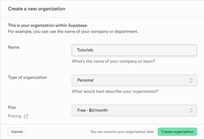
3. Regresamos al [supabase/dashboard](https://supabase.com/dashboard).
4. Damos clic al boton de `[New Project]` y dejamos la _Organization_ de nombre `Tutorials`.
5. Completamos el formulario:
    * Organization: `Tutorials`
    * Project-name: `SalesSystem`
    * Database password: ~~xoxoxoxo~~ (Usamos una buena contraseña)
    * Region: `East US (North Virginia)`
* Así se ve el formulario:</br>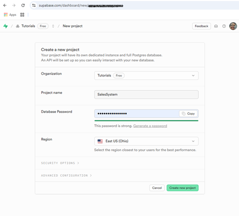 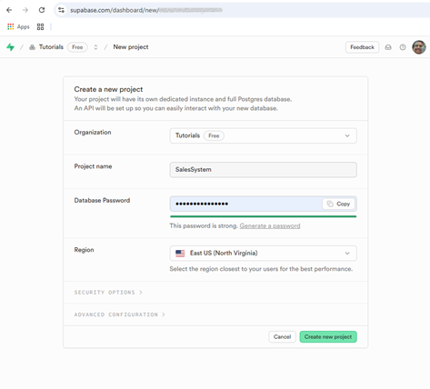
6. Y le damos clic en el botón `[Create new project]`: </br>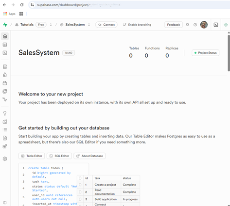.
7. En la página de `Supabase`, buscamos el símbolo de configuración que es como engranaje o _gear_ <svg xmlns="http://www.w3.org/2000/svg" width="32" height="32" viewBox="0 0 24 24" fill="none" stroke="currentColor" stroke-width="1.5" stroke-linecap="round" stroke-linejoin="round" class="lucide lucide-settings"><path d="M12.22 2h-.44a2 2 0 0 0-2 2v.18a2 2 0 0 1-1 1.73l-.43.25a2 2 0 0 1-2 0l-.15-.08a2 2 0 0 0-2.73.73l-.22.38a2 2 0 0 0 .73 2.73l.15.1a2 2 0 0 1 1 1.72v.51a2 2 0 0 1-1 1.74l-.15.09a2 2 0 0 0-.73 2.73l.22.38a2 2 0 0 0 2.73.73l.15-.08a2 2 0 0 1 2 0l.43.25a2 2 0 0 1 1 1.73V20a2 2 0 0 0 2 2h.44a2 2 0 0 0 2-2v-.18a2 2 0 0 1 1-1.73l.43-.25a2 2 0 0 1 2 0l.15.08a2 2 0 0 0 2.73-.73l.22-.39a2 2 0 0 0-.73-2.73l-.15-.08a2 2 0 0 1-1-1.74v-.5a2 2 0 0 1 1-1.74l.15-.09a2 2 0 0 0 .73-2.73l-.22-.38a2 2 0 0 0-2.73-.73l-.15.08a2 2 0 0 1-2 0l-.43-.25a2 2 0 0 1-1-1.73V4a2 2 0 0 0-2-2z"></path><circle cx="12" cy="12" r="3"></circle></svg>, al final del menú a la izquierda.
8. En el mismo menú de la izquierda buscamos `API` o `Data API`, copiamos la `URL` y la llevamos al archivo **`.env`**, con el siguiente _key_ `VITE_SUPABASE_URL=`.
9. Le damos clic al botón `[Go to API Keys]` o en el mismo menú de la izquierda buscamos `API Keys`.
10. Copiamos el `anon` `public`, en el arhico **`.env`** con la _key_ `VITE_SUPABASE_ANON_KEY=`.
11. Se crea el siguiente archivo **`src/supabase/supabase.config.tsx`**.
12. Entramos a este sitio [Use Supabase with React](https://supabase.com/docs/guides/getting-started/quickstarts/reactjs) y buscamos el paso `(3)`, para ejecutar este comando en una `TERMINAL`:
```bash
pnpm add @supabase/supabase-js -E
```
13. Regresamos al archivo **`src/supabase/supabase.config.tsx`**, y añadimos este código:
```js
import { createClient } from '@supabase/supabase-js';

export const supabase = createClient(
  import.meta.env.VITE_SUPABASE_URL || '',
  import.meta.env.VITE_SUPABASE_ANON_KEY || ''
);
```
14. Volvemos al sitio de `Supabase`y buscamos `Authentication`, con este icono <svg xmlns="http://www.w3.org/2000/svg" width="32" height="32" viewBox="0 0 24 24" fill="none" stroke="currentColor" stroke-width="1.5" stroke-linecap="round" stroke-linejoin="round" class="lucide lucide-auth "><path d="M5.24121 15.0674H12.7412M5.24121 15.0674V18.0674H12.7412V15.0674M5.24121 15.0674V12.0674H12.7412V15.0674M15 7.60547V4.60547C15 2.94861 13.6569 1.60547 12 1.60547C10.3431 1.60547 9 2.94861 9 4.60547V7.60547M5.20898 9.60547L5.20898 19.1055C5.20898 20.21 6.10441 21.1055 7.20898 21.1055H16.709C17.8136 21.1055 18.709 20.21 18.709 19.1055V9.60547C18.709 8.5009 17.8136 7.60547 16.709 7.60547L7.20899 7.60547C6.10442 7.60547 5.20898 8.5009 5.20898 9.60547Z"></path></svg>, y buscamo `Sign In / Providers`.
15. En la lista `Auth Providers`, activamos si falta `Email` y `Google`, aunque para este último requiere mas pasos.


### AuthStore (01:54:48)

1. Empezamos buscando en este sitio: [`Consola de Google Cloud`](https://cloud.google.com/storage/docs/cloud-console?hl=es-419).
2. Dar clic al botón `[Consola]` y debe aparecer algo similar a esto: </br> 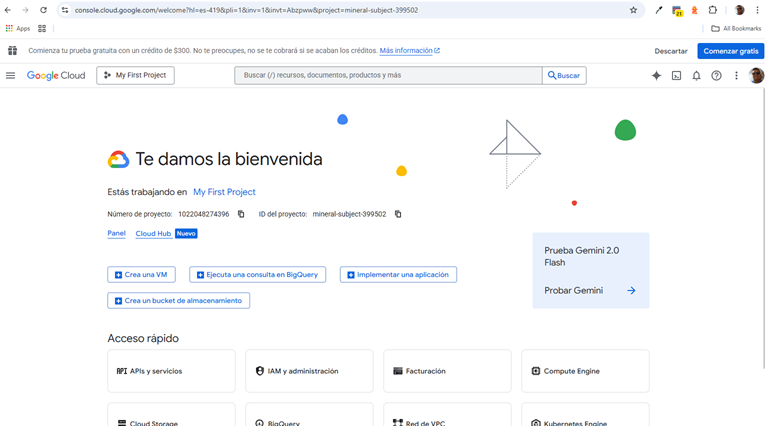.
3. Clic en el menú de hamburguesa en la parte superior izquierda: <svg xmlns="http://www.w3.org/2000/svg" width="32" height="32" fill="currentColor" class="bi bi-list" viewBox="0 0 16 16">  <path fill-rule="evenodd" d="M2.5 12a.5.5 0 0 1 .5-.5h10a.5.5 0 0 1 0 1H3a.5.5 0 0 1-.5-.5m0-4a.5.5 0 0 1 .5-.5h10a.5.5 0 0 1 0 1H3a.5.5 0 0 1-.5-.5m0-4a.5.5 0 0 1 .5-.5h10a.5.5 0 0 1 0 1H3a.5.5 0 0 1-.5-.5"/></svg>.
4. Luego seleccionamos `APIs y Servicios` y ahí `APIs y Servicios habilitados`: </br> 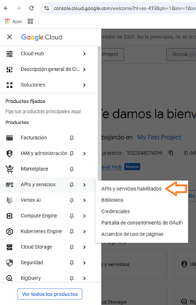
5. Damos clic en `Credenciales`.
6. Arriba en `+Crear Credenciales`, empezamos con `ID de cliente de OAuth`.
7. Damos clic en el botón de _Warning_ `[Configurar pantalla de consentimiento]`.
8. Se requiere Completar el proceso de `Información de marca`:</br>
9. Regresamos a `APIs y Servicios` y ahí `APIs y Servicios habilitados`: </br> 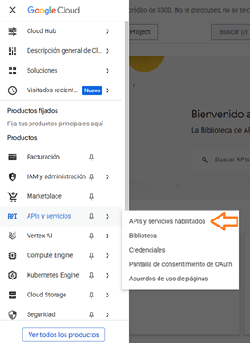.
10. Entramos en el Menú de la izquierda a `Credenciales`.
11. Seleccionamos la parte de arriba `+Crear Credenciales` y de las opciones clic en ` ID de cliente de OAuth `.
12. En `Tipo de Aplicación`, seleccionamos `Aplicación Web`:</br>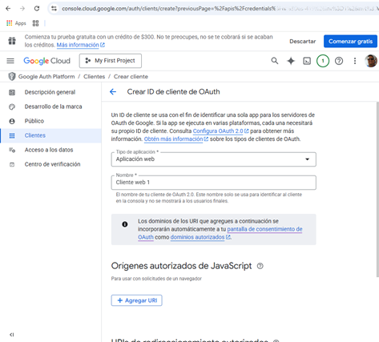
13. En el `Nombre` va `Sales System`.
14. En la sección `URIs de redireccionamiento autorizados`, damos clic al botón `[+ Agregar URI]`.
15. Regresamos al sitio de [`Supabase -> Google`](https://supabase.com/dashboard/project/{proyect}/auth/providers?provider=Google):</br>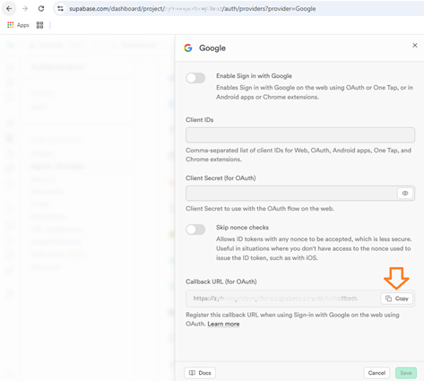
16. Seleccionamos de `Callback URL (for OAuth)` el texto para dar un `copy`.
17. Y lo llevamos al sitio de `Google` en `Crear ID de cliente de OAuth` y lo pegamos en la `URI` pendiente.
18. Y allí le damos clic en `Crear` y esperamos varios minutos.
19. Sale una ventana y copiamos el `ID de cliente`: </br> "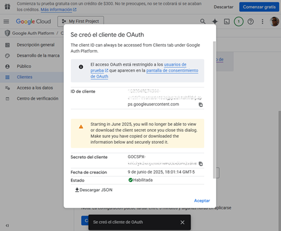.
20. Se pega en la pagina de `Supabase` pega en `Client ID for OAuth`.
21. Se repite el proceso de `Secreto del Cliente` de `Google`, para `Client Secret` de `Supabase`.
22. En `Supabase` estar seguro que el botón `[Enable Sign in in Google]` esté activo o en verde y dar clic en el botón `[Save]`.
23. Nos vamos a este sitio a revisar los pasos a proceder [`Supabase -> Login with Google`](https://supabase.com/docs/guides/auth/social-login/auth-google).
24. Creamos el archivo **`src/store/AuthStore.tsx`**, empezamos con la importación de `{create}` de `zustand`:</br>`import { create } from 'zustand';`
25. Creamos una función tipo flecha de nombre `useAuthStore` y luego la exportamos:
```js
export const useAuthStore = create((set) => ({
  
}));
```
26. Creamos el primer objeto que será una función de nombre `loginGoogle` y hacemos uso de la información en esta sección de la página [`Saving Google tokens #`](https://supabase.com/docs/guides/auth/social-login/auth-google#saving-google-tokens):
```js
const useAuthStore = create((set) => ({
  loginGoogle: async () => {
    // signInWithOAuth - this method is used to sign in with Google OAuth
    await supabase.auth.signInWithOAuth({
      provider: 'google',
      options: {
        redirectTo: window.location.origin,
      },
    });
  },
}));
```
27. El error en la línea de `supabase.auth.signInWithOAuth`, se requiere importar  `{supabase}` de `'../supabase/supabase.config'`.
28. En este sitio buscamos como desconectarnos de la sesión [``Signing out](https://supabase.com/docs/guides/auth/signout), y parece ser este simple comando :</br> `const { error } = await supabase.auth.signOut()`, completamos todo el códio de esta manera:
```js
import { create } from 'zustand';
import { supabase } from '../supabase/supabase.config';

interface AuthStore {
  loginGoogle: () => Promise<void>;
  logout: () => Promise<void>;
}

// eslint-disable-next-line @typescript-eslint/no-unused-vars
export const useAuthStore = create<AuthStore>((set) => ({
  loginGoogle: async () => {
    // signInWithOAuth - this method is used to sign in with Google OAuth
    await supabase.auth.signInWithOAuth({
      provider: 'google',
      options: {
        redirectTo: window.location.origin,
      },
    });
  },
  logout: async () => {
    // signOut - this method is used to sign out the user
    const { error } = await supabase.auth.signOut();
    if (error) {
      console.log('Error signing out:', error.message);
    }
  },
}));
```
>[!TIP]  
>
>#### En el contexto de cerrar sesión en una aplicación o sitio web, "signing out" y "logout" son esencialmente intercambiables y significan lo mismo: finalizar una sesión y desconectarse de una cuenta.
>
>El significado de ambos términos:
>_"Signing out" (o "sign out"):_
>Se utiliza para indicar el acto de cerrar sesión o desconectar de una cuenta, especialmente en el contexto de aplicaciones o sitios web.
>_"Logout":_
>Es una forma más informal de decir "signing out". También significa cerrar sesión o desconectar de una cuenta.
>_En resumen:_
>"Signing out" y "logout" son sinónimos en el contexto de cerrar sesión. La forma en que se use dependerá del contexto específico, pero ambos significan lo mismo.
29. Actualizamos el _barrel_ es decir el archivo **`src/index.ts`**.
30. Abrimos el archivo **`src/components/templates/LoginTemplate.tsx`**, para hacer la prueba de ingresar con una cuenta de `Google`, en la función `LoginTemplate()`, hago uso de la función nueva de `zustand` de nombre `useAuthStore`:
```js
import {
  ...
  useAuthStore,
} from '../../index.ts';
...
function LoginTemplate() {
  const { loginGoogle } = useAuthStore();
  ...
}
```
30. Abajo en el renderizado de `<SaveButton titulo='Google'`, activamos una nueva propiedad o parámetro de nmbre `funcion` y la igualamos a la de `zustand` de nombre `loginGoogle`:
```js
        <SaveButton
          funcion={loginGoogle}
          titulo='Google'
          bgcolor='#fff'
          color='0,0,0'
          width='100%'
          icono={<v.iconogoogle />}
        />
```
31. Luego hacemos las respectiva pruebas para verificar la funcionalidad del botón y el ingreso usando una cuenta de `Google`.


### Probando login (02:06:13)

1. Vamos a la pagina de [`supabase ->`<svg xmlns="http://www.w3.org/2000/svg" width="32" height="32" viewBox="0 0 24 24" fill="none" stroke="currentColor" stroke-width="1.5" stroke-linecap="round" stroke-linejoin="round" class="lucide lucide-auth "><path d="M5.24121 15.0674H12.7412M5.24121 15.0674V18.0674H12.7412V15.0674M5.24121 15.0674V12.0674H12.7412V15.0674M15 7.60547V4.60547C15 2.94861 13.6569 1.60547 12 1.60547C10.3431 1.60547 9 2.94861 9 4.60547V7.60547M5.20898 9.60547L5.20898 19.1055C5.20898 20.21 6.10441 21.1055 7.20898 21.1055H16.709C17.8136 21.1055 18.709 20.21 18.709 19.1055V9.60547C18.709 8.5009 17.8136 7.60547 16.709 7.60547L7.20899 7.60547C6.10442 7.60547 5.20898 8.5009 5.20898 9.60547Z"></path></svg>`Authentication -> URL Configuration`](https://supabase.com/dashboard/project/{proyect-name}/auth/url-configuration):</br>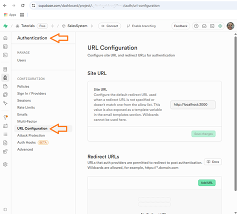
>[!WARNING]  
>Corrigiendo el paso [Conectando a SUPABASE (01:47:35)](#conectando-a-supabase-014735), las variables serán:
>```ini
>VITE_SUPABASE_URL=<SUBSTITUTE_SUPABASE_URL>
>VITE_SUPABASE_ANON_KEY=<SUBSTITUTE_SUPABASE_ANON_KEY>
>```
>Sin la partícula `APP`, para que quede igual a la configuración en el sito [`Use Supabase with React` paso (4)](https://supabase.com/docs/guides/getting-started/quickstarts/reactjs)
2. Cambiamos la dirección local existente para `NextJs` de `http://localhost:3000` por esta otra también local de `react+Vite` que es `http://localhost:5173/` en el campo `Site URL`.
3. Ahora si vamos a probar:</br>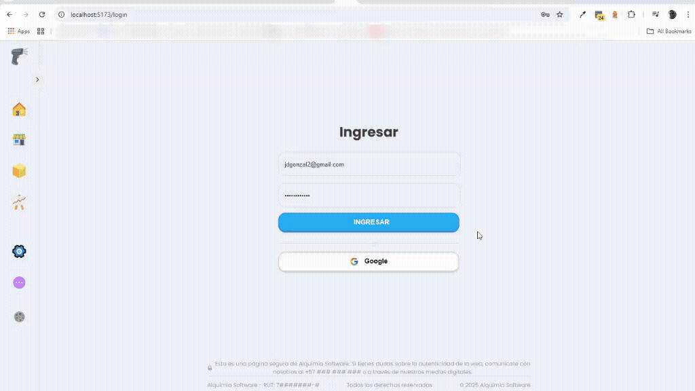


### Context (02:10:37)

1. Vamos a escuchar en todo momento el estado del usuario, para eso buscamos este sitio [`Listen to auth events`](https://supabase.com/docs/reference/javascript/auth-onauthstatechange), donde explica que podemos exsuchhr eventos en este canal `onAuthStateChange`.
2. Creamos el archivo **`src/context/AuthContext.tsx`**.
3. Creamos la función de flecha `AuthContextProvider`:
```js
export const AuthContextProvider = () => {};
```
4. Agregamos el parámetro `{children}` y por ende definimos el `children` como un `ReactNode`:
```js
import  { type ReactNode } from 'react';

export const AuthContextProvider = (
  { children }: { children: ReactNode }) => {
	return <>{children}</>;
};
```
5. Agregamos el _hook_ de nombre `useState()`, y la importación de `'react'`:
```js
    const [authState, setAuthState] = useState([]);
```
6. Agregamos el _hook_ de nombre `useEffect()`, y la importación de `'react'`:
```js
    useEffect(() => {}, []);
```
7. Vamos a escuchar de `Supabase` la `{data}`, dentro del `useEffect`:
```js
  useEffect(() => {
    const { data } = supabase.auth.onAuthStateChange(async (event, session) => {
      console.log('Auth state changed:', event, session);
    });
  }, []);
```
8. Dentro del `useEffect` , hacemos un `return`:
```js
    return ()=>{
      data.subscription; // Instructor
      // data?.subscription?.unsubscribe(); // Copilot
    }
```
9. Creamos una constante de tipo `createContext`, que tambien debemos importar de `react`:
```js
const AuthContext = createContext<null | unknown>(null);
```
10. Y ese `AuthContext`, es el que vamos a retornar al final:
```js
  return (
    <AuthContext.Provider value={{ authState }}>
      {children}
    </AuthContext.Provider>
  );
```
11. Exportamos la función `userAuth`, para devolver el _hook_ de nombre `useContext`, que tambien debemos importarla de `'react'`:
```js
// eslint-disable-next-line react-refresh/only-export-components
export const useAuthContext = () => {
  return useContext(AuthContext);
};
```
12. Actualizamos el _barrel_ es decir el archivo **`src/index.ts`**.
13. Vamos al archivo **`src/App.tsx`** y envolvemos todo el `<Containter` con `<`:
```js
  return (
    <ThemeProvider theme={themesStyle}>
      <AuthContextProvider>
        <Container className={sidebarOpen ? 'active' : ''}>
          ...
        </Container>
      </AuthContextProvider>
    </ThemeProvider>
  );
```
14. Abrimos el archivo **`src/components/templates/HomeTemplate.tsx`**, importamos el `'AuthStore'` de `zustang` y obtenemos el `logout`:
```js
...
import { useAuthStore } from '../../store/AuthStore';
...
function HomeTemplate() {
  const { logout } = useAuthStore();
  return (
    <Container>
      <span>HomeTemplate</span>
      <button onClick={logout}>Logout</button>
    </Container>
  );
}
```
15. El botón nos pemite Cerrar la Sesión que es un `SIGNED_OUT` y si nos vamos al sitio `http://localhost:5173/login` y seleccionamos el botón de `Google`, nos arroja un `SIGNED_IN` y luego un `INITIAL_SESSION`, el valor de la sección sería un _json_ con este valor:
```json
{
  "provider_token": "ya29...0177",
  "access_token": "eyJhb...URYpgE",
  "expires_in": 3600,
  "expires_at": 1749949186,
  "refresh_token": "ada...7z",
  "token_type": "bearer",
  "user": {
    "id": "8e0e5dec-3d8c-400f-88d0-373581a01236",
    "aud": "authenticated",
    "role": "authenticated",
    "email": "jdgonzal2@gmail.com",
    "email_confirmed_at": "2025-06-14T19:47:47.497872Z",
    "phone": "",
    "confirmed_at": "2025-06-14T19:47:47.497872Z",
    "last_sign_in_at": "2025-06-14T23:59:46.770936Z",
    "app_metadata": {
      "provider": "google",
      "providers": [
        "google"
      ]
    },
    "user_metadata": {
      "avatar_url": "https://lh3.googleusercontent.com/a/AC...=s96-c",
      "email": "jdgonzal2@gmail.com",
      "email_verified": true,
      "full_name": "Juan David Gonzalez Piza",
      "iss": "https://accounts.google.com",
      "name": "Juan David Gonzalez Piza",
      "phone_verified": false,
      "picture": "https://lh3.googleusercontent.com/a/AC...=s96-c",
      "provider_id": "1031...6569",
      "sub": "1031...6569"
    },
    "identities": [
      {
        "identity_id": "458e64b4-749b-4cb2-aae7-a42c59cd8c0f",
        "id": "1031...6569",
        "user_id": "8e0e5dec-3d8c-400f-88d0-373581a01236",
        "identity_data": {
          "avatar_url": "https://lh3.googleusercontent.com/a/AC...=s96-c",
          "email": "jdgonzal2@gmail.com",
          "email_verified": true,
          "full_name": "Juan David Gonzalez Piza",
          "iss": "https://accounts.google.com",
          "name": "Juan David Gonzalez Piza",
          "phone_verified": false,
          "picture": "https://lh3.googleusercontent.com/a/AC...=s96-c",
          "provider_id": "1031...6569",
          "sub": "1031...6569"
        },
        "provider": "google",
        "last_sign_in_at": "2025-06-14T19:47:47.476495Z",
        "created_at": "2025-06-14T19:47:47.476557Z",
        "updated_at": "2025-06-14T23:59:46.767573Z",
        "email": "jdgonzal2@gmail.com"
      }
    ],
    "created_at": "2025-06-14T19:47:47.447675Z",
    "updated_at": "2025-06-14T23:59:46.774678Z",
    "is_anonymous": false
  }
}
```


### Data User (02:23:46)

1. Abrimos el archivo **`src\context\AuthContext.tsx`** y agregamos un condicional en el `useEffect`, dentro del `onAuthStateChange` y antes del `console.log` y mejoramos la definición del _hook_ de tipo `useState` para `authState`:
```js
export const AuthContextProvider = ({ children }: { children: ReactNode }) => {
  const [authState, setAuthState] = useState<unknown | User>(null);

  useEffect(() => {
    const { data } = supabase.auth.onAuthStateChange(async (event, session) => {
      if (session?.user == null) {
        setAuthState([]);
        return;
      }
      setAuthState(session.user);
      ...
    });

    return () => {...};
  }, []);
  return (
    <AuthContext.Provider value={{ authState }}>
      {children}
    </AuthContext.Provider>
  );
};
```
2. Quitamos los `console.log`.
3. El instructor sugiere borrar o comentar el elemento `event`, pero este empieza a presentar fallas y mensaje de error, por tanto se deja.
4. Encierro el proceso de escucha del `onAuthStateChange`, dentro de un `try/catch`.
5. Actualizo el _barrel_ es decir el archivo **`src/index.ts`**.
6. Abro el archivo **`src/components/templates/HomeTemplate.tsx`**, y utilozo el `AuthContextProvider` del componente `AuthContext.tsx`:
```js
import { useAuthContext } from '../../context/AuthContext';
...
function HomeTemplate() {
  ...
  const { authState } = useAuthContext();
  ...
}
```
>[!WARNING]  
>Tengo el siguiente error `Property 'authState' does not exist on type 'unknown'.`, pero habrá que averiguarlo mas adelante si se puede solucionar, mientras tanto el valor si es capaz de leerlo.
7. Solo por probar ponemos debajo del `<button` una etiqueta `[!WARNING]  
>
>#### Solución al error mencionado en el paso anterior de `Property 'authState' does not exist on type 'unknown'`.
>
>1. En el archivo **`src\context\AuthContext.tsx`**, cree una `interface` de nombre `AuthContextType`:
>```js
>interface AuthContextType {
>  authState: User | null | [];
>}
>```
>2. Al momento de exportar el nuevo _hook_ de nombre `useAuthContext`, el `return` lo hacemos indicando el tipo definido en la `interface` y se inicializa en `null`:
>```js
>const AuthContext = createContext<AuthContextType>({ authState: null });
>```

1. Creamos en **"src"**, una nueva carpeta de nombre **"hooks"**.
2. Creamos dentro de esta nueva carpeta el archivo **`ProtectedRoutes.tsx`**.
3. Creamos una función de flecha con el mismo nombre del archivo y con algunos parámetros:
```js
import type { User } from '@supabase/supabase-js';
import type { ReactNode } from 'react';

export const ProtectedRoutes = ({
  user,
  redirectTo,
  children,
}: {
  user: unknown | User;
  redirectTo: string;
  children: ReactNode;
}) => {};
```
4. Ponemos un condicional para usar el `Navigate` de `'react-router-dom'`:
```js
import type { User } from '@supabase/supabase-js';
import type { ReactNode } from 'react';
import { Navigate } from 'react-router-dom';

export const ProtectedRoutes = ({
  user,
  redirectTo,
  children,
}: {
  user: unknown | User;
  redirectTo: string;
  children: ReactNode;
}) => {
  if (!user) {
    return <Navigate to={redirectTo} replace />;
  }
  return children ? children : <Outlet />;
};
```
5. Actualizo el _barrel_ es decir el archivo **`src/index.ts`**.
6. Abrimos el archivo **`src/routes/MyRoutes.tsx`**, empezamos trayendo de `useAuthContext` el `authState` y la importación del componente `useAuthContext`:
```js
  const { authState } = useAuthContext();
```
7. Organizamos una ruta usando el componente `ProtectedRoutes` y envolviendo el `{<Home />}`:
```js
      <Route element={<ProtectedRoutes user={authState} redirectTo='/login' />}>
        <Route path='/' element={<Home />} />
      </Route>
```


### Finalizando Login (02:37:57)

1. Abrimos el archivo **`src/App.tsx`**, importamos de `'react-router-dom'` el _hook_ de nombre `useLocation`.
2. Deserializamos el contenido del _hook_ `useLocation`:
```js
  const { pathname } = useLocation();
```
3. Debajo del renderizado de `<AuthContextProvider`, hacemos un condicional terciario, o solo mostramos `<Login />` o todo el `<Container`:
```js
  return (
    <ThemeProvider theme={themesStyle}>
      <AuthContextProvider>
        {pathname == '/login' ? (
          <Login />
        ) : (
          <Container className={sidebarOpen ? 'active' : ''}>
            ...
          </Container>
        )}
      </AuthContextProvider>
    </ThemeProvider>
  );
```
4. Movemos el `<GlobalStyle`, antes del condicional terciario.
5. Abrimos el archivo **`src\components\templates\LoginTemplate.tsx`** y agregamos la constante `ContentLogo` de tipo `styled.section`, debajo de la definida como `Content`:
```js
const ContentLogo = styled.section`
  display: flex;
  justify-content: center;
  align-items: center;
  margin-bottom: 20px;

  img {
    width: 100px;
    height: 100px;
    border-radius: 50%;
  }
`;
```
6. Antes del renderiado del `<Title` , agregamos el renderizado de `<ContentLogo`, con algunos elementos:
```js
        <ContentLogo>
          
          <span>{import.meta.env.VITE_SITE}</span>
        </ContentLogo>
```
7. En el archivo **`src\styles\variables.ts`**, añado mas valores al `logo`, utilizo los valores abajo en el _json_ que se exporta y corrijo en donde se esté utilizando:
```js
import logo_32x32 from '../assets/poss2_32x32.png'; //'../assets/ada369logo.png';
import logo_64x64 from '../assets/poss2_64x64.png';
import logo_128x128 from '../assets/poss2_128x128.png';
import logo_256x256 from '../assets/poss2_256x256.png';
```
```json
export const v = {
  ...
  logo_32x32: logo_32x32,
  logo_64x64: logo_64x64,
  logo_128x128: logo_128x128,
  logo_256x256: logo_256x256,
  ...
}
```
8. Mejoro algunos estilos, como los tiene el instructor.


## Section 3: Categoría de productos


>[!NOTE]  
>
>### Temas puntuales de la sección (Categoría de productos)
>
>**Descripción de la sección:**  
>En esta sección desarrollaremos el módulo de `Categoría de productos`, abarcando desde la creación de tablas y estructuras básicas hasta funcionalidades avanzadas como la integración con `Storage` y el uso de `TanStack Query`. Este módulo será clave para organizar y manejar la información de productos, empresas, usuarios y configuraciones.
>
>Entre los temas destacados, aprenderás a:
>* Diseñar y configurar las tablas básicas necesarias para el sistema.
>* Implementar _triggers_ para automatizar procesos en la base de datos.
>* Subir y gestionar imágenes en el _Storage_, optimizando la lógica para este proceso.
>* Mostrar y gestionar categorías de productos, empresas y usuarios mediante funciones bien estructuradas.
>* Asignar sucursales y registrar múltiples usuarios con relaciones bien definidas.
>* Crear una página de configuración funcional y estilizada.
>* Integrar `TanStack Query` para manejar la consulta y gestión de datos con eficiencia.
>
>Al finalizar esta sección, tendrás un sistema sólido y dinámico para gestionar productos y usuarios de manera profesional.


### Creando la tabla de productos (02:42:44)

1. El instructor ingresa directamente a la página de `Supabase`, busca <svg xmlns="http://www.w3.org/2000/svg" width="32" height="32" viewBox="0 0 24 24" fill="none" stroke="currentColor" stroke-width="1.5" stroke-linecap="round" stroke-linejoin="round" class="lucide lucide-table-editor "><path d="M2.9707 15.3494L20.9707 15.355M20.9405 9.61588H2.99699M8.77661 9.61588V21.1367M20.9405 5.85547V19.1367C20.9405 20.2413 20.0451 21.1367 18.9405 21.1367H4.99699C3.89242 21.1367 2.99699 20.2413 2.99699 19.1367V5.85547C2.99699 4.7509 3.89242 3.85547 4.99699 3.85547H18.9405C20.0451 3.85547 20.9405 4.7509 20.9405 5.85547Z"></path></svg> `Table Editor`, da clic en el botón `[Create a new table]`, pero prefiero hacerlo por comandos _SQL_.
2. Busco la opción <svg xmlns="http://www.w3.org/2000/svg" width="32" height="32" viewBox="0 0 24 24" fill="none" stroke="currentColor" stroke-width="1.5" stroke-linecap="round" stroke-linejoin="round" class="lucide lucide-sql-editor "><path d="M7.89844 8.4342L11.5004 12.0356L7.89844 15.6375M12 15.3292H16.5M5 21.1055H19C20.1046 21.1055 21 20.21 21 19.1055V5.10547C21 4.0009 20.1046 3.10547 19 3.10547H5C3.89543 3.10547 3 4.0009 3 5.10547V19.1055C3 20.21 3.89543 21.1055 5 21.1055Z"></path></svg> `SQL Editor`, allí voy a crear las tablas, pero primero voy a crear los archivos de extesión **`*.sql`**.

>[!TIP]  
>Abrí el archivo **`src/context/AuthContext.tsx`** y cambié el `interface`, por el `type` y este sigue trabajando normal.

3. Creo la carpeta en **"src"** **"db/sql/tables"**.
4. Para **Usuarios** creamos el archivo **`users.sql`**:
```sql
-- Create the `users` table
DROP TABLE IF EXISTS users;
CREATE TABLE IF NOT EXISTS users (
    id SERIAL PRIMARY KEY,
    username VARCHAR(50) UNIQUE NOT NULL,
    email VARCHAR(100) UNIQUE NOT NULL,
    password_hash VARCHAR(255) NOT NULL,
    name VARCHAR(100),
    id_type INT NOT NULL,
    document VARCHAR(20) UNIQUE NOT NULL,
    phone VARCHAR(15),
    id_role INT NOT NULL,
    address VARCHAR(255),
    id_auth VARCHAR(50) UNIQUE,
    is_active BOOLEAN DEFAULT TRUE,
    created_at TIMESTAMP DEFAULT CURRENT_TIMESTAMP,
    updated_at TIMESTAMP DEFAULT CURRENT_TIMESTAMP
);
COMMIT;
```
5. El instructor sugiere el uso de `TEXT` en vez de `VARCHAR`, pero en consultas es mas eficiente el uso de `VARCHAR`.
6. Copio el contenido del archivo **`users.sql`**, en el `SQL Editor` de `Supabase` y clic en el botón `[Run Ctrl <┘]`, nos hace una advertencia de:</br> `Potential issue detected with your query`</br> Pero le damos clic en el botón [`Run this query`], esto es por el _borrado_ de la tabla al principio con el `DROP`.
7. Revisamos la opción `Table Editor`, luego de darle la tecla [`F5`] y esto es lo que visualizamos: </br> 


### Creando tablas básicas (02:49:55)

1. Para **Tipos de Documentos** creamos el archivo **`src/db/sql/tables/docTypes.sql`**, con este código:
```sql
-- Create the `doc_types` table
DROP TABLE IF EXISTS doc_types;
CREATE TABLE IF NOT EXISTS doc_types (
    id INT PRIMARY KEY,
    name VARCHAR(50) UNIQUE NOT NULL,
    description VARCHAR(255),
    id_company INT NOT NULL,
    created_at TIMESTAMP DEFAULT CURRENT_TIMESTAMP,
    updated_at TIMESTAMP DEFAULT CURRENT_TIMESTAMP
);
-- Add foreign key constraint to `users` table
ALTER TABLE users 
ADD CONSTRAINT fk_doc_type FOREIGN KEY (id_type) REFERENCES doc_types(id) ON DELETE CASCADE;
-- Insert initial data into `doc_types`
INSERT INTO doc_types (id, name, description, id_company) VALUES
(1, 'CC', 'Cédula de Ciudadanía', 1),
(2, 'NIT', 'Registro Nacional de Persona Jurídica', 1),
(3, 'RG', 'Registro Geral', 1),
(4, 'CE', 'Cédula de Extranjería', 1),
(5, 'Pasaporte', 'Documento de viaje internacional', 1);
COMMIT;
```
2. Para **Compañías** creamos el archivo **`src/db/sql/tables/companies.sql`**, con este código:
```sql
-- Create the `companies` table
DROP TABLE IF EXISTS companies;
CREATE TABLE IF NOT EXISTS companies (
    id SERIAL PRIMARY KEY,
    name VARCHAR(100) UNIQUE NOT NULL,
    cnpj VARCHAR(14) UNIQUE NOT NULL,
    logo VARCHAR(255),
    currency VARCHAR(10) DEFAULT '$',
    address VARCHAR(255),
    phone VARCHAR(15),
    email VARCHAR(100) UNIQUE,
    created_at TIMESTAMP DEFAULT CURRENT_TIMESTAMP,
    updated_at TIMESTAMP DEFAULT CURRENT_TIMESTAMP,
    CHECK (currency IN ('$','€','£','¥','₩','₹','₽','₺','₪','₫'))
);
-- Insert initial data into `companies`
INSERT INTO companies (name, cnpj)
VALUES
    ('Empresa Ejemplo', '12345678000195'),
    ('Otra Empresa', '98765432000176');
COMMIT;
```
3. Para **Sucursales** creamos el archivo **`src/db/sql/tables/branches.sql`**, con este código:
```sql
-- Create the `branches` table
DROP TABLE IF EXISTS branches;
CREATE TABLE IF NOT EXISTS branches (
    id SERIAL PRIMARY KEY,
    name VARCHAR(100) NOT NULL,
    address VARCHAR(255),
    phone VARCHAR(15),
    email VARCHAR(100),
    id_company INT NOT NULL,
    id_user INT NOT NULL,
    created_at TIMESTAMP DEFAULT CURRENT_TIMESTAMP,
    updated_at TIMESTAMP DEFAULT CURRENT_TIMESTAMP,
    CONSTRAINT fk_company FOREIGN KEY (id_company) REFERENCES companies(id) ON DELETE CASCADE,
    CONSTRAINT fk_user FOREIGN KEY (id_user) REFERENCES users(id) ON DELETE CASCADE
);
COMMIT;
```
4. Para **Roles** creamos el archivo **`src/db/sql/tables/roles.sql`**, con este código:
```sql
-- Create the `roles` table
DROP TABLE IF EXISTS roles;
CREATE TABLE IF NOT EXISTS roles (
    id SERIAL PRIMARY KEY,
    name VARCHAR(50) UNIQUE NOT NULL,
    description VARCHAR(255),
    created_at TIMESTAMP DEFAULT CURRENT_TIMESTAMP,
    updated_at TIMESTAMP DEFAULT CURRENT_TIMESTAMP
);
-- Add foreign key constraint to `users` table
ALTER TABLE users
ADD CONSTRAINT fk_role FOREIGN KEY (id_role) REFERENCES roles(id) ON DELETE CASCADE;
-- Insert initial data into `roles`
INSERT INTO roles (name, description) VALUES
('Admin', 'Administrador del sistema'),
('User', 'Usuario regular'),
('Manager', 'Gerente de sucursal'),
('Accountant', 'Contador de la empresa'),
('Support', 'Soporte técnico');
COMMIT;
```
5. Así se visualiza la estructura o _Schema_ de nuestra base de datos en `Supabase`:</br>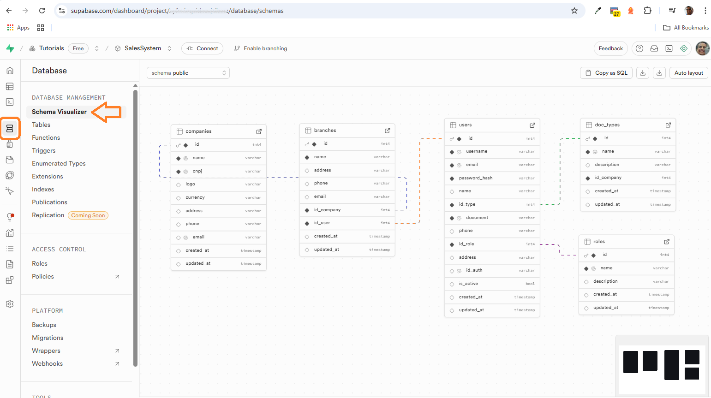


### Testing Trigger (03:02:55)

1. Vamos a crear la carpeta **"functions"**, dentro de la carpeta **"src/db/sql"**.
2. Dentro de la nueva carpeta creamos el archivo **`src/db/sql/functions/companyInsert.sql`**, con este código:
```sql
-- Create the `companyInsert` function to insert a new company into the database.
CREATE OR REPLACE FUNCTION fnc_company_insert()
RETURNS TRIGGER LANGUAGE plpgsql AS $$
BEGIN
    -- Insert the new company into the `companies` table
    INSERT INTO doc_types (name, description, id_company)
    VALUES
        (CONCAT('CC',TO_CHAR(NEW.id)), 'Cédula de Ciudadanía', NEW.id),
        (CONCAT('NIT',TO_CHAR(NEW.id)), 'Registro Nacional de Persona Jurídica', NEW.id),
        (CONCAT('RG',TO_CHAR(NEW.id)), 'Registro Geral', NEW.id),
        (CONCAT('CE',TO_CHAR(NEW.id)), 'Cédula de Extranjería', NEW.id),
        (CONCAT('Pasaporte',TO_CHAR(NEW.id)), 'Documento de viaje internacional', NEW.id);

    -- Return the new row
    RETURN NEW;
END
$$;
COMMIT;
```
3. Luego creamos la carpeta **"triggers"** y luego allí creamos el archivo **`src/db/sql/triggers/companyInsert.sql`**, con este código:
```sql
CREATE OR REPLACE TRIGGER trg_company_insert
AFTER INSERT ON companies
FOR EACH ROW
EXECUTE FUNCTION fnc_company_insert();
COMMIT;
```
4. Para una prueba ejecutamos el siguiente comando _sql_, para la creación de una empresa:
```sql
INSERT INTO companies (name, cnpj)
VALUES
    ('Nueva Empresa', '12345678002975');
COMMIT;
```
5. Luego de ejecutar la última prueba comprobamos que el _trigger_ creo nuevos registros enla tabla `doc_types`, que mas adelante veremos el uso de estos registros.


### Insertando Sucursales (03:13:30)

1. Se crea el archivo **`src/db/sql/functions/branchInsert.sql`**, pero no lo ejecutamos aun en el servidor de `Supabase`.
2. Lo mismo creamos **`src/db/sql/triggers/branchInsert.sql`**, pero no se ejecuta aun en `Supabase`.
3. Este paso le falta mucho, toca esperar a lo que sigue.


### Tabla Categorías (03:16:03)

1. Creamos el archivo **`src/db/sql/tables/categories.sql`**, con el siguiente código, y lo ejecutamos en `Supabase`:
```sql
-- Create tje `categories` table
DROP TABLE IF EXISTS categories;
CREATE TABLE IF NOT EXISTS categories (
    id SERIAL PRIMARY KEY,
    name VARCHAR(100) NOT NULL,
    color VARCHAR(20),
    icon VARCHAR(100),
    description TEXT,
    id_company INT NOT NULL,
    created_at TIMESTAMP DEFAULT CURRENT_TIMESTAMP,
    updated_at TIMESTAMP DEFAULT CURRENT_TIMESTAMP,
    CONSTRAINT fk_company FOREIGN KEY (id_company) REFERENCES companies(id) ON DELETE CASCADE
);
COMMIT;
```
2. Estas reglas o _Policies_ deben de configurarse en `Supabase`, y nos vamos al icono<svg xmlns="http://www.w3.org/2000/svg" width="32" height="32" viewBox="0 0 24 24" fill="none" stroke="currentColor" stroke-width="1.5" stroke-linecap="round" stroke-linejoin="round" class="lucide lucide-table-editor "><path d="M2.9707 15.3494L20.9707 15.355M20.9405 9.61588H2.99699M8.77661 9.61588V21.1367M20.9405 5.85547V19.1367C20.9405 20.2413 20.0451 21.1367 18.9405 21.1367H4.99699C3.89242 21.1367 2.99699 20.2413 2.99699 19.1367V5.85547C2.99699 4.7509 3.89242 3.85547 4.99699 3.85547H18.9405C20.0451 3.85547 20.9405 4.7509 20.9405 5.85547Z"></path></svg> `Table Editor`, da clic en la tabla `categories`, luego en los puntos suspensivoa al lado del nombre de la tabla:</br>
3. Damos clic al botón `[Create policy]`
4. Nos aparece una pantalla base y damos clic a la derecha en la columna `Templates` o Plantillas, al que dice `SELECT`(Es lo mismo que hacerlo en el que dice `Policy Command`):</br>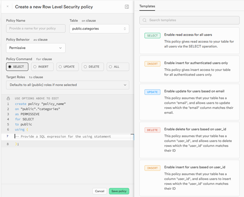
5. En `Target Roles`, selecciono `authenticated` y este es el texto del comando:
```sql
create policy "Enable read access for all users"
    on "public"."categories"
    as PERMISSIVE
    for SELECT
    to authenticated
    using (
        true
    );
```
6. Damos clic en el botón `[Save policy]`.
7. De nuevo clic en el botón `[Create policy]` y damos clic a la derecha en la columna `Templates` o plantillas sobre `INSERT`, revisar que `Target Roles` tenga `authenticated`, y esto es el comando que nos muestra:
```sql
create policy "Enable insert for authenticated users only"
    on "public"."categories"
    as PERMISSIVE
    for INSERT
    to authenticated
    with check (
        true
    );
```
8. Damos clic en el botón `[Save policy]`.
9. De nuevo clic en el botón `[Create policy]` y damos clic a la derecha en la columna `Templates` o plantillas sobre `UPDATE`, revisar que `Target Roles` tenga `authenticated`, y esto es el comando que nos muestra:
```sql
create policy "Enable update for users based on email"
    on "public"."categories"
    as PERMISSIVE
    for UPDATE
    to authenticated
    using (
        (select auth.jwt()) ->> 'email' = email
        with check (
        (select auth.jwt()) ->> 'email' = email
    );
```
>[!WARNING]  
>Aquí hay errores varios, empezando que la tabla `categories` no tiene el campo `'email'` y el otro es que hay un paréntesis por cerrar, y debemos corregirlo enseguida.
10. cambiamos el `using` por solo `id=id`, lo mismo aplica para el `with check`:
```sql
create policy "Enable update for users based on email"
    on "public"."categories"
    as PERMISSIVE
    for UPDATE
    to authenticated
    using (
        id=id
    with check (
        id=id
    );
```
11. Damos clic en el botón `[Save policy]`.
>[!WARNING]  
>El paréntesis faltante es un defecto del formulario en pantalla o de la _U.I._, en pocas palabras no es necesario añadir ese cierre de paréntesis.
12. De nuevo clic en el botón `[Create policy]` y damos clic a la derecha en la columna `Templates` o plantillas sobre `DELETE`, revisar que `Target Roles` tenga `authenticated`, cambiamos el `using` con `id=id` y esto es el comando que nos muestra:
```sql
create policy "Enable delete for users based on user_id"
    on "public"."categories"
    as PERMISSIVE
    for DELETE
    to authenticated
    using (
        id=id
    );
```
13. Damos clic en el botón `[Save policy]`, así se ve el _CRUD_ de las reglas o _policies_ para la table `categories`: </br>
14. Regresamos a <svg xmlns="http://www.w3.org/2000/svg" width="32" height="32" viewBox="0 0 24 24" fill="none" stroke="currentColor" stroke-width="1.5" stroke-linecap="round" stroke-linejoin="round" class="lucide lucide-table-editor "><path d="M2.9707 15.3494L20.9707 15.355M20.9405 9.61588H2.99699M8.77661 9.61588V21.1367M20.9405 5.85547V19.1367C20.9405 20.2413 20.0451 21.1367 18.9405 21.1367H4.99699C3.89242 21.1367 2.99699 20.2413 2.99699 19.1367V5.85547C2.99699 4.7509 3.89242 3.85547 4.99699 3.85547H18.9405C20.0451 3.85547 20.9405 4.7509 20.9405 5.85547Z"></path></svg> `Table Editor`.
15. Y el Instructor sugiere quitar de cada tabla en `Supabase` todas las `RLS` (_Row Level Security_), pero resulta que esta versión de `Supabase` (jun-20-2025), todas las tablas tienen los `RLS` inactivos:</br>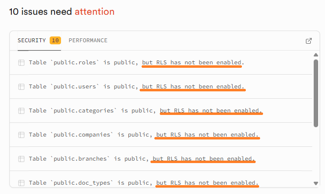

>[!TIP]  
> En `Supabase`, RLS significa **Seguridad a Nivel de Fila** (_Row Level Security_, por sus siglas en inglés). Es una característica de Postgresql que permite controlar el acceso a los datos a nivel de fila individual dentro de una tabla. En otras palabras, RLS permite definir políticas que determinan qué usuarios o roles pueden ver, insertar, actualizar o eliminar filas específicas en una tabla.
>
>¿Cómo funciona RLS en `Supabase`?
>* **Políticas:**  
>RLS se basa en políticas, que son reglas SQL que se aplican a cada consulta que accede a una tabla.
>* **Acceso condicional:**  
>Estas políticas pueden basarse en el usuario autenticado, roles, columnas de la tabla u otras condiciones.
>* **Control granular:**  
>RLS proporciona un control muy granular sobre el acceso a los datos, permitiendo que los desarrolladores definan políticas muy específicas para diferentes usuarios o roles.
>
>Beneficios de usar RLS en `Supabase`:
>* **Mayor seguridad:**  
>RLS ayuda a proteger los datos al garantizar que solo los usuarios autorizados puedan acceder a la información correcta.
>* **Control de acceso centralizado:**  
>Las políticas de RLS se definen en la base de datos, lo que facilita la gestión y el mantenimiento del control de acceso.
>* **Escalabilidad:**  
>RLS puede ayudar a escalar aplicaciones multiusuario, ya que permite definir políticas específicas para diferentes usuarios o roles.
>* **Integración con la autenticación:**  
>RLS se integra con el sistema de autenticación de `Supabase`, lo que permite utilizar la información del usuario autenticado para aplicar las políticas de seguridad.
>
>En resumen, RLS es una herramienta poderosa en `Supabase` que permite a los desarrolladores proteger sus datos y controlar el acceso a ellos de manera granular y centralizada


### Diagrama lógico para la subida de imágenes (03:22:42)

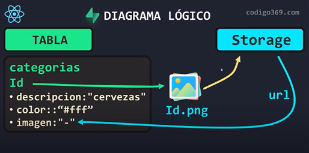

1. Esto es opcional para las `categories`.
2. Cuando se pueda crear la Categoría se subirá la imagen desde el PC local.
3. Se cambia el nombre de la imagen por el `id`.
4. `Supabase` tambien tiene un servicio de `storage`, para almacenar en este caso las imágenes.
5. Cada vez que subo la imagen al `storage` este me devuelve una ruta o _URL_.
6. La ruta con algunos cambios la almacenamos en la tabla `categories`.


### Función insertar categorías (03:25:27)

1. Dentro de la carpeta **"src/supabase"**, creamos el archivo **`crudCategories.tsx`**.
2. Empezamos por crear la función de tipo asíncrona y exportable de nombre `InsertCategory()`.
3. El instructor nos sugiere ir a esta página para leer la documentación [`JavaScript Client Library`](https://supabase.com/docs/reference/javascript/insert).
4. Lo que sugiere en la docuemntación es algo así con un _json_ es decir con clave-valor:
```js
const { error } = await supabase
  .from('countries')
  .insert({ id: 1, name: 'Mordor' })
```
5. Pero como hay que tener varios elmentos en consideración, nos hacemos un procedimiento almancenado en `Supabase`, y creamos el archivo **`src/db/sql/functions/categoryInsert.sql`**, con el código que aparece abajo, para luego ejecutar en `Supabase`:
```sql
-- Create the `fnc_category_insert` function to insert a new category into the database.
CREATE OR REPLACE FUNCTION fnc_category_insert(
    _name VARCHAR(100), 
    _color VARCHAR(20), 
    _icon VARCHAR, 
    _description TEXT, 
    _id_company INT
)
RETURNS INT LANGUAGE plpgsql AS $$
-- delcare a variable to hold the new category ID
DECLARE new_category_id INT;
BEGIN
    -- Check if the category name already exists
    PERFORM 1 FROM categories WHERE name = _name AND id_company = _id_company;
    IF FOUND THEN
        RAISE EXCEPTION 'Category with name "%" already exists for company ID %', _name, _id_company;
    ELSE
        -- If not found, insert the new category
        INSERT INTO categories (
            name,
            color,
            icon,
            description,
            id_company,
            created_at,
            updated_at
        )
        VALUES
            (_name, _color, _icon, _description, _id_company, CURRENT_TIMESTAMP, CURRENT_TIMESTAMP)
        RETURNING id INTO new_category_id;
        -- Return the new category ID
        RETURN new_category_id;
    END IF;
END
$$;
COMMIT;
```
6. Así se ve el _schema_ o esquema de la base de datos:</br>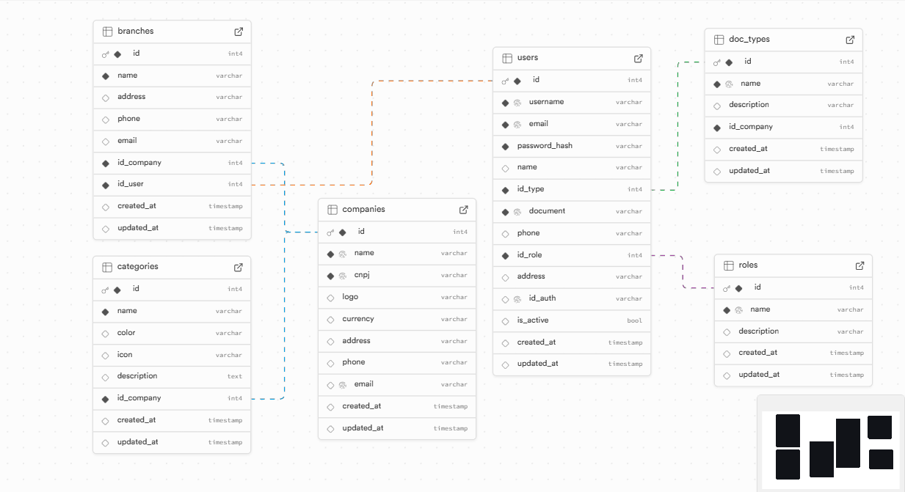
7. Como falta la llamada dentro del archivo **`src\supabase\crudCategories.tsx`** a la función recien creada en `Supabase`, hice este arreglo temporal a la función `InsertCategory()`:
```js
import { supabase } from '../index.ts';

export async function InsertCategory(category: {
  name: string;
  color: string;
  icon: string;
  description: string;
  id_company: number;
  file: string;
}) {
  const { data, error } = await supabase.rpc('fnc_category_insert', category);

  console.log('InsertCategory', data, error);
}
```


### Configurando el Storage (03:38:34)

1. Empezamos con esta documentación [`Remote Procedure Calls`](https://supabase.com/docs/reference/javascript/rpc).
2. Puedes llamar a las funciones de Postgres como _Llamadas a Procedimientos Remotos_ (`RPC`), lógica en tu base de datos que puedes ejecutar desde cualquier lugar. Las funciones son útiles cuando la lógica rara vez cambia, como para restablecer y actualizar contraseñas.
3. El paso anterior ya lo había hecho en el archivo **`src\supabase\crudCategories.tsx`**.
4. Antes de continuar vamo a instalar unos _Mensajes Emerjentes_ y los buscamos en este sitio [`sweetalert2`](https://sweetalert2.github.io/).
5. Vamos a la parte de [_Installation_](https://sweetalert2.github.io/#download) y usamos este código en una `TERMINAL`:</br>`pnpm install sweetalert2 -E`
6. Completamos el contenido de **`src\supabase\crudCategories.tsx`**, usando la nueva biblioteca de `'sweetalert2'` y empezamos con la importación y luego su uso en un condicional:
```js
...
import Swal from 'sweetalert2';

export async function InsertCategory(
  category: {
    name: string;
    color: string;
    icon: string;
    description: string;
    id_company: number;
  },
  file: string
) {
  const { data, error } = await supabase.rpc('fnc_category_insert', category);
  if (error) {
    Swal.fire({
      icon: 'error',
      title: 'Oops...',
      text: error.message,
    });
  }
}
```
7. Debemos aprovechar de la `data` el valor que retornamos en la función `fnc_category_insert()` de `Supabase` y la variable que retorna que es `new_category_id`:
```js
  const new_category_id = data;
```
8. Regresamos a `Supabase` y buscamos en el menú a <svg xmlns="http://www.w3.org/2000/svg" width="32" height="32" viewBox="0 0 24 24" fill="none" stroke="currentColor" stroke-width="1.5" stroke-linecap="round" stroke-linejoin="round" class="lucide lucide-storage "><path d="M19.4995 11.3685V8.50725L14.0723 3.10584H5.49951C4.94722 3.10584 4.49951 3.55355 4.49951 4.10584V9.1051M19.4468 8.48218L14.0701 3.10547L14.0701 7.48218C14.0701 8.03446 14.5178 8.48218 15.0701 8.48218L19.4468 8.48218ZM6.86675 9.1051H3.96045C3.40816 9.1051 2.96045 9.55282 2.96045 10.1051V19.1051C2.96045 20.2097 3.85588 21.1051 4.96045 21.1051H18.9604C20.065 21.1051 20.9604 20.2097 20.9604 19.1051V12.3685C20.9604 11.8162 20.5127 11.3685 19.9605 11.3685H9.98622C9.72382 11.3685 9.47194 11.2654 9.28489 11.0813L7.56808 9.39226C7.38103 9.20824 7.12915 9.1051 6.86675 9.1051Z"></path></svg> `Storage`.
9. Damos clic al botón `[New bucket]` y en el campo de `Name of the bucket`, le ponemos `images`, activamos el botón de `Public bucket` y le damos `[Save]`:</br>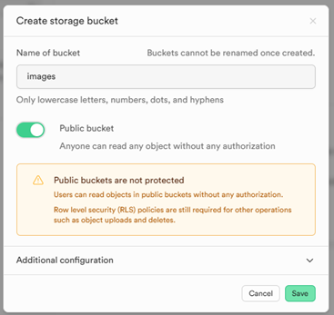
10. Dentro de este _bucket_ de nombre `images`, damos clic en el botón `[Create folder]` y en el nombre le ponemos `categories`.
11. Estando en el _bucket_ de nombre `images`, damos clic a la izquierda en `Policies`.
12. Damos click al botón `[New policy]`, y seleccionamos el de abajo <svg xmlns="http://www.w3.org/2000/svg" width="14" height="14" viewBox="0 0 24 24" fill="none" stroke="currentColor" stroke-width="2" stroke-linecap="round" stroke-linejoin="round" class="lucide lucide-square-pen"><path d="M12 3H5a2 2 0 0 0-2 2v14a2 2 0 0 0 2 2h14a2 2 0 0 0 2-2v-7"></path><path d="M18.375 2.625a1 1 0 0 1 3 3l-9.013 9.014a2 2 0 0 1-.853.505l-2.873.84a.5.5 0 0 1-.62-.62l.84-2.873a2 2 0 0 1 .506-.852z"></path></svg>`For full customization`.
13. En el campo `Policy name`, le ponemos `Image Permissions`
14. Pongo los cuatro _chulos_ o _check_ (✅), para `SELECT`, `INSERT`, `UPDATE` y `DELETE`, que son `Allowed operation`.
15. Selcciono en `Target roles` la opción de `authenticated`: </br> 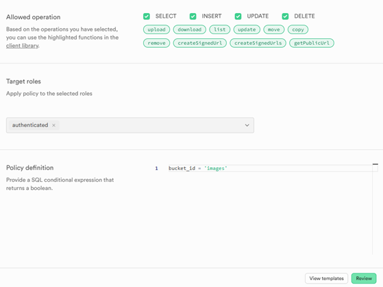
16. Damos clic en `[Review]`, nos aparecen las cuatro operaciones y damos clic en el botón `[Save policy]`.


### Subiendo imagen al Storage (03:47:19)

1. Podemos empezar con el sitio [`STORAGE->Upload a file`](https://supabase.com/docs/reference/javascript/storage-from-upload).
>[!NOTE]  
>
>#### Subir un archivo  
>
>Sube un archivo a un depósito existente.
>
>* Permisos de política RLS requeridos:
>   * bucketspermisos de tabla: ninguno
>   * objectsPermisos de tabla: solo insertcuando está cargando archivos nuevos y selectcuando insertestá updateinsertando archivos
>* Consulte la guía de almacenamiento para saber cómo funciona el control de acceso.
>* En React Native, usar Blob, Fileo FormDatano funciona correctamente. Suba el archivo usando ArrayBufferdatos de archivo base64 (vea el ejemplo a continuación).
>
>Parámetros
>* **camino** _Requerido_ cadena
>   * La ruta del archivo, incluido el nombre, debe tener el formato folder/subfolder/filename.png. El contenedor debe existir antes de intentar cargarlo.
>* **cuerpo del archivo** _Requerido_ Cuerpo del archivo
>   * El cuerpo del archivo que se almacenará en el depósito.
>
>Opciones del archivo
>* **Control de caché** _Opcional_ cadena
>   * El tiempo que el recurso se almacena en caché en el navegador y en la CDN de Supabase. Se configura en el Cache-Control: max-age=<seconds>encabezado. El valor predeterminado es 3600 segundos.
>* **tipo de contenido** _Opcional_ cadena
>   * El Content-Typevalor del encabezado. Debe especificarse si se usa un fileBodyvalor que no sea Blobni Fileni FormData; de lo contrario, el valor predeterminado será text/plain;charset=UTF-8.
>* **dúplex** _Opcional_ cadena
>   * La opción dúplex es un parámetro de cadena que habilita o deshabilita la transmisión dúplex, lo que permite leer y escribir datos en la misma secuencia. Se puede pasar como opción al método fetch().
>* **encabezados** _Opcional_ Registro<cadena, cadena>
>   * Opcionalmente, agregue encabezados adicionales
>* **metadatos** _Opcional_ Registro<cadena, cualquier>
>   * La opción de metadatos es un objeto que permite almacenar información adicional sobre el archivo. Esta información se puede usar para filtrar y buscar archivos. El objeto de metadatos puede contener cualquier par clave-valor que desee almacenar.
>* **inserción** _Opcional_ booleano
>   * Cuando upsert se establece en verdadero, el archivo se sobrescribe si existe. Cuando se establece en falso, se genera un error si el objeto ya existe. El valor predeterminado es falso.
>
1. Regresando al archivo **`src/supabase/crudCategories.tsx`**, creamos la función asíncrona de nombre `uploadImage()`, y copio un código del sitio antes consultado:
```js
async function uploadImage(){
  const avatarFile = event.target.files[0]
  const { data, error } = await supabase
    .storage
    .from('avatars')
    .upload('public/avatar1.png', avatarFile, {
      cacheControl: '3600',
      upsert: false
    })  
}
```
1. Corregimos la función `uploadImage()`:
```js
async function uploadImage(category_id: string, imageFile: File) {
  // const avatarFile = event.target.files[0]
  const pathFile = 'categories/' + category_id;
  const { data, error } = await supabase.storage
    .from('images')
    .upload(pathFile, imageFile, {
      cacheControl: '2', // '3600' -> 1 hora,
      upsert: true,  // El archivo se reemplaza si ya existe
    });
    if (error) {
      Swal.fire({
        icon: 'error',
        title: 'Oops...',
        text: error.message,
      });
      return null;
    }
    if (data) {
      const { data: urlData } = await supabase.storage
        .from('images')
        .getPublicUrl(pathFile);
      return urlData.publicUrl;
    }
}
```
1. Ajustamos la función anterior de nombre `InsertCategory()`, para tener la información del `imageFile`:
```js
export async function InsertCategory(
  category: {...},
  imageFile: File
) {
  const { data, error } = await supabase.rpc('fnc_category_insert', category);
  if (error) {
    ...
    return null;
  }
  const fileSize = imageFile.size ; 
  if (fileSize != undefined) {
    const new_category_id = data; //data?.[0]?.new_category_id;
    // eslint-disable-next-line @typescript-eslint/no-unused-vars
    const imageUrl = await uploadImage(new_category_id as string, imageFile);
  }
}
```


### Mostrar catergorías (03:58:00)

1. En el archivo **`src/supabase/crudCategories.tsx`**, creamos la función asíncronica de nombre `changeCategoryIcon()`:
```js
async function changeCategoryIcon(category: {
  id: number;
  icon: string;
}) {
  const { error } = await supabase
    .from('categories')
    .update(category)
    .eq('id', category.id);
  if (error) {
    Swal.fire({
      icon: 'error',
      title: 'Oops...',
      text: error.message,
    });
    return null;
  }
}
```
2. En el mismo archivo, pero en la función `InsertCategory()`, usamos el valor el valor obtenido en `imageUrl`, para cargar un objeto a ser usado como parámetros en el llamdo de `changeCategoryIcon()`:
```js
export async function InsertCategory(
  category: {...},
  imageFile: File
) {
  const { data, error } = await supabase.rpc('fnc_category_insert', category);
  ...
  const fileSize = imageFile.size;
  if (fileSize != undefined) {
    const new_category_id = data; 
    // retorna directamente `urlData.publicUrl`
    const imageUrl = await uploadImage(new_category_id as string, imageFile);
    const updateCategory = {
      id: new_category_id,
      icon: imageUrl || '', // Provide a default empty string if imageUrl is null or undefined
    };
    await changeCategoryIcon(updateCategory);
  }
}
```
3. Creamos una constante para utilizar en cada parte que ponemos la palabra `'categories'`, por la constante `tableName`, para sustituir todo donde aparece la cadena de caracters por la constante.
4. Añadimos una función asincrónica y exportable,  para mostrar Categorias:
```js
export async function GetCategoriesByCompanyId(id_company: number) {
  const { data, error } = await supabase
    .from(tableName)
    .select('*')
    .eq('id_company', id_company)
    .order('name', { ascending: true });
  if (error) {
    Swal.fire({
      icon: 'error',
      title: 'Oops...',
      text: error.message,
    });
    return [];
  }
  return data;
}
```
5. Actualizo el _barrel_ es decir el archivo **`src/index.ts`**.


### Probando insertar empresa (04:04:00)

1. Empezamos creando el archivo **`src/supabase/crudCompanies.tsx`**.
2. Empezamos importando `{supabase}` y `Swal` y la constante `tableName`:
```js
import { supabase } from '../index.ts';
import Swal from 'sweetalert2';

const tableName = 'companies';
```
3. Creamos la función `InsertCompany()` asincrónica y exportable, con algo de código:
```js
export async function InsertCompany(company: {
  name: string;
  cnpj: string;
  logo: string;
  address: string;
  phone: string;
  email: string;
}) {
  const { data, error } = await supabase.from(tableName).insert(company).select();
  if (error) {
    Swal.fire({
      icon: 'error',
      title: 'Oops...',
      text: error.message,
    });
    return null;
  }
  return data;
}
```
4. Actualizo el _barrel_ es decir el archivo **`src/index.ts`**.
5. Creamos este archivo **`src\store\CompanyStore.tsx`**.
6. Empiezo importando elementos de `zustand` y de `supabase` y teniendo una _interface_ lista:
```js
import { create } from 'zustand';

interface CompanyStore {
  
}
```
7. Creo una función tipo flecha exportable de nombre `useCompanyStore()`:
```js
export const useCompanyStore = create<CompanyStore>((set) => ({
  
}));
```
7. Empezamos con el primer objeto de nombre `inserCompany` y la definimos arriba la _interface_ de nombre `CompanyStore`:
```js
import { create } from 'zustand';
import { InsertCompany } from '../index.ts';
type companyType = {
  name: string;
  cnpj: string;
  logo: string;
  address: string;
  phone: string;
  email: string;
};

interface CompanyStore {
  insertCompany: (company: companyType) => Promise<void>;
}

// eslint-disable-next-line @typescript-eslint/no-unused-vars
export const useCompanyStore = create<CompanyStore>((set) => ({
  insertCompany: async (company: companyType) => {
    const data =  await InsertCompany(company);
    console.log('Company inserted:', data);
  },
}));
```
8. Abrimos el archivo **`src/components/templates/LoginTemplate.tsx`**.
9. Creo una constante deserializando el contenido de la nueva `useComanyStore()`:
```js
  const { insertCompany } = useCompanyStore();
```
10. Creamos una función de pruebas llamada `insertEmpresa()`,asíncrona y le cargamos un dato de pruebas:
```js
  const { insertCompany } = useCompanyStore();
  async function insertCompanyTest() {
    const company = {
      name: 'Test Company',
      cnpj: '1515151212',
      logo: 'https://example.com/logo.png',
      address: '123 Test St, Test City, TC 12345-678',  
      phone: '1234567890',
      email: 'correo@server.com'
    }
    await insertCompany(company);
  }
```
11. Añado abajo un renderizado del componente `<SaveButton`, antews de cerrar el `</div>`:
```js
        <SaveButton
          funcion={insertCompanyTest}
          titulo='Insertar Empresa Test'
          />
```
12. Ajusto en el componente `SaveButton`, para que alguanas propiedades sean Opcionales:
```js
interface SaveButtonProps {  
  funcion?: ()=> void; // Optional, to pass a function on click
  titulo: string;
  bgcolor?: string; // Optional, to set the background color of the button|
  icono?: JSX.Element; // Optional, import type { JSX } from 'react';
  url?: string; // Optional, if you want to use it as a link
  color?: string; // Optional, to set the text color of the button
  disabled?: boolean; // Optional, if you want to disable the button
  width?: string; // Optional, to set the width of the button
}
```
13. Ahora si probando el nuevo botón para crear una _company_: </br> 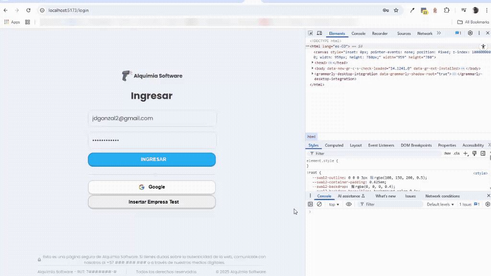
14. En el archivo **`src\supabase\crudCompanies.tsx`**, le agrego al momento del proceso con `supabase`que al final despues del `select()` otra función `maybeSingle()`.
15. Para probar de nuevo, borremos el último registro de la tabla  `companies` en `Supabase`, y así se ve el contenido en la consola después de la prueba: </br> ")


### Mostrar usuarios (04:16:08)

1. Borremos o comentemos el botón de pruebas del archivo **`src/components/templates/LoginTemplate.tsx`**.
2. Borremos o comentemos la función `insertCompanyTest()` y lo que se relaciona con esto dentro de este archivo.
3. Abrimos el archivo **`src/store/AuthStore.tsx`**.
4. En la _key_ de nombre `loginGoogle`, llevamos el contenido de `supabase` a un objeto para deserializar:
```js
    const { data, error } = await supabase.auth.signInWithOAuth()
```
5. Dentro de esta misma _key_ aprovechamos si hay valores en `data` o en `error`, simplemente lo dejamos como mensaje en la consola, por ahora:
```js
    if (error) {
      console.log('Error signing in with Google:', error.message);
    }
    if (data) {
      console.log('Successfully signed in with Google:', data);
    }
```
6. Creamos el archivo **`src/supabase/crudUsers.tsx`**.
7. Empiezo importando a `{ supabase }` y a `Swal`, mas la definición de `tableName`:
```js
import { supabase } from '../index.ts';

const tableName = 'users';
```
8. Luego creo la función exportable y asincrónica de nombre `GetUser()`:
```js
export async function GetUser(userId: string): Promise<unknown> {
  const { data } = await supabase
    .from(tableName)
    .select('*')
    .eq('id_auth', userId)
    .maybeSingle();

  return data;
}
```
9. Actualizo el _barrel_ es decir el archivo **`src/index.ts`**.
10. Oculto o comento todos los `console.log` que muestran `authState` en:
* **`HomeTemplate.tsx`**
* **`ProtectedRoutes.tsx`**
* **`MyRoutes`**
11. Agrego en el archivo **`src/context/AuthContext.tsx`**, en la importación del `index.ts`, el nuevo `GetUser`:
```js
import { supabase, GetUser } from '../index.ts';
```
12. Debajo del _hook_ de tipo `useEffect`, creamos una función tipo flecha de nombre `insertUser()`:
```js
  const insertUser = async (userId: string) => {
    const response = await GetUser(userId);
    if (!response) {
      console.error('User not found');
    }
  };
```
13. Dentro del `useEffect`, justo cuando definimos este </br>`setAuthState(session?.user);`</br> llamamos la función nueva de `insertUser()`:
```js
      if (session == null) {
        setAuthState(null);
      } else {
        setAuthState(session?.user || null);
        insertUser(session?.user?.id || '');
      }
```


### Inserta empresa (04:26:36)

1. En el archivo **`src/db/sql/tables/companies.sql`**, agregamos unas líneas que vamos luego a ejecutar en el <svg xmlns="http://www.w3.org/2000/svg" width="32" height="32" viewBox="0 0 24 24" fill="none" stroke="currentColor" stroke-width="1.5" stroke-linecap="round" stroke-linejoin="round" class="lucide lucide-sql-editor "><path d="M7.89844 8.4342L11.5004 12.0356L7.89844 15.6375M12 15.3292H16.5M5 21.1055H19C20.1046 21.1055 21 20.21 21 19.1055V5.10547C21 4.0009 20.1046 3.10547 19 3.10547H5C3.89543 3.10547 3 4.0009 3 5.10547V19.1055C3 20.21 3.89543 21.1055 5 21.1055Z"></path></svg> `SQL Editor`:
```sql
-- Add a new column `id_auth` to the `companies` table
ALTER TABLE companies
ADD COLUMN IF NOT EXISTS id_auth VARCHAR(36) UNIQUE;
```
2. Ya con eso tenemos una columna nueva en la tabla de `companies`.


### Insertando usuarios (04:29:38)

1. Creamos el archivo **`src/db/sql/tables/branchAssignment.sql`**, que luego ejecutaremos en `Supabase`, para crear una nueva tabla:
```sql
-- Create the `branch_assignments` table
DROP TABLE IF EXISTS branch_assignments;
CREATE TABLE IF NOT EXISTS branch_assignments (
    id SERIAL PRIMARY KEY,
    id_branch INT NOT NULL,
    id_user INT NOT NULL,
    role VARCHAR(50),
    created_at TIMESTAMP DEFAULT CURRENT_TIMESTAMP,
    updated_at TIMESTAMP DEFAULT CURRENT_TIMESTAMP,
    CONSTRAINT fk_branch FOREIGN KEY (id_branch) REFERENCES branches(id) ON DELETE CASCADE,
    CONSTRAINT fk_user FOREIGN KEY (id_user) REFERENCES users(id) ON DELETE CASCADE
);
```
2. Arreglamos la tabla `branches` y añadimos lo siguiente en el archivo **`src/db/sql/tables/branches.sql`**, para luego ejecutar en `Supabase`:
```sql
-- Delete the `id_user` column from the `branches` table
ALTER TABLE branches
    DROP COLUMN IF EXISTS id_user;
-- Add a new columns `cnpj`, `logo`, `currency` to the `branches` table
ALTER TABLE branches
    ADD COLUMN IF NOT EXISTS logo VARCHAR(255),
    ADD COLUMN IF NOT EXISTS currency VARCHAR(10) DEFAULT '$';
-- Add a check constraint for the `currency` column
ALTER TABLE branches
    ADD CONSTRAINT chk_currency CHECK (currency IN ('$','€','£','¥','₩','₹','₽','₺','₪','₫'));
```
3. Abrimos el archivo **`src/db/sqltables/companies.sql`**, para borrar el contenido, antes de crear la nueva columna `id_auth`, la misma que borramos antes de volverla a crear, para que la nueva columna `id_auth` quede con `NOT NULL`
```sql
-- Delete all content from the `companies` table
DELETE FROM companies;
-- Delete the `id_auth` column from the `companies` table
ALTER TABLE companies
    DROP COLUMN IF EXISTS id_auth;
-- Add a new column `id_auth` to the `companies` table
ALTER TABLE companies
    ADD COLUMN IF NOT EXISTS id_auth VARCHAR(36) UNIQUE NOT NULL;
```
4. Abrimos el archivo **`src/context/AuthContext.tsx`**, ela función de flecha `insertUser()`, en el condicional ponemos el `else` y llamamos la función `InsertCompany`,y en los parámetros agregamos el nuevo campo `id_auth`, con el valor de `userId`:
```js
    if (!response) {
      console.error('User not found');
    } else {
      await InsertCompany({
        name: session?.user.user_metadata?.full_name || session?.user?.id,
        cnpj: '',
        logo: session?.user.user_metadata?.picture ||'',
        address: '',
        phone: session?.user?.phone || '',
        email: session?.user?.email || '',
        id_auth: session?.user?.id,
      });
    }
```
5. Se grega una resir de interfaces que hacen referencia a la session:
```js
export interface SessionInterface {
  provider_token: string;
  access_token:   string;
  expires_in:     number;
  expires_at:     number;
  refresh_token:  string;
  token_type:     string;
  user:           UserInterface;
}

export interface SessionUserInterface {
  id: string;
  aud: string;
  role: string;
  email: string;
  email_confirmed_at: Date;
  phone: string;
  confirmed_at: Date;
  last_sign_in_at: Date;
  app_metadata: SessionAppMetadataInterface;
  user_metadata: SessionDataInterface;
  identities: SessionIdentityInterface[];
  created_at: Date;
  updated_at: Date;
  is_anonymous: boolean;
}

export interface SessionAppMetadataInterface {
  provider: string;
  providers: string[];
}

export interface SessionIdentityInterface {
  identity_id: string;
  id: string;
  user_id: string;
  identity_data: SessionDataInterface;
  provider: string;
  last_sign_in_at: Date;
  created_at: Date;
  updated_at: Date;
  email: string;
}

export interface SessionDataInterface {
  avatar_url: string;
  email: string;
  email_verified: boolean;
  full_name: string;
  iss: string;
  name: string;
  phone_verified: boolean;
  picture: string;
  provider_id: string;
  sub: string;
}
```
6. Cosa que al llamar la función `insertUser()`, lo hagamos con los parámetros de enviar la `session`:
```js
        insertUser(session as unknown as SessionInterface);
```
7. Abrimos el archivo **`src\supabase\crudCompanies.tsx`**, y se añade el nuevo parámetro de `id_auth`.
8. Hacemos la prueba, autenticándonos de nuevo y viendo que se crea el nuevo registro en la tabla `companies`: </br>
9. El error que nos sale una vez se ingresa es porque la búsqueda del usuario se hace en la tabla `users` y hasta ahora el `id_auth`, solo se ha ingresado en la tabla `companies`: </br> 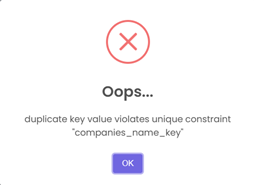
10. Volvemos al archivo **`src/supabase/crudUsers.tsx`**, añadimos una función exportable y asincrónica de nombre `InsertAdminUser()`:
```js
export async function InsertAdminUser(user: {
  email: string;
  password_hash: string;
  name: string;
  id_type: number;
  document: string;
  phone: string;
  id_role: number;
  address: string;
  id_auth: string;
  is_active: boolean;
}): Promise<unknown> {
  if (!user.id_auth) {
    throw new Error('User ID is required');
  }
  
  const { data, error } = await supabase
    .from(tableName)
    .insert([user])
    .select()
    .maybeSingle();

  if (error) {
    throw error;
  }

  return data;
} 
```
11. Volvemos a **`src/context/AuthContext.tsx`**, ponemos en las importaciones del `index.ts`, la nueva función `InsertAdminUser` y la llamamos debajo de `InsertCompany()`:
```js
      await InsertAdminUser({
        email: session?.user?.email || '',
        password_hash: '', // Password hash should be handled securely
        name: session?.user.user_metadata?.full_name || '',
        id_type: 1, // Assuming 1 is the ID for 'company'
        document: session?.user?.id.slice(-12), // Example document
        phone: session?.user?.phone || '',
        id_role: 1, // Assuming 1 is the ID for 'admin'
        address: '', // Address can be added later
        id_auth: session?.user?.id,
        is_active: true,
      });
```
12. Creamos el achivo **`src/db/sql/db_20250629.sql`**, que ejecuta toda la creación de tablas, índices,funciones y disparadores, para ser ejecutada en `Supabase`.
13. Ya tenemos de nuevo toda la BD creada: </br> 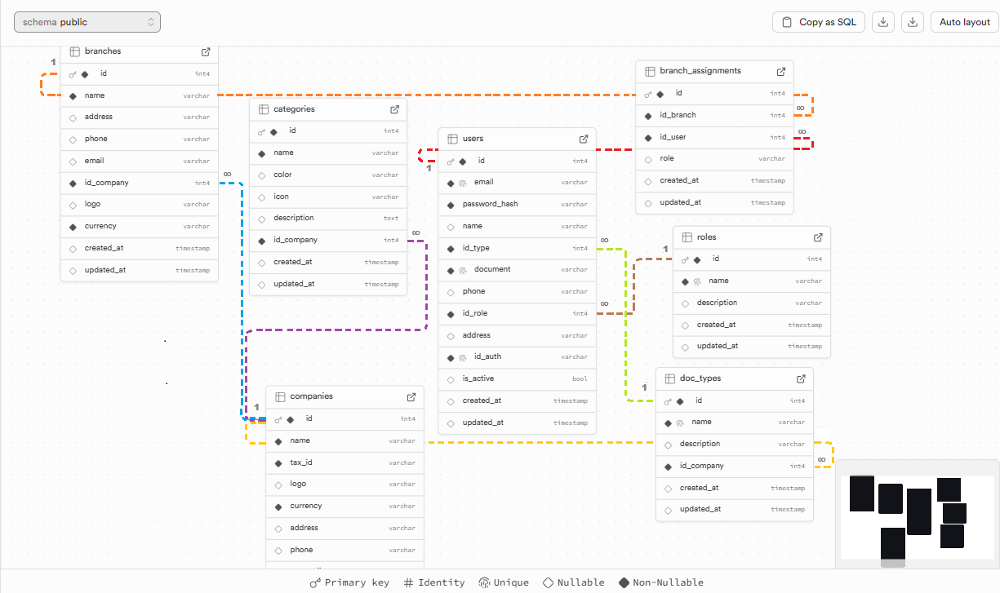
14. Creamos este archivo **`src/supabase/crudDocTypes.tsx`**, con este código:
```js
import { supabase } from '../index.ts';

const tableName = 'doc_types';

export async function GetDocType(companyId: string): Promise<unknown> {
  if (!companyId) {
    throw new Error('User ID is required');
  }
  const { data } = await supabase
    .from(tableName)
    .select('*')
    .eq('id_company', companyId)
    .maybeSingle();

  return data;
}

```
15. Actualizo el _barrel_ es decir el archivo **`src/index.ts`**.

>[!WARNING]  
>No ejecutamos pruebas. Por ahora faltan procesos para que funcione correctamente.


### Registrando varios usuarios (04:40:45)

1. Abrimos el archivo **`src/context/AuthContext.tsx`** y estamos llamando las funciones `InsertCompany()` y `InsertAdminUser()`, le agregamos al momento de `InsertCompany()`, asignar el valor obtenido a una constante de nombre `company`.
2. En el archivo **`src/supabase/crudDocTypes.tsx`**, defino una _interface_ para `docType`:
```js
export interface docTypeInterface  {
  id: number;
  name: string;
  description: string;
  id_company: string;
};

export async function GetDocType(companyId: string): Promise<unknown> {
  if (!companyId) {
    throw new Error('User ID is required');
  }
  const { data, error } = await supabase...
  return data as docTypeInterface;
}
```
3. Luego llamamos la función `GetDocType()` con un `await` y lo asignamos a la constante `resDocType`:
```js
      const resCompany =await InsertCompany({
        ...
      });
      
      const resDocType = await GetDocType(resCompany.id) as docTypeInterface;
      console.info('get docType:', resDocType);
```
4. la función `InsertAdminUser()`, la mejoro con los datos ya obtenidos tantto en `resCompany`, como en `resDocType`:
```js
      await InsertAdminUser({
        email: resCompany?.email || session?.user?.email,
        password_hash: '', // Password hash should be handled securely
        name: resCompany?.name || session?.user.user_metadata?.full_name,
        id_type: resDocType?.id || 1, // Assuming docType has an id field
        document: resCompany?.tax_id || session?.user?.id.slice(-12), // Example document
        phone: resCompany?.phone || session?.user?.phone,
        id_role: 1, // Assuming 1 is the ID for 'admin'
        address: resCompany?.address || '', // Address can be added later
        id_auth: resCompany?.id_auth || session?.user?.id,
        is_active: true,
      });
```
5. Creamos el archivo **``**, para el manejo de roles:
```js
import { supabase } from '../index.ts';

const tableName = 'roles';

export interface rolesInterface  {
  id: number;
  name: string;
  description: string;
};

export async function GetRoleByName(roleName: string): Promise<unknown> {
  if (!roleName) {
    throw new Error('Role Name is required');
  }
  const { data, error } = await supabase
    .from(tableName)
    .select('*')
    .eq('name', roleName)
    .maybeSingle();
  if (error) {
    return null;
  }
  return data as rolesInterface;
}
```
6. Actualizo el _barrel_ es decir el archivo **`src/index.ts`**.
7. Regresamos al archivo **`src/context/AuthContext.tsx`** y llamo la nueva función `GetRoleByName()`:
```js
      const resRole = await GetRoleByName('admin') as rolesInterface;

      await InsertAdminUser({
        ...
        id_role: resRole?.id || 1, // Assuming 1 is the ID for 'admin'
        ...
      });
```
8. Agrego al archivo **`src/supabase/crudCompanies.tsx`** el exportable de la _interface_ de nombre `CompanyInterface`.
9. Agrego al archivo **`src/supabase/crudUsers.tsx`** el exportable de la _interface_ de nombre `UserInterface`.
10. Corrijo conflictos en el archivo **`src/context/AuthContext.tsx`**, para la _interface_ de los elementos de la _session_.
11. En el archivo **`src/supabase/crudCompanies.tsx`**, quito lo relacionado con `Swal`.
12. El el **`src/context/AuthContext.tsx`**, agrego un condicional si el `resCompany` obtuve algo:
```js
const insertUser = async (session: SessionInterface) => {
    const resUser = await GetUser(session?.user?.id || '');
    if (!resUser) {
      const resCompany = (await InsertCompany({
        ...
      })) as CompanyInterface;

      if (resCompany) {
        const resDocType = (await GetDocType(
          resCompany.id
        )) as docTypeInterface;

        const resRole = (await GetRoleByName('admin')) as rolesInterface;

        await InsertAdminUser({
          ...
        });
      }
    }
  };
```
13. Probamos si ya almacena los datos una vez hace el ingreso del _Login_ de `Google`: </br> 


### Insertar asignación de sucursales (04:57:39)

1. Copiamos el archivo **`db_20250629.sql`** en uno nuevo **`src/db/sql/db_20250630.sql`**
2. Editamos el archivo **`src/db/sql/tables/branchAssignment.sql`**, para que el campo `id_user`, permita el _NULL_, y lo mismo en el respectivo **`db_20250630.sql`**.
3. En el los mismos archivos quitamos el campo `id_role`.
4. Ponemos un `CONSTRAINT` para que sean únicos el `id_branch` y el `id_user`:
```sql
-- Create the `branch_assignments` table
DROP TABLE IF EXISTS branch_assignments;
CREATE TABLE IF NOT EXISTS branch_assignments (
    id SERIAL PRIMARY KEY,
    id_branch INT NOT NULL,
    id_user INT, -- NOT NULL,
    --role VARCHAR(50),
    created_at TIMESTAMP DEFAULT CURRENT_TIMESTAMP,
    updated_at TIMESTAMP DEFAULT CURRENT_TIMESTAMP,
    CONSTRAINT fk_branch FOREIGN KEY (id_branch) REFERENCES branches(id) ON DELETE CASCADE,
    CONSTRAINT fk_user FOREIGN KEY (id_user) REFERENCES users(id) ON DELETE CASCADE,
    CONSTRAINT unique_branch_user UNIQUE (id_branch, id_user)
);

COMMIT;
```
5. Creamos el archivo **`src/db/sql/functions/userInsert.sql`** con la función `fnc_after_users_insert()`:
```sql
-- Create the `fnc_after_users_insert` function to insert a new elements after insert in `users` table.
CREATE OR REPLACE FUNCTION fnc_after_users_insert()
RETURNS TRIGGER LANGUAGE plpgsql AS $$
DECLARE new_id_branch INT;
BEGIN
    -- Select the last user ID to assign the new branch
    SELECT MAX(id) INTO new_id_branch FROM branches;
    -- Update the new user assignment into the `branch_assignments` table
    INSERT INTO branch_assignments (id_branch, id_user)
        VALUES (new_id_branch, NEW.id)
        ON CONFLICT (id_branch, id_user) DO UPDATE
        SET id_branch = EXCLUDED.id_branch, id_user = EXCLUDED.id_user;
    -- Return the new row
    RETURN NEW;
END
$$;

COMMIT;
```
6. Creamos el archivo **`src/db/sql/triggers/userInsert.sql`**, será un _trigger_ para llamar la nueva función:
```sql
-- Create trigger to update branch assignment after a new user is inserted.
CREATE OR REPLACE TRIGGER trg_after_users_insert
  AFTER INSERT ON users
  FOR EACH ROW
  EXECUTE FUNCTION fnc_after_users_insert();

COMMIT;
```
7. Añadimos estos dos nuevos _queries_ dentro del archivo **`db_20250630.sql`** y ejecutamos el contenido de **`db_20250630.sql`**, dentro de `Supabase`.
>[!TIP]  
>El instructor da muchas vueltas, añadiendo a la tabla `companies` un `id_user`, pero esto no es necesario.</br> Lo mismo que ingresar en la _function_ de BD de nombre `fnc_after_companies_insert()` el _insert_ en la tabla `branch_assignments`, cuando esto se puede dejar todo en la _function_ de BD de nombre `fnc_after_users_insert()`.
8. Hacemos una prueba y este es el resultado: </br>


### Creando pagina de configuración (05:14:06)

1. Creamos la página de nombre **`src/pages/Configurations.tsx`**.
2. Llamamos el `rfce` _snippet_ y hacemos los ajustes necesarios:
```js
import styled from 'styled-components';

const Container = styled.div``;

function Configurations() {
  return (
    <Container>
      <span>Configurations</span>
    </Container>
  );
}

export default Configurations;
```
3. Creamos el _template_ de nombre **``**:
4. Ejecutamos el _snippet_ `rfce` y hacemos algunas correcciones:
```js
import styled from 'styled-components';

const Container = styled.div``;

function ConfigurationsTemplate() {
  return (
    <Container>
      <span>Configurations</span>
    </Container>
  );
}

export default ConfigurationsTemplate;
```
5. Actualizamos el _barrel_ es decir el archivo **`src/index.ts`**.
6. Regresamos a **`src/pages/Configurations.tsx`**, importamos de `'../index.tx'` el componente `ConfigurationsTemplate` y lo renderizamos en el `return`:
```js
import { ConfigurationsTemplate } from '../index.ts';

function Configurations() {
  return <ConfigurationsTemplate />;
}

export default Configurations;
```
7. Abrimos el archivo **`src/routes/MyRoutes.tsx`**, para agregar debajo de la `<Route` al `Home`, otra a `Configurations`, tambien se agrega en la importación del `'../index.tx'`:
```js
...
import {
  Configurations,
  ...
} from '../index.ts';

export function MyRoutes() {
  const { authState } = useAuthContext();
  // console.info('MyRoutes authState:', authState);
  return (
    <Routes>
      <Route
        element={<ProtectedRoutes authState={authState} redirectTo='/login' />}
      >
        <Route path='/' element={<Home />} />
        <Route path='/config' element={<Configurations />} />
      </Route>

      <Route path='*' element={<div>404 Not Found</div>} />
      <Route path='/login' element={<Login />} />
    </Routes>
  );
}
```
8. Abrimos el archivo **`src/utils/dataEstatica.ts`**,  en la constante `SecondarylinksArray`, </br>Cambiamos el texto de:</br> `to: '/configurar',` </br>Por el texto de: </br>`to: '/config',`
9. Cerremos los otros archivos y dejamos solo abierto **`src/components/templates/ConfigurationsTemplate.tsx`**.


### Diseño de pagina configuraciones (05:16:24)

1. Copiamos del repositorio el archivo [fondocuadros.svg](https://github.com/Franklin369/pos-react-curso-hasta-seccion-categorias/blob/main/src/assets/fondocuadros.svg), en nuestra carpeta **"src/assets"**.
2. Teniendo abierto el archivo **`ConfigurationsTemplate.tsx`**, Copiamos el contenido del repositorio [ConfiguracionesTemplate.jsx](https://github.com/Franklin369/pos-react-curso-hasta-seccion-categorias/blob/main/src/components/templates/ConfiguracionesTemplate.jsx), con los ajustes que se requieran.
>[!WARNING]  
>Nos aparece un error :</br>`Module '"../../index"' has no exported member 'useModulesStore'.`</br> para una solución temporal, hacemos esto:
>1. Creamos el archivo **`src/store/ModulesStore.tsx`**, con este código base:
>```js
>import { create } from 'zustand';
>
>// eslint-disable-next-line @typescript-eslint/no-unused-vars
>export const useModulesStore = create((set) => ({
>  dataModules: [],
>  mostrarModulos: async () => {
>    return null;
>  },
>}));
>```
>2. Actualizamos el _barrel_ es decir el archivo **`src/index.ts`**.
>3. Así al menos ejecuta el aplicativo.
3. Ante los errores relacionados con `theme`, abrimos el archivo **`src/styles/GlobalStyles.tsx`**, y en la _interface_ de nombre `DefaultTheme`, añadimos los temas o propiedades faltantes:
```js
declare module 'styled-components' {
  export interface DefaultTheme {
    bgtotal: string;
    text: string;
    color2: string;
    colorScroll: string;
    logorotate: string;
    bgAlpha: string;
    bg6: string;
    bg5: string;  
    color1: string; 
    bgtgderecha: string;  
    bg3: string;
    bg  : string;
    bg4 : string;
    bgcards: string;
    colorsubtitlecard: string;
    colortitlecard: string;
  }
}
```
4. El Instructor muestra imagenes en la página de `configuracion`, pero esto depende de datos almacenados en `Supabase`, que aun no hemos creado, es decir estos resultados se verán mas adelante.
5. Aún hay errores de _Typescript_ en el archivo **`src/components/templates/ConfigurationsTemplate.tsx`**, que se podrán solucionar en el futuro.

>[!WARNING]  
>
>### Error en **`ConfigurationsTemplate.tsx`**, no aparecen los iconos:
>
>* [Solución parcial](#solución-parcial-para-ver-los-elementos-de-configuración)


### Instalando TanStack (05:18:44)

1. Vamos a esta página [TanStack
Query](https://tanstack.com/query/latest), que menciona esta información:</br> **Potente gestión de estados asincrónicos para TS/JS, React, Solid, Vue, Svelte y Angular**</br>`Olvídate de la gestión granular de estados, la recarga manual y la infinidad de código asincrónico. TanStack Query te ofrece consultas y mutaciones declarativas, siempre actualizadas y autogestionadas que mejoran directamente la experiencia del desarrollador y del usuario.`.
>[!IMPORTANT]  
>
>#### Hay que detener la ejecución que tenemos de :</br> `pnpm dev` </br> Para poder instalar lo de `TanStack`.

2. Vamos a ver el proceso de instalación en este sitio [TanStack -> React -> Installation](https://tanstack.com/query/latest/docs/framework/react/installation).
3. En una `TERMINAL`, ejecutamos este comando:</br>`pnpm add @tanstack/react-query -E`
4. También hay una recomendación de ejecutar:</br>`pnpm add -D @tanstack/eslint-plugin-query -E`
5. En este sitio [Quick Start](https://tanstack.com/query/latest/docs/framework/react/quick-start), hay un ejemplo de como utilizarlo, y lo vamos a probar en el archivo **`src/main.tsx`**, empezamos importando solo el `QueryClient` y el `QueryClientProvider`:
```js
import {
  QueryClient,
  QueryClientProvider,
} from '@tanstack/react-query';
```
6. Definimos un cliente:
```js
// Create a client
const queryClient = new QueryClient();
```
7. Debajo del renderizado de `<BrowserRouter`, rodeamos la `<App />` con el renderizado de `<QueryClientProvider`:
```js
    <BrowserRouter>
      <QueryClientProvider client={queryClient}>
        <App />
      </QueryClientProvider>
    </BrowserRouter>
```
8. Adicional instalamos el _Devtools_ de TanStack Query de este sitio [Devtools](https://tanstack.com/query/v4/docs/framework/react/devtools), y ejecutamos en una `TERMINAL` este comando:</br>`pnpm add @tanstack/react-query-devtools -E`
9. Abrimos el archivo **`package.json`** y borramos los _carets_ o `^`, si aparecen estos símbolos.
10. Abrimos el archivo **`src/App.tsx`**, para añadir la importación de `ReactQueryDevtools`:
```js
import { ReactQueryDevtools } from '@tanstack/react-query-devtools';
```
11. Agregamos el renderizado de este `<ReactQueryDevtools`, debajo de un cierre llaves `}`,justo antes de `</AuthContextProvider>`:
```js
      <AuthContextProvider>
        <GlobalStyles />
        {...}
        <ReactQueryDevtools initialIsOpen={true} />
      </AuthContextProvider>
```
>[!IMPORTANT]  
>
>#### Volvemos a ejecutar en una `TERMINAL` el comando :</br> `pnpm dev`

12. Así luce la pantalla del sitio de `login`, con el botón abajo de :</br>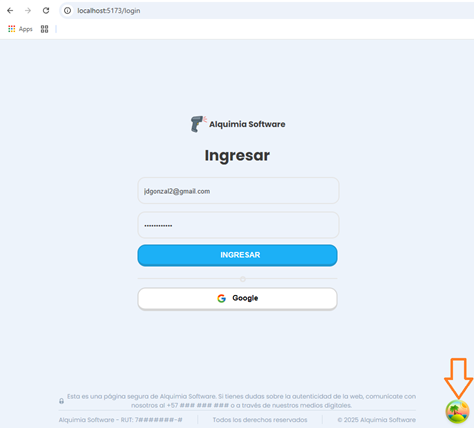
13. Al darle clic a ese botón de `Devtools`, aparece una ventana abajo para visualizar los movimientos de `TanStack`: </br> 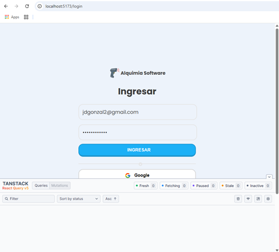


### Mostrar módulos (05:23:04)


1. Creamos el archivo **`src\pages\Categories.tsx`**, escribimos el _snippet_ `rfce` y le completamos la información:
```js
import styled from 'styled-components';

const Container = styled.div``;

function Categories() {
  return <Container>Categories</Container>;
}

export default Categories;
```
2. Creamos este otro **`src/components/templates/CategoriesTemplate.tsx`**, ponemos el _snippet_ `rfce` y completamos:
```js
import styled from 'styled-components';

const Container = styled.div``;

function CategoriesTemplate() {
  return <Container>CategoriesTemplate</Container>;
}

export default CategoriesTemplate;
```
3. Actualizamos el _barrel_ es decir el archivo **`src/index.ts`**.
4. Regresamos al archivo **`src\pages\Categories.tsx`**, e importamos el `{ CategoriesTemplate }`, del `'../index.ts'`.
5. Renderizado el recién importado `<CategoriesTemplate />`:
```js
import styled from 'styled-components';
import { CategoriesTemplate } from '../index.ts';

const Container = styled.div``;

function Categories() {
  return (
    <Container>
      <CategoriesTemplate />
    </Container>
  );
}

export default Categories;
```
6. Abrimos el archivo **`src/routes/MyRoutes.tsx`**, para añadir la ruta a la nueva página:
```js
    <Routes>
      <Route
        element={<ProtectedRoutes {...}/>}
      >
        ...
        <Route path='/config/categories' element={<Categories />} />
      </Route>
      ...
    </Routes>
```
7. Abrimos el archivo **`src\utils\dataEstatica.ts`**, y buscamos _array_ de nombre `DataModulosConfiguracion`y cambiamos el objeto `title: 'Categoria de productos'`, en la llave del `link`, por este valor :</br>`link: '/config/categories',`.
>[!WARNING]  
>
>### Solución parcial para ver los elementos de configuración
>
>* [Error en la página `config`](#error-en-configurationstemplatetsx-no-aparecen-los-iconos)
>* [Diseño de la página `config`](#diseño-de-pagina-configuraciones-051624)
8. Abrimos el archivo para revisar **`src\components\templates\ConfigurationsTemplate.tsx`**:</br>-> Se reorganiza el contenido de la constante `Container`.</br>-> En `.card > .card-content`, se quita lo de `position: absolute;`. </br> -> Se cambia `dataModules.map((item, index)`, por `dataModulosConfiguracion.map((item, index)`.</br>-> Por ende se importa `dataModulosConfiguracion` de `'../../utils/dataEstatica.ts'`.
9. Al menos nos salen los cinco elementos de la configuración, salen sin colores y en una sola columna:</br>
10. Creamos un archivo **`src/db/sql/tables/modules.sql`**, para ejecutar luego en `Supabase`, lo mismo que copiamos en un nuevo **`src/db/sql/db_20250704.sql`**:
```sql
-- Create the `modules` table
DROP TABLE IF EXISTS modules;
CREATE TABLE IF NOT EXISTS modules (
    id SERIAL PRIMARY KEY,
    name VARCHAR(50) UNIQUE NOT NULL,
    description VARCHAR(100),
    checked BOOLEAN DEFAULT FALSE,
    icon VARCHAR(100),
    link VARCHAR(50),
    created_at TIMESTAMP DEFAULT CURRENT_TIMESTAMP,
    updated_at TIMESTAMP DEFAULT CURRENT_TIMESTAMP
);

-- Insert initial data into `modules`
INSERT INTO modules (name, description, checked, icon, link) VALUES
('Productos',	'registra tus productos',	TRUE,	'https://i.ibb.co/85zJ6yG/caja-del-paquete.png',	'/configurar/productos'),
('Personal',	'ten el control de tu personal',	TRUE,	'',	'/configurar/usuarios'),
('Tu empresa',	'configura tus opciones básicas',	TRUE,	'',	'/configurar/empresa'),
('Categoria de productos',	'asigna categorias a tus productos',	TRUE,	'',	'/config/categories'),
('Marca de productos',	'gestiona tus marcas',	TRUE,	'',	'/configurar/marca');

-- ?Policies for `modules` table
```
11. Así se ve la estructura de la base de datos en `Supabase`, con la nueva tabla:</br>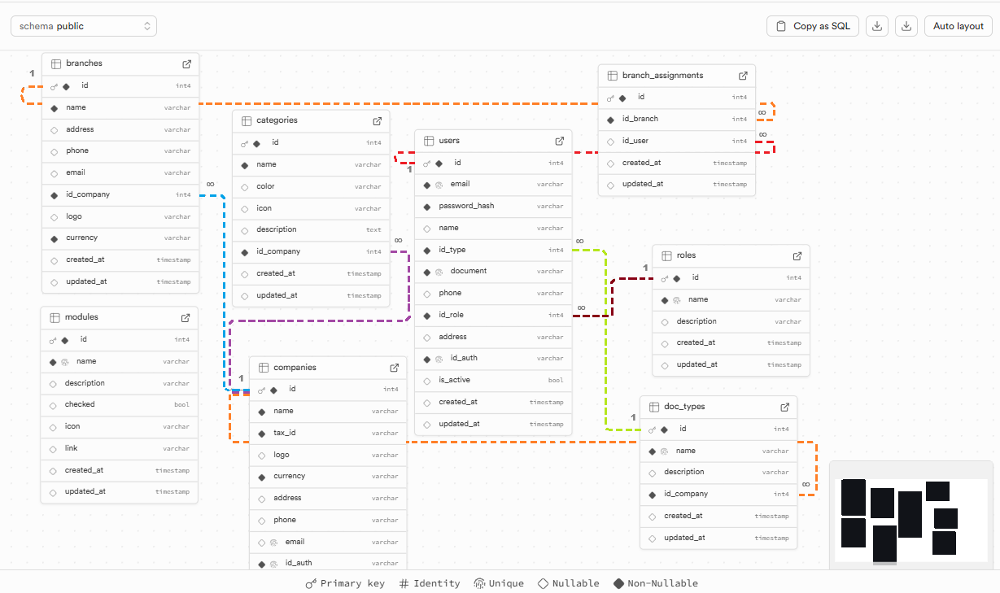
12. Creamos el archivo **`src/supabase/crudModules.tsx`**, copiamos de **`src/supabase/crudRoles.tsx`** y ajustamos:
```js
import { supabase } from '../index.ts';

const tableName = 'modules';

export interface modulesInterface {
  id: number;
  name: string;
  description: string;
  checked: boolean;
  icon: string;
  link: string;
}

export async function GetAllModules(): Promise<unknown> {
  const { data, error } = await supabase.from(tableName).select('*');
  if (error) {
    return null;
  }
  return data as modulesInterface[];
}
```
13. Actualizamos el _barrel_ es decir el archivo **`src/index.ts`**.
14. Abrimos el archivo **`src\store\ModulesStore.tsx`**, y hacemos uso del nuevo `GetAllModules()`:
```js
import { create } from 'zustand';
import { GetAllModules } from '../index.ts';

type moduleType = {
  id: number;
  name: string;
  description: string;
  checked: boolean;
  icon: string;
  link: string;
};

export const useModulesStore = create((set) => ({
  dataModules: [],
  getAllModules: async () => {
    const data = await GetAllModules();
    return set({
      dataModules: data as moduleType[],
    });
    /*
    El instructor sugiere:
    set({
      dataModules: data as moduleType[],
    });
    return data as moduleType[]; // Retorna los datos obtenidos
    */
  },
}));
```
15. Aprovecho y corrijo **`src\store\CompanyStore.tsx`**:
```js
type companyType = {
  name: string;
  tax_id: string;
  logo: string;
  address: string;
  phone: string;
  email: string;
  id_auth: string;
};
```


### Usando Tanstack Query (05:33:34)

1. Entramos al archivo **`src/pages/Configurations.tsx`**.
2. Llamamos el _hook_ de nombre `useModuleStore` y lo llevamos una constante de nombre `{getAllModules}`:
```js
  // Replace 'YourStoreType' with the actual type/interface of your store
  const { getAllModules } = useModulesStore() as {
    getAllModules: () => unknown;
  };
```
3. Luego usamos el _hook_ de `@tanstack` de nombre `useQuery`, con dos parámetros `queryKey` y `queryFn`, para luego hacer un _object destructuring_ o **desestructuración de objetos**, a tres valores o atributors con los nombres de `data`, `isLoading` y `error`:
```js
  const { data, isLoading, error } = useQuery({
    queryKey: ['showModules'],
    queryFn: getAllModules,
  });
```
4. Debajo del `useQuery`, añado una condicional, para `isLoading`:
```js
  if (isLoading) {
    return(<span>cargando...</span>);
  }
```
5. Añado otro condicional para `error`:
```js
  if (error) {
    return <span>error...</span>;
  }
```
6. Vamos al archivo **`src/components/templates/ConfigurationsTemplate.tsx`**, para consumir la `data`con un _hook_ de tipo `useModulesStore()`:
```js
import { useModulesStore } from '../../index.ts';

function ConfigurationsTemplate() {
  const {} = useModulesStore();
  ...
}
```
7. Solo consumimos de `useModulesStore()`, la `dataModules`:
```js
  const { dataModules } = useModulesStore() as {
    dataModules: Array<{
      link: string;
      state: boolean;
      icono: string;
      title: string;
      subtitle: string;
    }>;
  };
```
8. Cambiamos `{dataModulesConfiguracion.map` por `{dataModules.map`, por ende borramos la importación no requerida de</br> `import { dataModulesConfiguracion } from '../../utils/dataEstatica.ts';`
9. Se pone en **`src/store/ModulesStore.tsx`** el proceso sugerido por el instructor en vez del de copilot:
```js
export const useModulesStore = create((set) => ({
  dataModules: [],
  getAllModules: async () => {
    /* Lo sugerido por Copilot
    const data = await GetAllModules();
    return set({
      dataModules: data as moduleType[],
    });
    /*
    El instructor sugiere:*/
    const response = await GetAllModules()
    set({dataModules:response})
    return response; // Retorna los datos obtenidos
    /**/
  },
}));
```
10. En el archivo **`src/pages/Configurations.tsx`**, ocultamos o borramos lo relacionado con la `data`.
11. Ajustamos los nombres en **`src/components/templates/ConfigurationsTemplate.tsx`**, de los campos a los que traemos de la base de datos de `Supabase`.
12. Esto es traer la información de la Base de Datos en vez del archivo **`src/utils/dataEstatica.ts`**.


### Agregando Spinner (05:41:48)


1. Abrimos el archivo **`src/supabase/crudModules.tsx`** y nos copiamos la alerta o condicional `if (error) {` con la importación de `Swal` del rchivo **`src\supabase\crudCategories.tsx`**.
2. Vamos al sitio [`React Spinners by David Hu`](https://www.davidhu.io/react-spinners/).
3. Para instalarlo en una `TERMINAL`, ejecutar el comando: </br> `pnpm add --save react-spinners -E`
4. En este sitio [`npm -> React Spinners`](https://www.npmjs.com/package/react-spinners) hay algunos ejemplos del modo de uso del `Spinner`, en la pate de `Usage`.
5. Creamos el archivo **`src\components\molecules\Spinner.tsx`** y pnemos el _snippet_ de nombre `rfce`, y nos quedaría algo así:
```js
import styled from 'styled-components';

function Spinner() {
  return <div>Spinner</div>;
}

const Container = styled.div``;

export default Spinner;
```
6. Importamos la biblioteca de `"react-spinners"` y hacemos uso de este entre el componente de estilos de nombre `Container`:
```js
function Spinner() {
  return (
    <Container>
      <GridLoader
        color='#36D7B7'
        loading={true}
        cssOverride={{
          display: 'block',
          margin: '0 auto',
          borderColor: 'red',
        }}
        size={150}
      />
    </Container>
  );
}
```
7. Al componente de stilos `Container`, le agregamos unos _css_:
```css
const Container = styled.div`
  display: flex;
  justify-content: center;
  align-items: center;
  height: 100vh;
`;
```
9. Actualizamos el _barrel_ es decir el archivo **`src/index.ts`**.
10. Volvemos al archivo **`configurations.tsx`** y cambiamos el simple `<span>cargando...</span>` por el `<Spinner />`, actualizamos la importación del `'index.ts'`.
11. Ajustamos el componente **`Spinner.tsx`**, con algunas cacterísticas:
```js
import { RingLoader } from 'react-spinners';

function Spinner() {
  return (
    <Container>
      <RingLoader
        color='#36D7B7'
        loading={true}
        cssOverride={{
          display: 'block',
          margin: '0 auto',
          borderColor: 'red',
        }}
        size={100}
      />
    </Container>
  );
}
```


