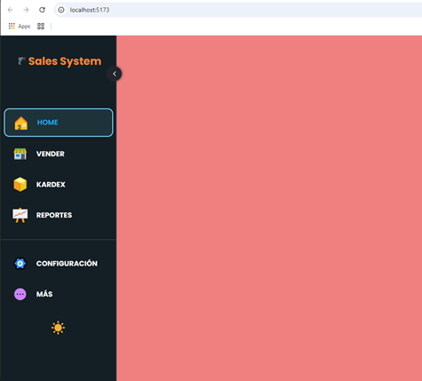

# Crea y Despliega un Sistema de Ventas FULL STACK con REACT y PostgreSQL | 2025

## SalesSystem

[](https://www.youtube.com/watch?v=URG4rnmdThs&t=270s)

## 1. Precondiciones (00:00:00)

1. Instalar `NODEJS` y `npm` en su sistema, usando el `nvm`:
  [Instalar múltiples versiones de Node.js en Windows](https://rafaelneto.dev/blog/instalar-multiples-versiones-nodejs-windows/).

```bash
nvm install [version]
nvm use [version]
```

2. Verificar las versiones de `NODEJS` instaladas en una `TERMINAL`:

```bash
nvm list
```

3. Instalar también el `pnpm` [pnpm installation](https://pnpm.io/installation), es mas rápido que el  `npm`.

4. Instalar [Visual Studio Code](https://code.visualstudio.com/insiders/).

5. Dentro de `Visual Studio Code`, se recomiendan estas extensiones:
* `ES7+ React/Redux/React-Native snippets` de `dsznajder` 4.4.x.
* `Better Comments` de `Aaron Bond` 3.0.x.
* `ESLint` de `Microsoft` 3.0.x.
* `Paste JSON as Code` de `quicktype` 23.0.x.
* `Prettier - Code formatter` de `Prettier` 11.0.x.
* `React Create Component` de `Javier Gutierrez` 1.5.x.
* `Simple React Snippets` de `Burke Holland` 1.2.x
* `TSLint` de `Microsoft` 1.3.x.
* `vscode-styled-components` de `Styled Components` 1.7.x.

## 2. Login

>[!IMPORTANT]  
>### Temas puntuales de la sección  
>**Descripción de la sección:**  
>En esta sección exploraremos todo lo relacionado con el desarrollo del módulo de `Login`. Aprenderás desde la creación del proyecto hasta la implementación completa del sistema de autenticación utilizando herramientas modernas como `Zustand` y `Supabase`. Además, diseñaremos una interfaz intuitiva y funcional, enfocándonos en detalles como maquetado, estilos globales, y componentes reutilizables.
>
>Entre los temas que abordaremos están:
>
>* Configuración inicial del proyecto con herramientas como `Auto Barrel`.
>* Organización del código y buenas prácticas en estructuras de carpetas.
>* Diseño del login con componentes responsivos y ajustes de estilos.
>* Implementación de un `AuthStore` para gestionar el estado global.
>* Conexión del proyecto con `Supabase` para autenticar usuarios.
>* Incorporación de funciones avanzadas como manejo del contexto y gestión de datos del usuario.
>
>Al finalizar esta sección, tendrás un módulo de login totalmente funcional y estilizado, listo para integrarse en cualquier aplicación.

### Creando el Proyecto (00:04:30)

1. Estando en la raíz de nuestro proyecto ejecutamos este comando
usando `VITE`:
```bash
pnpm create vite@latest . --template react-ts
```

>[!NOTE]  
>* El instructor sugiere el uso de `npm`, prefiereo el uso de `pnpm`.
>* También sugiere usar `JavaScript`, pero lo prefiero en `TypeScript`. Es mas exigente y pone mas retos, me gusta mas.

2. Nos consulta lo siguiente, en el proceso de instalación:
```dos
  Current directory is not empty. Please choose how to proceed:
│  ○ Cancel operation
│  ○ Remove existing files and continue
│  ● Ignore files and continue
```
* Seleccionamos la tercera `Ignore files and continue`.
```dos
Package name:
│  salessystem
```
* Lo dejamos así, con el `salessystem`.
```dos
◇  Scaffolding project in E:\tutorials\react\SalesSystem...
│
└  Done. Now run:

  pnpm install
  pnpm run dev
```
* Nos sugiere esto al final.

3. Así luce nuestro proyecto hasta el momento:  


4. Abrimos el **`package.json`** y eliminamos todos los _carets_ (`^`).

5. Ejecutamos en una `TERMINAL`, las dos líneas que nos sugirió al
final del proceso de creación del proyecto en `react`:
```bash
pnpm install
pnpm run dev
```
* Nos arroja esta respuesta:
```bash
  VITE v6.3.5  ready in 940 ms

  ➜  Local:   http://localhost:5173/
  ➜  Network: use --host to expose
  ➜  press h + enter to show help
```
* Así luce la página inicial:  


### Instalar `Auto Barrel` (00:06:44)

1. Instalar la extensión en `Visual Studio Code` de nombre `Auto Barrel for VSCode` de `Manuel Gil` 1.19.x.
2. Acá está el link para descargar el propuesto por el instructor: [auto-barrel-1.10.0](images/auto-barrel-1.10.0_vsixhub.com.zip).


### Configuración de `Auto Barrel` (00:07:37)

>[!NOTE]  
>El instructor habla de configurar el `Auto Barrel` por 
>`Extension Settings`, pero este no requiere dicho cambio en la versión 1.19.x.

### Organizando Carpetas (00:08:01)

1. Creamos la carpeta **"components"** dentro de **"src"**.

2. Creamos la carpeta **"pages"** dentro de **"src"**.

3. Creamos la carpeta **"routes"** dentro de **"src"**.

4. Creamos la carpeta **"styles"** dentro de **"src"**.

5. Creamos la carpeta **"utils"** dentro de **"src"**.

6. Creamos la carpeta **"supabase"** dentro de **"src"**.

7. Creamos la carpeta **"store"** dentro de **"src"**.

### Instalando dependencias básicas (00:09:32)

1. Empezamos en una `TERMINAL` con 
[`styled-components`](https://www.npmjs.com/package/styled-components) y su respectivo 
[`@types`](https://www.npmjs.com/package/@types/styled-components):
```bash
pnpm add styled-components @types/styled-components -E
```

2. En la `TERMINAL` seguimos con
[`react-router-dom`](https://www.npmjs.com/package/react-router-dom) y el respectivo
[`@types`](https://www.npmjs.com/package/@types/react-router-dom):
```bash
pnpm add react-router-dom @types/react-router-dom -E
```

3. En la `TERMINAL` otra librería o dependencia,
[`react-icons`](https://www.npmjs.com/package/react-icons) 
y no requiere el adicional 
[`@types`](https://www.npmjs.com/package/@types/react-icons)
pues el sitio dice "`This is a stub types definition. react-icons provides its own type definitions, so you do not need this installed`":
```bash
pnpm add react-icons -E
```

4. En la `TERMINAL` esta dependencia
[`Iconify for React`](https://www.npmjs.com/package/@iconify/react)
, no requiere `@types`, este sitio no existe:
```bash
pnpm add --save-dev @iconify/react -E
```

### Agregando Estilos Globales (00:11:55)

1. Empezamos borrando el archivo **`src/App.css`**.
2. Borramos también el **`src/index.css`**.
3. Borramos el contenido del `return` del archivo **`src/App.tsx`**, dejando dentro de la etiqueta `<>` vacía, esto `<span>Hola mundo</span>`.
4. Borramos de este mismo archivo el _hook_ `useState` y todos los `import`.
5. Del archivo **`src\main.tsx`**, borramos la importación del `index.css`.
6. Ajustamos también otras cosas en el archivo **`index.html`**:
```html
<!doctype html>
<html lang="es-CO">
  <head>
    <meta charset="UTF-8" />
    <link rel="icon" type="image/svg+xml" href="/vite.svg" />
    <meta name="viewport" content="width=device-width, initial-scale=1.0" />
    <title>POSS 1.0.0</title>
  </head>
  <body>
    <div id="root"></div>
    <script type="module" src="/src/main.tsx"></script>
  </body>
</html>
```
7. Agrego la imagen de un ícono para nuestro proyecto en extensión `.PNG`, la obtengo con la _A.I_ de `Copilot`, y consigo dos imágens, esta  y esta , que la voy a copiar en las carpetas **"public"** y **"src/assets"**, en diferentes tamaños.
8. En el archivo **`index.html`**, cambiamos la `url` del `<link rel="icon"`, por el de la imagen de 32x32:
```html
    <link rel="icon" type="image/png" href="/poss2_32x32.png" />
```
9. Creamos el archivo **`GlobalStyles.tsx`** en la carpeta **"src/styles"**.
10. Empezamos importando el `'styled-components'` el elemento `{createGlobalStyle}`.
11. Exportamos la constante `GlobalStyles` qu es igual al valor que recién importamos mas un grupo de valores dentro de comillas invertidas o en el teclado _ascii_ el [`ALT`]+[9]+[6]:
```js
import { createGlobalStyle } from 'styled-components';

export const GlobalStyles = createGlobalStyle`
  @import url('https://fonts.googleapis.com/css2?family=Poppins:wght@200;300;400;500;600;700;800;900&display=swap');
  body{
    margin: 0;
    padding: 0;
    box-sizing: border-box;
    font-family: 'Poppins', sans-serif;
    background-color: pink; /* #f4f4f4;*/
    color: #333;
  }
`;
```
12.  Vamos a crear un `Auto Barrel`, en la carpeta **"src"**, esto crea un arhivo de nombre **`index.ts`**, el instructor sugiere que solo se utilice para _Componentes_, con esto por ahora:
```js
export { default as App } from './App';
export * from './main';
export * from './styles/GlobalStyles';
```
13.    En el archivo **`src/App.tsx`**, agregamos un `import` al `./index.ts` el elemento `{GlobalStyles}`, y el renderizado de `<GlobalStyles />`:
```js
import { GlobalStyles } from './index.ts';

function App() {
  return (
    <div>
      <GlobalStyles />
      <h1>Hola mundo</h1>
    </div>
  );
}

export default App;
```
14.  Y así se ve la pantalla hasta el momento: <br> 


### Primer maquetado (00:20:40)

1. En el archivo **`src/App.tsx`**, agregamos esta importación: <br> `import styled from 'styled-components';`.
2. Creamos una constante `Container` igual a `styled.main` al lado de `main` abrimos y cerramos la comilla invertida o en el teclado _ascii_ el [`ALT`]+[9]+[6]:
```js
import styled from 'styled-components';
import { GlobalStyles } from './index.ts';

const Container = styled.main`
  // Es un componente de estilo
  display: grid;
  grid-template-columns: 1fr;
  background-color: lightyellow;
`;

function App() {
  return (
    <Container>
      <GlobalStyles />
      <section className='leftSidebar'>
        <p>uno</p>
      </section>
      <section className='mainMenu'>
        <p>dos</p>
      </section>
      <section className='rightRoutes'>
        <p>tres</p>
      </section>
    </Container>
  );
}

export default App;
```
3. Creamos el archivo **`breakpoints.ts`** y copiamos el contenido del repositorio [breakpoints.jsx](https://github.com/Franklin369/pos-react-login/blob/main/src/styles/breakpoints.jsx). <br> Como explica el instructor, estos son _objetos_ No _componentes_ por ende la extensión debe ser `.ts`.
4. En el archivo **`src/App.tsx`**, en la definición del componente `Container`, agregamos definiciones de cada clase usada en las `<section`:
```css
const Container = styled.main`
  // Es un componente de estilo
  display: grid;
  grid-template-columns: 1fr;
  background-color: lightyellow;
  .leftSidebar{
    display: none; /* Oculta la barra lateral izquierda */
    background-color: lightblue;
  };
  .mainMenu{
    position: absolute;
    background-color: lightgreen;
  };
  .rightRoutes{
    background-color: lightcoral;
  };
`;
```
5. Agregamos la importación de `./styles/breakpoints.ts` y de allí tomamos `{Device}`.
6. Luego en la misma definición del `Container`, agregamos los `@media`, relacionando con cada _objeto_ de `Device`:
```css
  @media ${Device.tablet} {
    grid-template-columns: 88px 1fr ; /* una columnas */
    .leftSidebar {
      display: initial; /* Barra lateral izquierda en tablets */
    }
    .mainMenu {
      position: none; /* Elimina la posición absoluta en tablets */
      width: 100%;
    }
    .rightRoutes {
      width: 100%;
    }
  }
```


### Definiendo secciones (00:32:29)

1. Al archivo **`src/App.tsx`**, agregamos mas estilos a la constante `Container`:
```css
...
  ...
  .rightRoutes {
    background-color: lightcoral;
    grid-column: 1; /* Ocupa toda la fila */
    width: 100%; /* Asegura que ocupe todo el ancho disponible */
  }
  @media ${Device.tablet} {
   ...
    .rightRoutes {
      width: 100%;
      grid-column: 2; /* Ocupa la segunda columna */
      width: calc(100% - 88px); /* Ajusta el ancho para ocupar el espacio restante */
    }
  }
```
2. En la carpeta **"src\pages"**, creamos el archivo **`Home.tsx`**, y ejecutamos el _snippet_ `rfce`:
```js
import React from 'react';

function Home() {
  return <div>Home</div>;
}

export default Home;
```
3. Cambiamos el único `import` por uno para tomar los dato de `"styled-components"` e igual creamos la constante `Container` para utilizarla como componente:
```js
import styled from 'styled-components';

const Container = styled.div``;

function Home() {
  return (
    <Container>
      <span>Home</span>
    </Container>
  );
}

export default Home;
```
4. Creamos una cuatro carpetas dentro de **"src/components"**:
* `atoms`
* `molecules`
* `organisms`
* `templates`
5. Dentro de la nueva carpeta **"src/components/templates"**, creamos el archivo **`HomeTemplate.tsx`**, ejecutamos el _snippet_, ajustamos la importación a 'styled-components' y añadimos la definición del componente `Container`:
```js
import styled from 'styled-components';

const Container = styled.div``;

function HomeTemplate() {
  return (
    <Container>
      <span>HomeTemplate</span>
    </Container>
  );
}

export default HomeTemplate;
```
6. En la carpeta **"src/routes"** creamos el archivo **`routes.ts`**, con este código inicial:
```js
import { Route, Routes, BrowserRouter } from 'react-router-dom';
import { Home } from '../index.ts';

function MyRoutes() {
  return (
    <BrowserRouter>
      <Routes>
        <Route path='/' element={<Home />} />
        <Route path='*' element={<div>404 Not Found</div>} />
      </Routes>
    </BrowserRouter>
  );
}

export default MyRoutes;
```
7. Actualizo el `Auto barrel`, es decir el archivo **`index.ts`** y esto es lo que debe mostrar hasta el momento:
```js
export { default as App } from './App';
export { default as HomeTemplate } from './components/templates/HomeTemplate';
export * from './main';
export { default as Home } from './pages/Home';
export { default as MyRoutes } from './routes/MyRoutes';
export * from './styles/GlobalStyles';
export * from './styles/breakpoints';
```
8. Luego regreso al archivo **`src/App.tsx`**, añado a la importación del `'index'`, el de `MyRoutes` y lo renderizo en la `classname` de nombre `'rightRoutes'`:
```js
function App() {
  return (
    <Container>
      <GlobalStyles />
      <section className='leftSidebar'>
        <p>Sidebar</p>
      </section>
      <section className='mainMenu'>
        <p>MainMenu</p>
      </section>
      <section className='rightRoutes'>
        <MyRoutes />
      </section>
    </Container>
  );
}
```
9. Dentro de la carpeta **"src/components/organisms"**, creamos otra carpeta de nombre `sidebar`, creamos un componente de nombre **`Sidebar.tsx`**, ejecutamos el _snippet_ `rfce` y le ajustamos para utilizar el `'styled-components'`:
```js

```
10. Actualizamos el `Auto Barrel` o el archivo **`index.ts`**.
11. Y en el archivo **`src/App.tsx`**, añado a la importación del `'index'`, el de `Sidebar` y lo renderizo en la `classname` de nombre `'leftSidebar'`:
```js
function App() {
  return (
    <Container>
      <GlobalStyles />
      <section className='leftSidebar'>
        <Sidebar />
      </section>
      <section className='mainMenu'>
        <p>MainMenu</p>
      </section>
      <section className='rightRoutes'>
        <MyRoutes />
      </section>
    </Container>
  );
}
```
12. Tomamos del archivo **`src/styles/GlobalStyles.tsx`**, el dato de `@import url` para los _fonts_ y lo llevamos para **`index.html`**:
```html
    <style>
      @import url("https://fonts.googleapis.com/css2?family=Poppins:wght@200;300;400;500;600;700;800;900&display=swap");
    </style>
```
13. Ahora si borramos de **`src/styles/GlobalStyles.tsx`**, ese valor de `@import url`.


### Definiendo return (00:43:22)

1. El archivo **`src/routes/MyRoutes.tsx`**, ya tiene el `return` para ser tratado como _Componente_.
2. En el archivo **`src\components\templates\HomeTemplate.tsx`**, agregamos unos elementos _css_, dentro de las comillas invertidas de la definición de `Container`:
```css
const Container = styled.div`
  height: 100vh;
`;
```
3. En el archivo **`src/pages/Home.tsx`**, Renderizo el componente `<HomeTemplate`, y lo importo del `'../index.ts'`:
```js
import styled from 'styled-components';
import {HomeTemplate} from '../index.ts'; 

const Container = styled.div``;

function Home() {
  return (
    <Container>
      <HomeTemplate/>
    </Container>
  );
}

export default Home;
```
4. En el archivo **`src/App.tsx`**, corrijo algunos estilos de _css_ para las clases `mainMenu` y `rightRoutes`,para el `@media ${Device.tablet}`:
```css
  @media ${Device.tablet} {
    grid-template-columns: 88px 1fr; /* una columnas */
    .leftSidebar {
      display: initial; /* Barra lateral izquierda en tablets */
    }
    .mainMenu {
      display: none;
    }
    .rightRoutes {
      grid-column: 2; /* Ocupa la segunda columna */
    }
  }
```
5. Así se ve la pantalla hasta el momento, tanto en presentación `tablet` o `mobile`: <br>  <br> 


### Implementando temas con zustand (00:44:38)

1. En una `TERMINAL`, instalamos la despendencia de <br>[](https://www.npmjs.com/package/zustand)):
```bash
pnpm add zustand -E
```
2. En la carpeta **"src/store"**, es donde se va implementar el manejo de los estados de `Zustand`, y allí creamos un archivo de nombre **`ThemeStore.tsx`**.
3. En el nuevo archivo empezamos con una importación de `'Zustand'`:
```js
import { create } from 'zustand';

interface ThemeState {
  theme: 'light' | 'dark';
  toggleTheme: () => void;
}
export const useThemeStore = create<ThemeState>((set) => ({
  theme: 'light',
  toggleTheme: () =>
    set((state) => ({
      theme: state.theme === 'light' ? 'dark' : 'light',
    })),
}));
```
4. Agregamos en la carpeta **"src/styles"**, el archivo **`themes.ts`**, y le copiamos la información de esta ruta [`themes.jsx`](https://github.com/Franklin369/pos-react-login/blob/main/src/styles/themes.jsx).
5. En el archivo **`src/store/ThemeStore.tsx`** importamos de `'../styles/themes.ts'` los dos objetos `{Light, Dark}`.
6. Completamos el código de **`ThemeStore.tsx`**:
```js
import { create } from 'zustand';
import { Light, Dark } from '../styles/themes';

interface ThemeState {
  theme: 'light' | 'dark';
  themesStyle: typeof Light | typeof Dark;
  setTheme: () => void;
}
export const useThemeStore = create<ThemeState>((set, get) => ({
  theme: 'light',
  themesStyle: Light,
  setTheme: () => {
    const { theme } = get();
    set({ theme: theme === 'light' ? 'dark' : 'light' });
    set({ themesStyle: theme === 'light' ? Dark : Light });
  },
}));
```
7. Regresamos al archivo **`src/App.tsx`** importamos de `'styled-components'` el `{ThemeProvider}` y envolvemos todo debajo del `return` en el renderizado de `<ThemeProvider`:
```js
function App() {
  return (
    <ThemeProvider theme={{ mode: 'light' }}>
      <Container>
        <GlobalStyles />
        <section className='leftSidebar'>
          <Sidebar />
        </section>
        <section className='mainMenu'>
          <p>MainMenu</p>
        </section>
        <section className='rightRoutes'>
          <MyRoutes />
        </section>
      </Container>
    </ThemeProvider>
  );
}
```
8. Actualizamos el `Auto Barrel` o el archivo **`index.ts`**.
9. En el archivo **`src/App.tsx`** usamos un _hook_ de `Zustand`, que lo bautizamos como `useThemeStore`, con la respectiva importación:
```js
...
import { GlobalStyles, MyRoutes, Sidebar, useThemeStore } from './index.ts';
...
function App() {
  const { themesStyle } = useThemeStore();
  return (
    <ThemeProvider theme={themesStyle}>
      ...
    </ThemeProvider>
  );
}
```


### Agregando el SIDEBAR (00:56:56)

1. Copiamos de esta ruta [`Sidebar.jsx`](https://github.com/Franklin369/pos-react-login/blob/main/src/components/organismos/sidebar/Sidebar.jsx), el contenido en el archivo **`src\components\organisms\sidebar\Sidebar.tsx`**.
>[!WARNING]
>Tenemos errores, pues nos faltan componentes:
>* `import { LinksArray, SecondarylinksArray, ToggleTema } from '../../../index';`
>* `import { v } from '../../../styles/variables';`
2. Copiamos el contenido de esta ruta [`ToggleTema.jsx`](https://github.com/Franklin369/pos-react-login/blob/main/src/components/organismos/ToggleTema.jsx), dentro del archivo **`src/components/organisms/ToggleTema.tsx`**, que debemos crear.
3. Creamos el archivo **`src\styles\variables.ts`** y copiamos el contenido de [`variables.jsx`](https://github.com/Franklin369/pos-react-login/blob/main/src/styles/variables.jsx).
4. En el archivo de **`variables.ts`**, correjimos el logo por el que tenemos en la carpeta **"assets"**: <br> `import logo from '../assets/poss2_32x32.png';`
5. Creamos el archivo **`src/utils/dataEstatica.ts`** y copiamos el contenido de [`dataEstatica.jsx`](https://github.com/Franklin369/pos-react-login/blob/main/src/utils/dataEstatica.jsx)
6. Actualizao el `Auto Barrel` o el archivo **`index.ts`**.
7. Hago correcciones de _TypeScript_ en el archivo **`src/components/organisms/sidebar/Sidebar.tsx`**:
```js
...
import { v } from '../../../styles/variables';
...
interface SidebarProps {
  state: boolean;
  setState: React.Dispatch<React.SetStateAction<boolean>>;
  $isopen: string;
}

export function Sidebar({ state, setState, $isopen }: SidebarProps) {
  return (...)
}
```
8. En el archivo **`src/App.tsx`**, al renderizar el `<Sidebar`, debemos ponerle algunas propiedades o parámetros, antes de eso creamos un _hook_ tipo `useState`:
```js
  const [sidebarOpen, setSidebarOpen] = useState(false);
```
* E importar el respectivo _hook_: <br> `import { useState } from 'react';`
9. Quitamos el renderizadode `<BrowserRouter` del archivo **`src/routes/MyRoutes.tsx`** y nos lo llevamos al archivo **`src\main.tsx`**:
```js
import { StrictMode } from 'react';
import { createRoot } from 'react-dom/client';

import App from './App.tsx';
import { BrowserRouter } from 'react-router-dom';

createRoot(document.getElementById('root')!).render(
  <StrictMode>
    <BrowserRouter>
      <App />
    </BrowserRouter>
  </StrictMode>
);
```
10. El archivo **`src/routes/MyRoutes.tsx`**, quedó solo con este código:
```js
import { Route, Routes } from 'react-router-dom';
import { Home } from '../index.ts';

function MyRoutes() {
  return (
    <Routes>
      <Route path='/' element={<Home />} />
      <Route path='*' element={<div>404 Not Found</div>} />
    </Routes>
  );
}

export default MyRoutes;
```
11. Así se ve hasta el momento el aplicativo en pantalla: <br> 


12. Los íconos que se están utilizando en el archivo **`src\utils\dataEstatica.ts`**, vienen de este sitio [Iconify for React](https://iconify.design/docs/icon-components/react/), mas específicamente de este [icons](https://icon-sets.iconify.design/).
13. Hay un sitio para almacenar las imágenes a parte del poyecto, utiliza este sitio [imgbb](https://es.imgbb.com/), se aloja las imagenes, tiene este texto: <br> `ImgBB es un servicio gratuito de alojamiento de imágenes. Actualiza tu suscripción para acceder a todas las funciones.`
14. Así luce el proyecto con el cambio de _Dark_ o _Light_: <br>  


>[!WARNING]
>El archivo **`src/components/organisms/sidebar/Sidebar.tsx`**, presenta muchos errores de _TypeScript_, mas adelante se buscará el modo de solucionarlos.
